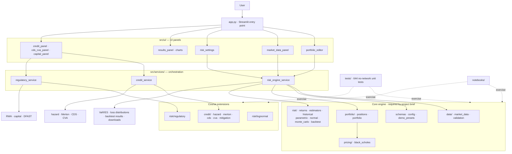

# MATH5320 Portfolio Risk System

**Course:** MATH GR 5320 Financial Risk Management, Columbia University, Spring 2026
**Authors:** Nigel Li, Michael Adegbite, Stella
**Test suite:** 644 passed, 1 skipped, 95% statement coverage

A portfolio risk calculation system supporting stocks and European options. Computes historical, parametric (delta-normal), and Monte Carlo VaR and ES, with walk-forward backtesting (Kupiec, Christoffersen, Basel traffic-light). Extension modules cover exact lognormal VaR/ES, reduced-form hazard models, Merton structural default, CDS pricing, CVA, and regulatory capital.

---

## Deliverables

The project has five graded deliverables. PDFs are compiled from the LaTeX sources in `submission/latex_deliverables/`.

| # | Deliverable | Points | LaTeX source | Pages |
|---|---|---|---|---|
| 1 | Model Documentation | 30 | `01_model_documentation.tex` | 18 |
| 2 | Software Design Documentation | 15 | `02_software_design_documentation.tex` | 24 |
| 3 | Test Plan | 20 | `03_test_plan.tex` | 20 |
| 4 | Software | 25 | *(this repository)* | -- |
| 5 | Test Results | 10 | `04_test_results.tex` | 14 |

A combined report (`00_combined_final_report.tex`, 27 pages) consolidates all five deliverables into a single document with crosswalk tables that map requirements, Bloomberg MRM template sections, and grading criteria to specific pages.

### Compiling the PDFs

```bash
cd submission/latex_deliverables
pdflatex -interaction=nonstopmode 00_combined_final_report.tex   # run twice for TOC
pdflatex -interaction=nonstopmode 00_combined_final_report.tex
```

An `images/` symlink in that directory resolves all screenshot references automatically.

---

## Quick Start

```bash
pip install -r requirements.txt
streamlit run app.py
```

The app has 8 tabs: Portfolio Input, Market Data, Risk Settings, Run Analysis, Backtesting, Credit Risk, CDS/CVA, and Capital & Stress.

---

## Verifying the Software (Deliverable 4)

The system handles arbitrary portfolios. Two pre-built notebooks demonstrate this end to end without requiring the Streamlit app. Both are fully executed and included in `submission/`.

### `submission/demo.ipynb` — Formula-sheet walkthrough (15 sections)

Walks through every formula-sheet topic using the programmatic API:

| Section | What it covers |
|---|---|
| §1 | Coverage matrix and risk-measure theory |
| §2 | European option pricing and delta (Black-Scholes) |
| §3 | Delta-hedge intuition |
| §4 | Historical scenario VaR and ES |
| §5 | Single-stock GBM VaR (exact lognormal) |
| §6 | Two-stock parametric VaR |
| §7 | Rolling window vs EWMA calibration |
| §8 | Historical AAPL/CAT VaR and ES on real data |
| §9 | Monte Carlo VaR and ES |
| §10 | VaR backtesting (Kupiec test) |
| §11 | Hazard rate / reduced-form credit model |
| §12 | Merton structural credit model |
| §13 | CDS pricing |
| §14 | CVA and counterparty risk mitigation |
| §15 | Regulatory capital / RWA |

### `submission/advanced_demo.ipynb` — Equal-weight Magnificent 7 portfolio

Demonstrates the system on a realistic multi-asset portfolio (AAPL, MSFT, GOOGL, AMZN, NVDA, META, TSLA) with options:

| Section | What it proves |
|---|---|
| §1 | Arbitrary portfolio construction (7 stocks) |
| §2 | All three VaR/ES models on a stock-only basket |
| §3 | Diversification benefit (portfolio VaR < sum of individual VaRs) |
| §4 | Adding option positions to an existing portfolio |
| §5 | Full stock + option portfolio risk across all models |
| §6 | **Manual parameter input** — bypasses historical calibration, feeds μ and Σ directly |
| §7 | **Option volatility shock sensitivity** — demonstrates `underlying_beta` mode |
| §8 | Walk-forward VaR backtesting with diagnostics |
| §9 | Merton structural default model on a real ticker |
| §10 | Frontend validation summary with screenshots |

To re-run either notebook yourself:

```bash
pip install -r requirements.txt
jupyter notebook submission/demo.ipynb
jupyter notebook submission/advanced_demo.ipynb
```

### `submission/demo.md` / `submission/advanced_demo.md` — Frontend workflow traces

Step-by-step Streamlit screenshots showing the full UI workflow for the same portfolios.

---

## Running Tests

### Full no-network suite

```bash
python -m pytest tests/ --ignore=tests/integration_test.py --ignore=tests/integration_test_formula_sheet.py
```

Expected: **644 passed, 1 skipped**.

### With coverage

```bash
python -m pytest tests/ --cov=src --cov-report=term-missing \
  --ignore=tests/integration_test.py --ignore=tests/integration_test_formula_sheet.py
```

Expected: **95% statement coverage** (2225 statements, 110 missed).

### Network integration tests

```bash
python tests/integration_test.py                  # End-to-end with live Yahoo data
python tests/integration_test_formula_sheet.py    # Full formula-sheet integration
```

### Course validation fixtures

`tests/test_course_validation.py` embeds fixtures from the course-supplied `risk_engine_validation_test_sheet.pdf` (LN01-LN04, HZ01-HZ04, MR01-MR02, CDS01-CDS04, CVA01-CVA05, REG01-REG02). Numerical values match at 1% relative tolerance.

### Individual test files

```bash
python -m pytest tests/test_backend.py -v              # Core engine + service layer (43 tests)
python -m pytest tests/test_numerical_precision.py -v   # IEEE 754 failure modes (7 tests)
python -m pytest tests/test_course_validation.py -v     # Course fixture goldens
python -m pytest tests/test_homework_cases.py -v        # Homework regression fixtures
python -m pytest tests/test_credit.py -v                # Hazard / Merton / CDS / CVA
python -m pytest tests/test_lognormal.py -v             # Exact GBM VaR / ES
python -m pytest tests/test_regulatory.py -v            # RWA / capital / DFAST
python -m pytest tests/test_strict_numerics.py -v       # Numerical discipline
python -m pytest tests/test_ui_panels.py -v             # Streamlit UI panels
python -m pytest tests/test_market_data.py -v           # CSV loader + yfinance wrappers
```

---

## Project Requirements Compliance

Requirements from `docs/references/project_requirements.pdf`.

| Requirement | Status | Where to verify |
|---|---|---|
| Stock and option positions as input | Done | `src/schemas.py`; `advanced_demo.ipynb §1, §4` |
| Calibrate to historical data | Done | `src/risk/estimators.py`; `demo.ipynb §7` |
| Accept manual parameters as input | Done | `parametric_var_es(calibration_mode="manual")`; `advanced_demo.ipynb §6` |
| Historical VaR and ES | Done | `src/risk/historical.py`; `demo.ipynb §4, §8` |
| Parametric (delta-normal) VaR and ES | Done | `src/risk/parametric.py`; `demo.ipynb §6` |
| Monte Carlo VaR and ES | Done | `src/risk/monte_carlo.py`; `demo.ipynb §9` |
| Backtest VaR against history | Done | `src/risk/backtest.py`; `demo.ipynb §10`, `advanced_demo.ipynb §8` |

### Grading penalty flags

| Penalty flag | How it is addressed | Where to verify |
|---|---|---|
| Not modelling volatility changes for options | `underlying_beta` shock mode scales option vol with the underlying return | `advanced_demo.ipynb §7` |
| Using historical vol instead of implied vol | `OptionPosition.volatility` is a user-supplied implied vol field | `src/schemas.py`, model doc §4.5 |
| Incorrect covariance | Window and EWMA covariance from log returns; delta-dollar exposures `x = n*S*delta` | `tests/test_strict_numerics.py` |
| Inappropriate parametric VaR | `VaR = -m + s * Phi^{-1}(alpha)` with h-day horizon scaling | `src/risk/normal.py`, `tests/test_course_validation.py` |
| Tests not supporting model-doc conclusions | 644 tests, 95% coverage, course homework fixtures embedded | `tests/test_homework_cases.py`, `tests/test_course_validation.py` |

---

## Architecture



All quantitative logic lives in pure Python modules under `src/` with no Streamlit imports, so tests and notebooks call the same functions the app uses.

## Repository Layout

```
MATH5320/
├── app.py                          # Streamlit entry point (UI only)
├── requirements.txt
├── README.md
├── src/
│   ├── schemas.py                  # StockPosition, OptionPosition, Portfolio
│   ├── config.py                   # Global defaults
│   ├── demo_presets.py             # Reproducible Streamlit demo presets
│   ├── data/
│   │   ├── market_data.py          # CSV loader + yfinance downloader + cache
│   │   └── validation.py           # Input validation
│   ├── pricing/
│   │   └── black_scholes.py        # BS price and delta
│   ├── portfolio/
│   │   ├── positions.py            # Per-position value and delta
│   │   └── portfolio.py            # Portfolio valuation and exposure vector
│   ├── risk/
│   │   ├── returns.py              # Log returns, overlapping horizon returns
│   │   ├── estimators.py           # Window and EWMA mean/covariance
│   │   ├── historical.py           # Historical VaR/ES
│   │   ├── parametric.py           # Delta-Normal VaR/ES
│   │   ├── normal.py               # Closed-form normal VaR/ES helpers
│   │   ├── monte_carlo.py          # Monte Carlo VaR/ES
│   │   ├── lognormal.py            # Exact GBM VaR/ES
│   │   ├── regulatory.py           # RWA, capital ratio, DFAST helpers
│   │   └── backtest.py             # Walk-forward backtest + Kupiec/Christoffersen
│   ├── credit/
│   │   ├── hazard.py               # Reduced-form hazard and survival
│   │   ├── merton.py               # Merton structural default model
│   │   ├── cds.py                  # CDS par spread
│   │   ├── cva.py                  # CVA and exposure helpers
│   │   └── mitigation.py           # Netting and collateral
│   ├── services/
│   │   ├── risk_engine_service.py  # Market-risk orchestration
│   │   ├── credit_service.py       # Credit and CVA orchestration
│   │   └── regulatory_service.py   # RWA and DFAST orchestration
│   └── ui/
│       ├── portfolio_editor.py     # Portfolio input
│       ├── market_data_panel.py    # Data loading
│       ├── risk_settings.py        # Parameter controls
│       ├── results_panel.py        # Results and downloads
│       ├── credit_panel.py         # Hazard / Merton panel
│       ├── cds_cva_panel.py        # CDS / CVA panel
│       ├── capital_panel.py        # Capital and stress panel
│       └── charts.py               # Plotly chart helpers
├── tests/                          # 644 no-network unit and regression tests
├── notebooks/                      # Course walkthrough notebooks
├── docs/
│   ├── references/                 # Project requirements PDF, validation sheet
│   └── screenshots/                # Application screenshots (used in LaTeX reports)
└── submission/                     # Final submission package (see below)
```

---

## Submission Package Contents

```
submission/
├── latex_deliverables/
│   ├── 00_combined_final_report.tex    # All 5 deliverables in one document (27 pp)
│   ├── 01_model_documentation.tex      # Deliverable 1 (18 pp)
│   ├── 02_software_design_documentation.tex  # Deliverable 2 (24 pp)
│   ├── 03_test_plan.tex                # Deliverable 3 (20 pp)
│   ├── 04_test_results.tex             # Deliverable 5 (14 pp)
│   └── images -> ../../docs/screenshots/
├── 00_combined_final_report.md         # Markdown mirrors
├── 01_model_documentation.md
├── 02_software_design_documentation.md
├── 03_test_plan.md
├── 04_test_results.md
├── demo.ipynb                          # Formula-sheet demo (15 sections, executed)
├── demo.md                             # Frontend workflow trace with screenshots
├── advanced_demo.ipynb                 # M7 portfolio demo (10 sections, executed)
├── advanced_demo.md                    # M7 frontend trace with screenshots
└── test_artifacts/
    ├── pytest_output.txt               # Full pytest output (644 passed, 1 skipped)
    └── coverage_output.txt             # Coverage report (95%, 2225 stmts, 110 missed)
```

---

## Key Modelling Conventions

| Convention | Specification |
|---|---|
| **Returns** | Daily log returns: r_t = log(S_t / S_{t-1}) |
| **Horizon returns** | Overlapping rolling sum: R_t^(h) = sum r_{t-k} for k=0..h-1 |
| **Price shock** | S_shocked = S_0 * exp(R) |
| **PnL** | pnl = V_T - V_0 |
| **Loss** | loss = V_0 - V_T (positive = loss) |
| **EWMA lambda** | lambda = (N-1)/(N+1) |
| **Horizon scaling** | mu_h = mu * h, Sigma_h = Sigma * h |
| **Parametric VaR** | -m + s * Phi^{-1}(confidence) |
| **Parametric ES** | -m + s * phi(z) / alpha |
| **Option pricing** | Black-Scholes with continuous dividends |
| **Kupiec test** | LR_uc ~ chi-squared(1) |

---

## Programmatic API

All quantitative modules are plain Python with no Streamlit dependency. The canonical entry point is `RiskEngineService`:

```python
from src.services.risk_engine_service import RiskEngineService
from src.schemas import Portfolio, StockPosition, OptionPosition
from datetime import date

portfolio = Portfolio(
    stocks=[StockPosition(ticker="AAPL", quantity=100)],
    options=[
        OptionPosition(
            ticker="AAPL_C_200", underlying_ticker="AAPL",
            option_type="call", quantity=1, strike=200.0,
            maturity=date(2026, 12, 19), volatility=0.25,
            risk_free_rate=0.045, dividend_yield=0.0, multiplier=100,
        )
    ],
)

svc = RiskEngineService(
    portfolio=portfolio, prices=prices,
    pricing_date=date(2025, 1, 2),
    lookback_days=252, horizon_days=10,
    var_confidence=0.99, es_confidence=0.975,
    estimator="window", n_simulations=10_000,
)

results = svc.run_all()          # Historical, parametric, Monte Carlo
bt = svc.run_backtest("historical")  # Walk-forward with Kupiec + Basel
```

See `submission/demo.ipynb` for complete worked examples of every module.
