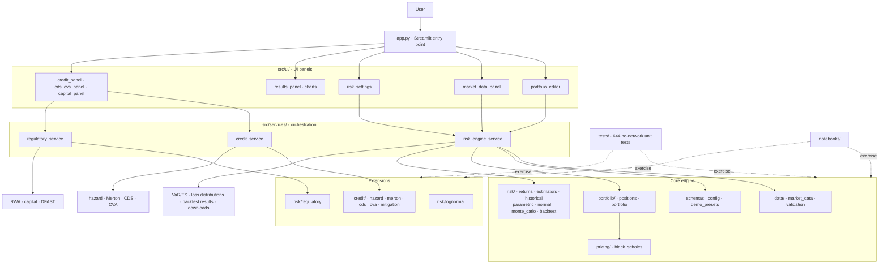

# Portfolio Risk System

**Authors:** Nigel Li, Michael Adegbite, Stella  
**Test suite:** 644 passed, 1 skipped, 95% statement coverage

A portfolio risk calculation system supporting stocks and European options. Computes historical, parametric (delta-normal), and Monte Carlo VaR and ES, with walk-forward backtesting (Kupiec, Christoffersen, Basel traffic-light). Extension modules cover exact lognormal VaR/ES, reduced-form hazard models, Merton structural default, CDS pricing, CVA, and regulatory capital.

---

## App Screenshots

The Streamlit interface has 8 tabs covering the full risk pipeline.

| Portfolio Input | Run Analysis |
|---|---|
|  |  |

| Backtesting | Credit Risk |
|---|---|
|  |  |

| CDS / CVA | Capital & Stress |
|---|---|
|  |  |

---

## Quick Start

```bash
pip install -r requirements.txt
streamlit run app.py
```

For notebooks and tests, install the full development tooling:

```bash
pip install -r requirements-dev.txt
```

### Environment setup

#### Option A — venv (app only)

```bash
python -m venv .venv
source .venv/bin/activate
pip install -r requirements.txt
streamlit run app.py
```

#### Option B — venv (notebooks, tests, and app)

```bash
python -m venv .venv
source .venv/bin/activate
pip install -r requirements-dev.txt
python -m ipykernel install --user --name portfolio-risk-dev \
  --display-name "Python (Portfolio Risk)"
```

#### Option C — Conda (app only)

```bash
conda env create -f environment.yml
conda activate portfolio-risk
streamlit run app.py
```

#### Option D — Conda (notebooks, tests, and app)

```bash
conda env create -f environment-dev.yml
conda activate portfolio-risk-dev
python -m ipykernel install --user --name portfolio-risk-dev \
  --display-name "Python (Portfolio Risk)"
```

`requirements.txt` is the lean runtime install. `requirements-dev.txt` adds notebook and validation tooling.

---

## Demo Notebooks

Two pre-built notebooks demonstrate the system end to end without running the Streamlit app. Both are fully executed and included in `submission/`.

### `submission/demo.ipynb` — Formula walkthrough (15 sections)

| Section | Coverage |
|---|---|
| §1 | Coverage matrix and risk-measure theory |
| §2 | European option pricing and delta (Black-Scholes) |
| §3 | Delta-hedge intuition |
| §4 | Historical scenario VaR and ES |
| §5 | Single-stock GBM VaR (exact lognormal) |
| §6 | Two-stock parametric VaR |
| §7 | Rolling window vs EWMA calibration |
| §8 | Historical AAPL/CAT VaR and ES on real data |
| §9 | Monte Carlo VaR and ES |
| §10 | VaR backtesting (Kupiec test) |
| §11 | Hazard rate / reduced-form credit model |
| §12 | Merton structural credit model |
| §13 | CDS pricing |
| §14 | CVA and counterparty risk mitigation |
| §15 | Regulatory capital / RWA |

### `submission/advanced_demo.ipynb` — Equal-weight Magnificent 7 portfolio

Demonstrates the system on a realistic multi-asset portfolio (AAPL, MSFT, GOOGL, AMZN, NVDA, META, TSLA) with options:

| Section | Coverage |
|---|---|
| §1 | Arbitrary portfolio construction (7 stocks) |
| §2 | All three VaR/ES models on a stock-only basket |
| §3 | Diversification benefit (portfolio VaR < sum of individual VaRs) |
| §4 | Adding option positions to an existing portfolio |
| §5 | Full stock + option portfolio risk across all models |
| §6 | Manual parameter input — bypasses historical calibration, feeds μ and Σ directly |
| §7 | Option volatility shock sensitivity — demonstrates `underlying_beta` mode |
| §8 | Walk-forward VaR backtesting with diagnostics |
| §9 | Merton structural default model on a real ticker |
| §10 | Frontend validation summary with screenshots |

```bash
pip install -r requirements-dev.txt
jupyter notebook submission/demo.ipynb
jupyter notebook submission/advanced_demo.ipynb
```

---

## Running Tests

### Full no-network suite

```bash
pip install -r requirements-dev.txt
python -m pytest tests/ --ignore=tests/integration_test.py --ignore=tests/integration_test_formula_sheet.py
```

Expected: **624 passed, 0 skipped**.

### With coverage

```bash
python -m pytest tests/ --cov=src --cov-report=term-missing \
  --ignore=tests/integration_test.py --ignore=tests/integration_test_formula_sheet.py
```

Expected: **~96% statement coverage**.

### Network integration tests

```bash
python tests/integration_test.py                  # End-to-end with live Yahoo data
python tests/integration_test_formula_sheet.py    # Full integration
```

### Individual test files

```bash
python -m pytest tests/test_backend.py -v              # Core engine + service layer (43 tests)
python -m pytest tests/test_numerical_precision.py -v   # IEEE 754 failure modes (7 tests)
python -m pytest tests/test_credit.py -v                # Hazard / Merton / CDS / CVA
python -m pytest tests/test_lognormal.py -v             # Exact GBM VaR / ES
python -m pytest tests/test_regulatory.py -v            # RWA / capital / DFAST
python -m pytest tests/test_strict_numerics.py -v       # Numerical discipline
python -m pytest tests/test_ui_panels.py -v             # Streamlit UI panels
python -m pytest tests/test_market_data.py -v           # CSV loader + yfinance wrappers
```

---

## Architecture



All quantitative logic lives in pure Python modules under `src/` with no Streamlit imports, so tests and notebooks call the same functions the app uses.

---

## Repository Layout

```
portfolio-risk-system/
├── app.py                          # Streamlit entry point (UI only)
├── environment.yml
├── environment-dev.yml
├── requirements.txt
├── requirements-dev.txt
├── README.md
├── src/
│   ├── schemas.py                  # StockPosition, OptionPosition, Portfolio
│   ├── config.py                   # Global defaults
│   ├── demo_presets.py             # Reproducible Streamlit demo presets
│   ├── data/
│   │   ├── market_data.py          # CSV loader + yfinance downloader + cache
│   │   └── validation.py           # Input validation
│   ├── pricing/
│   │   └── black_scholes.py        # BS price and delta
│   ├── portfolio/
│   │   ├── positions.py            # Per-position value and delta
│   │   └── portfolio.py            # Portfolio valuation and exposure vector
│   ├── risk/
│   │   ├── returns.py              # Log returns, overlapping horizon returns
│   │   ├── estimators.py           # Window and EWMA mean/covariance
│   │   ├── historical.py           # Historical VaR/ES
│   │   ├── parametric.py           # Delta-Normal VaR/ES
│   │   ├── normal.py               # Closed-form normal VaR/ES helpers
│   │   ├── monte_carlo.py          # Monte Carlo VaR/ES
│   │   ├── lognormal.py            # Exact GBM VaR/ES
│   │   ├── regulatory.py           # RWA, capital ratio, DFAST helpers
│   │   └── backtest.py             # Walk-forward backtest + Kupiec/Christoffersen
│   ├── credit/
│   │   ├── hazard.py               # Reduced-form hazard and survival
│   │   ├── merton.py               # Merton structural default model
│   │   ├── cds.py                  # CDS par spread
│   │   ├── cva.py                  # CVA and exposure helpers
│   │   └── mitigation.py           # Netting and collateral
│   ├── services/
│   │   ├── risk_engine_service.py  # Market-risk orchestration
│   │   ├── credit_service.py       # Credit and CVA orchestration
│   │   └── regulatory_service.py   # RWA and DFAST orchestration
│   └── ui/
│       ├── portfolio_editor.py     # Portfolio input
│       ├── market_data_panel.py    # Data loading
│       ├── risk_settings.py        # Parameter controls
│       ├── results_panel.py        # Results and downloads
│       ├── credit_panel.py         # Hazard / Merton panel
│       ├── cds_cva_panel.py        # CDS / CVA panel
│       ├── capital_panel.py        # Capital and stress panel
│       └── charts.py               # Plotly chart helpers
├── tests/                          # 644 no-network unit and regression tests
├── notebooks/                      # Walkthrough notebooks
├── docs/
│   └── screenshots/                # Application screenshots
└── submission/                     # Reports and executed notebooks
    ├── demo.ipynb                  # Formula walkthrough (15 sections, executed)
    ├── advanced_demo.ipynb         # M7 portfolio demo (10 sections, executed)
    └── latex_deliverables/         # LaTeX source for all reports
```

---

## Programmatic API

All quantitative modules are plain Python — no Streamlit dependency — so you can call them directly from a notebook, script, or test without running the app.

### Data structures

```python
from src.schemas import Portfolio, StockPosition, OptionPosition
from datetime import date

portfolio = Portfolio(
    stocks=[StockPosition(ticker="AAPL", quantity=100)],
    options=[
        OptionPosition(
            ticker="AAPL_C_200",
            underlying_ticker="AAPL",
            option_type="call",
            quantity=1,
            strike=200.0,
            maturity=date(2026, 12, 19),
            volatility=0.25,
            risk_free_rate=0.045,
            dividend_yield=0.0,
            multiplier=100,
        )
    ],
)
```

### Service layer (recommended entry point)

```python
from src.services.risk_engine_service import RiskEngineService

svc = RiskEngineService(
    portfolio=portfolio,
    prices=prices,
    pricing_date=date(2025, 1, 2),
    lookback_days=252,
    horizon_days=10,
    var_confidence=0.99,
    es_confidence=0.975,
    estimator="window",
    ewma_N=60,
    n_simulations=10_000,
)

results = svc.run_all()
print(results["historical"]["var"])    # Historical VaR ($)
print(results["parametric"]["es"])     # Parametric ES ($)
print(results["monte_carlo"]["var"])   # Monte Carlo VaR ($)
```

### Backtesting

```python
bt = svc.run_backtest(model="historical")

kupiec = bt["kupiec"]           # {"p_hat", "lr_stat", "p_value", "reject_h0", ...}
cc = bt["conditional_coverage"] # Christoffersen independence + joint coverage
basel = bt["basel"]             # {"zone": "GREEN"|"YELLOW"|"RED", "n_exceptions": int, ...}
```

### Direct risk module calls

```python
from src.risk.historical import historical_var_es
from src.risk.parametric import parametric_var_es
from src.risk.monte_carlo import monte_carlo_var_es

# Each returns {"var": float, "es": float, ...}
res = historical_var_es(portfolio=portfolio, prices=prices,
    pricing_date=date(2025, 1, 2), lookback_days=252, horizon_days=10,
    var_confidence=0.99, es_confidence=0.975)

# Manual parameter override (bypasses historical calibration)
res = parametric_var_es(..., calibration_mode="manual",
    manual_market_params={
        "mu_daily": {"AAPL": 0.0003, "MSFT": 0.0004},
        "cov_daily": {"AAPL": {"AAPL": 4e-4, "MSFT": 2e-4}, "MSFT": {"AAPL": 2e-4, "MSFT": 3e-4}},
    })
```

### Credit modules

```python
from src.services.credit_service import merton_summary, cva_summary
from src.credit.cds import cds_par_spread

# Merton structural model
snap = merton_summary(V0=100, B=80, r=0.05, mu=0.08, sigma=0.25, T=1)
print(snap["Q"]["PD"])   # Risk-neutral default probability
print(snap["E0"])        # Equity value

# CDS par spread
spread = cds_par_spread(payment_times=[1,2,3,4,5], hazards=[0.03]*5, r=0.03, R=0.40)

# CVA
summary = cva_summary(exposures, marginal_default_probs, R=0.40, V0=50_000)
```

### Regulatory capital

```python
from src.services.regulatory_service import compute_rwa_and_ratio, run_dfast

rwa = compute_rwa_and_ratio(portfolio=portfolio, prices=spots,
    risk_weights={"AAPL": 1.0, "MSFT": 1.0}, equity=50_000.0,
    pricing_date=date(2025, 1, 2))

dfast = run_dfast(portfolio=portfolio, prices=spots, pricing_date=date(2025, 1, 2))
for name, res in dfast.items():
    print(f"{name}: PnL = ${res['pnl']:,.0f}  ({res['equity_shock']:+.0%})")
```

---

## Key Modelling Conventions

| Convention | Specification |
|---|---|
| **Returns** | Daily log returns: r_t = log(S_t / S_{t-1}) |
| **Horizon returns** | Overlapping rolling sum: R_t^(h) = Σ r_{t-k} for k=0..h-1 |
| **Price shock** | S_shocked = S_0 · exp(R) |
| **PnL** | pnl = V_T − V_0 |
| **Loss** | loss = V_0 − V_T (positive = loss) |
| **EWMA lambda** | λ = (N−1)/(N+1) |
| **Horizon scaling** | μ_h = μ·h, Σ_h = Σ·h |
| **Parametric VaR** | −m + s · Φ⁻¹(confidence) |
| **Parametric ES** | −m + s · φ(z) / α |
| **Option pricing** | Black-Scholes with continuous dividends |
| **Kupiec test** | LR_uc ~ χ²(1) |

---

## Bloomberg CSV format

Wide-format CSV with a date column and one column per ticker — the standard Bloomberg terminal export:

```
Date,AAPL US Equity,CAT US Equity
2023-01-03,125.07,228.47
2023-01-04,126.36,231.29
```

The loader handles date parsing and sort order automatically. See `submission/demo.ipynb` for complete worked examples.
