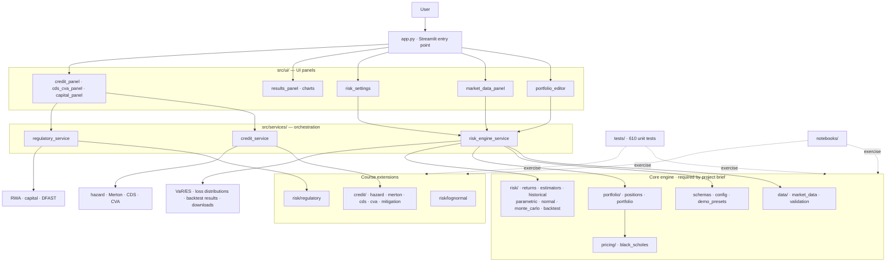

# MATH5320 Portfolio Risk System

A Streamlit application for portfolio risk analysis supporting stocks and European options.

## Features

| Feature | Details |
|---|---|
| **Historical VaR / ES** | Full portfolio repricing under overlapping h-day log-return scenarios |
| **Parametric VaR / ES** | Delta-Normal with horizon scaling; window or EWMA estimator |
| **Monte Carlo VaR / ES** | Full repricing under N(μ_h, Σ_h) simulated log-return shocks |
| **Black-Scholes Pricing** | European calls and puts with continuous dividends |
| **VaR Backtesting** | Walk-forward forecasting with Kupiec in the app and Christoffersen/Basel diagnostics in code |
| **Downloads** | JSON risk summary, losses CSV, backtest CSV |

## What Matters for the Brief

The project brief is narrower than the full repo. The core graded system is the stock and European-option risk engine:

- portfolio input,
- historical or manual parameter calibration,
- historical, parametric, and Monte Carlo VaR,
- historical, parametric, and Monte Carlo ES,
- walk-forward backtesting.

The credit, CVA, lognormal, and regulatory pieces are still part of the repo and still tested, but they should be read as course extensions rather than the main project boundary.

## Architecture Overview



The main split is simple: `app.py` handles Streamlit rendering and calls services when the user clicks "Run". The services orchestrate the math modules. All quantitative logic (pricing, risk, credit, regulatory) lives in pure Python modules under `src/` with no Streamlit imports, so tests and notebooks can call them directly without running the app.

## Repository Layout

```
MATH5320/
├── app.py                          # Streamlit entry point (UI only)
├── requirements.txt
├── README.md
├── src/
│   ├── schemas.py                  # StockPosition, OptionPosition, Portfolio
│   ├── config.py                   # Global defaults
│   ├── demo_presets.py             # Reproducible Streamlit demo presets
│   ├── data/
│   │   ├── market_data.py          # CSV loader + yfinance downloader + cache
│   │   └── validation.py           # Input validation
│   ├── pricing/
│   │   └── black_scholes.py        # BS price and delta
│   ├── portfolio/
│   │   ├── positions.py            # Per-position value and delta
│   │   └── portfolio.py            # Portfolio valuation and exposure vector
│   ├── risk/
│   │   ├── returns.py              # Log returns, overlapping horizon returns
│   │   ├── estimators.py           # Window and EWMA mean/covariance
│   │   ├── historical.py           # Historical VaR/ES
│   │   ├── parametric.py           # Delta-Normal VaR/ES
│   │   ├── normal.py               # Closed-form normal VaR/ES helpers
│   │   ├── monte_carlo.py          # Monte Carlo VaR/ES
│   │   ├── lognormal.py            # Exact GBM VaR/ES
│   │   ├── regulatory.py           # RWA, capital ratio, DFAST helpers
│   │   └── backtest.py             # Walk-forward backtest + Kupiec/Christoffersen
│   ├── credit/
│   │   ├── hazard.py               # Reduced-form hazard and survival
│   │   ├── merton.py               # Merton structural default model
│   │   ├── cds.py                  # CDS par spread
│   │   ├── cva.py                  # CVA and exposure helpers
│   │   └── mitigation.py           # Netting and collateral
│   ├── services/
│   │   ├── risk_engine_service.py  # Market-risk orchestration
│   │   ├── credit_service.py       # Credit and CVA orchestration
│   │   └── regulatory_service.py   # RWA and DFAST orchestration
│   └── ui/
│       ├── portfolio_editor.py     # Portfolio input
│       ├── market_data_panel.py    # Data loading
│       ├── risk_settings.py        # Parameter controls
│       ├── results_panel.py        # Results and downloads
│       ├── credit_panel.py         # Hazard / Merton panel
│       ├── cds_cva_panel.py        # CDS / CVA panel
│       ├── capital_panel.py        # Capital and stress panel
│       └── charts.py               # Plotly chart helpers
├── tests/                          # 610 no-network unit and regression tests
├── notebooks/                      # Course walkthrough notebooks
├── docs/
│   ├── references/
│   └── screenshots/
└── submission/                     # Final submission package
```

## Quick Start

```bash
# Install dependencies
pip install -r requirements.txt

# Run the app
streamlit run app.py
```

## Usage Workflow

1. **Portfolio Input** - Add stock positions (ticker + quantity) and option positions (label, underlying, type, quantity, strike, maturity, vol, r, q, multiplier).
2. **Market Data** - Download price history from Yahoo Finance or upload a CSV file.
3. **Risk Settings** - Configure lookback window, horizon, VaR/ES confidence levels, estimator type (window or EWMA), and Monte Carlo simulation count.
4. **Run Analysis** - Click "Run Risk Analysis" to compute all three VaR/ES models. Results include a comparison table, loss histograms, correlation heatmap, and download buttons.
5. **Backtesting** - Select a model and click "Run Backtest" for walk-forward VaR backtesting with Kupiec test results.

## Key Modelling Conventions

| Convention | Specification |
|---|---|
| **Returns** | Daily log returns: r_t = log(S_t / S_{t-1}) |
| **Horizon returns** | Overlapping rolling sum: R_t^(h) = Σ r_{t-k} for k=0..h-1 |
| **Price shock** | S_shocked = S_0 × exp(R) |
| **PnL** | pnl = V_T − V_0 |
| **Loss** | loss = V_0 − V_T (positive = loss) |
| **EWMA λ** | λ = (N−1)/(N+1) |
| **Horizon scaling** | μ_h = μ × h, Σ_h = Σ × h |
| **Parametric VaR** | −m + s × Φ⁻¹(confidence) |
| **Parametric ES** | −m + s × φ(z) / α |
| **Option pricing** | Black-Scholes with continuous dividends |
| **Kupiec test** | LR_uc ~ χ²(1) |

## Running Tests

All commands below are run from the project root.

### Full unit-test suite (no network)

```bash
python -m pytest tests/ --ignore=tests/integration_test.py --ignore=tests/integration_test_formula_sheet.py
```

### With coverage report

```bash
python -m pytest tests/ --cov=src --cov-report=term-missing \
  --ignore=tests/integration_test.py --ignore=tests/integration_test_formula_sheet.py
```

Coverage is reported with pytest-cov and reviewed through the terminal missing-line report.

### Individual test files

```bash
python -m pytest tests/test_backend.py -v            # Core engine + service layer
python -m pytest tests/test_course_validation.py -v  # PDF validation-sheet fixtures
python -m pytest tests/test_charts.py -v             # Plotly chart helpers
python -m pytest tests/test_ui_panels.py -v          # Streamlit UI panels (AppTest)
python -m pytest tests/test_credit.py -v             # hazard / Merton / CDS / CVA
python -m pytest tests/test_regulatory.py -v         # RWA / capital / DFAST
python -m pytest tests/test_lognormal.py -v          # Exact GBM VaR / ES
python -m pytest tests/test_market_data.py -v        # CSV loader + yfinance wrappers
python -m pytest tests/test_config_and_validation.py -v
python -m pytest tests/test_credit_service.py -v
python -m pytest tests/test_coverage_gaps.py -v
```

### Running a single class or test

```bash
python -m pytest tests/test_course_validation.py::TestLN02_HomeworkIV -v
python -m pytest tests/test_course_validation.py::TestMR01_HomeworkVII_QvsP::test_pd_Q -v
```

### Network integration tests

```bash
python tests/integration_test.py                  # End-to-end with real market data
python tests/integration_test_formula_sheet.py    # Full formula-sheet integration
```

### Useful pytest flags

| Flag | Effect |
|---|---|
| `-v` | Verbose (one line per test) |
| `-x` | Stop at first failure |
| `-k "merton"` | Only tests matching the keyword |
| `--lf` | Re-run only last failures |
| `-s` | Don't capture stdout (useful for debugging prints) |

### Course validation fixtures

`tests/test_course_validation.py` encodes the course-supplied fixtures from
`risk_engine_validation_test_sheet.pdf` (LN01–LN04, HZ01–HZ04, MR01–MR02,
CDS01–CDS04, CVA01–CVA05, REG01–REG02, plus non-numeric monotonicity /
methodology checks). Numerical goldens are compared at approximately 1%
relative tolerance (`REL = 0.01` in `tests/test_course_validation.py`).

The two AAPL/CAT acceptance tests (ACC01, ACC02) skip cleanly unless
`data/AAPL-bloomberg.csv` and `data/CAT-bloomberg.csv` are present.

## Project Requirements Coverage Matrix

Requirements from `docs/references/project_requirements.pdf` (MATH GR 5320).

| Requirement | Status | Implementation | Tests |
|---|---|---|---|
| Accept stock and option positions as input | ✅ | [src/schemas.py](src/schemas.py), [src/ui/portfolio_editor.py](src/ui/portfolio_editor.py) | [tests/test_backend.py](tests/test_backend.py) |
| Calibrate to historical price data | ✅ | [src/data/market_data.py](src/data/market_data.py), [src/risk/returns.py](src/risk/returns.py), [src/risk/estimators.py](src/risk/estimators.py) | [tests/test_market_data.py](tests/test_market_data.py), [tests/test_backend.py](tests/test_backend.py) |
| Accept manual parameters as input | ✅ | [src/risk/estimators.py](src/risk/estimators.py) (`manual_mean_cov`) | [tests/test_coverage_gaps.py](tests/test_coverage_gaps.py) |
| Compute historical VaR and ES | ✅ | [src/risk/historical.py](src/risk/historical.py) | [tests/test_backend.py](tests/test_backend.py), [tests/test_homework_cases.py](tests/test_homework_cases.py) |
| Compute parametric (delta-normal) VaR and ES | ✅ | [src/risk/parametric.py](src/risk/parametric.py) | [tests/test_backend.py](tests/test_backend.py), [tests/test_course_validation.py](tests/test_course_validation.py) |
| Compute Monte Carlo VaR and ES | ✅ | [src/risk/monte_carlo.py](src/risk/monte_carlo.py) | [tests/test_backend.py](tests/test_backend.py), [tests/test_course_validation.py](tests/test_course_validation.py) |
| Backtest VaR against historical exceptions | ✅ | [src/risk/backtest.py](src/risk/backtest.py), [src/ui/results_panel.py](src/ui/results_panel.py) | [tests/test_backtest_extensions.py](tests/test_backtest_extensions.py), [tests/test_course_validation.py](tests/test_course_validation.py) |
| Option pricing (Black-Scholes) | ✅ | [src/pricing/black_scholes.py](src/pricing/black_scholes.py) | [tests/test_backend.py](tests/test_backend.py), [tests/test_coverage_gaps.py](tests/test_coverage_gaps.py) |
| Covariance estimation (window and EWMA) | ✅ | [src/risk/estimators.py](src/risk/estimators.py) | [tests/test_backend.py](tests/test_backend.py), [tests/test_coverage_gaps.py](tests/test_coverage_gaps.py) |
| Option volatility shock (not just fixed vol) | ✅ | [src/risk/historical.py](src/risk/historical.py) (`option_vol_shock_mode="underlying_beta"`) | [tests/test_backend.py](tests/test_backend.py) |

**Grading penalty flags addressed:**

| Penalty flag (project guide) | How it is addressed |
|---|---|
| Not modelling volatility changes for options | `underlying_beta` shock mode scales option vol with the underlying return: `σ' = max(floor, σ·(1 − β·R))`. Default remains `fixed`; `underlying_beta` is available and demonstrated in `submission/advanced_demo.ipynb §7`. |
| Using historical volatility instead of implied volatility | Option positions carry a user-supplied `volatility` field (implied vol). The system does not back out implied vol from market prices; this limitation is documented in `submission/00_combined_final_report.md §10`. |
| Incorrect covariance | Covariance is estimated from historical log returns using a rolling window or EWMA; the delta-dollar exposure vector is computed correctly as `x = n·S·Δ`. See [src/risk/parametric.py](src/risk/parametric.py) and [tests/test_strict_numerics.py](tests/test_strict_numerics.py). |
| Inappropriate parametric VaR | Parametric VaR uses the correct delta-normal formula: `VaR = −m + s·Φ⁻¹(α)` with proper h-day horizon scaling. See [src/risk/normal.py](src/risk/normal.py) and [tests/test_course_validation.py](tests/test_course_validation.py). |
| Tests not supporting model-doc conclusions | 610 no-network tests with 96% statement coverage. Course fixture values (HW03–HW11) are embedded in [tests/test_homework_cases.py](tests/test_homework_cases.py) and [tests/test_course_validation.py](tests/test_course_validation.py). |

---

## Final Submission Documents

The final submission package is in `submission/`.

| File | Purpose |
|---|---|
| `submission/00_combined_final_report.md` | Primary final report |
| `submission/01_model_documentation.md` | Model documentation |
| `submission/02_software_design_documentation.md` | Software design documentation |
| `submission/03_test_plan.md` | Test plan |
| `submission/04_test_results.md` | Test results |
| `submission/demo.ipynb` | Formula-sheet demonstration notebook (15 sections, fully executed) |
| `submission/demo.md` | Front-end workflow trace with screenshots |
| `submission/advanced_demo.ipynb` | Advanced demo: equal-weight M7 portfolio, §1-§10 including manual calibration and option-vol shock checks |
| `submission/advanced_demo.md` | M7 portfolio front-end trace with screenshots plus notebook-only proof for prompt-sensitive checks |
