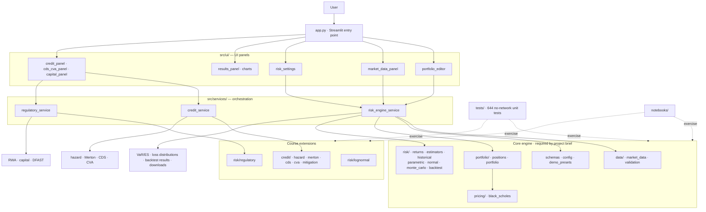

# MATH5320 Portfolio Risk System

**Course:** MATH GR 5320 Financial Risk Management, Columbia University, Spring 2026
**Authors:** Nigel Li, Michael Adegbite, Stella
**Test suite:** 644 passed, 1 skipped, 95% statement coverage

A portfolio risk calculation system supporting stocks and European options. Computes historical, parametric (delta-normal), and Monte Carlo VaR and ES, with walk-forward backtesting (Kupiec, Christoffersen, Basel traffic-light). Extension modules cover exact lognormal VaR/ES, reduced-form hazard models, Merton structural default, CDS pricing, CVA, and regulatory capital.

---

## Deliverables

The project has five graded deliverables. PDFs are compiled from the LaTeX sources in `submission/latex_deliverables/`.

| # | Deliverable | Points | LaTeX source | Pages |
|---|---|---|---|---|
| 1 | Model Documentation | 30 | `01_model_documentation.tex` | 18 |
| 2 | Software Design Documentation | 15 | `02_software_design_documentation.tex` | 24 |
| 3 | Test Plan | 20 | `03_test_plan.tex` | 20 |
| 4 | Software | 25 | *(this repository)* | -- |
| 5 | Test Results | 10 | `04_test_results.tex` | 14 |

A combined report (`00_combined_final_report.tex`, 27 pages) consolidates all five deliverables into a single document with crosswalk tables that map requirements, Bloomberg MRM template sections, and grading criteria to specific pages.

### Compiling the PDFs

```bash
cd submission/latex_deliverables
pdflatex -interaction=nonstopmode 00_combined_final_report.tex   # run twice for TOC
pdflatex -interaction=nonstopmode 00_combined_final_report.tex
```

An `images/` symlink in that directory resolves all screenshot references automatically.

---

## Quick Start

```bash
pip install -r requirements.txt
streamlit run app.py
```

The app has 8 tabs: Portfolio Input, Market Data, Risk Settings, Run Analysis, Backtesting, Credit Risk, CDS/CVA, and Capital & Stress.

---

## Verifying the Software (Deliverable 4)

The system handles arbitrary portfolios. Two pre-built notebooks demonstrate this end to end without requiring the Streamlit app. Both are fully executed and included in `submission/`.

### `submission/demo.ipynb` — Formula-sheet walkthrough (15 sections)

Walks through every formula-sheet topic using the programmatic API:

| Section | What it covers |
|---|---|
| §1 | Coverage matrix and risk-measure theory |
| §2 | European option pricing and delta (Black-Scholes) |
| §3 | Delta-hedge intuition |
| §4 | Historical scenario VaR and ES |
| §5 | Single-stock GBM VaR (exact lognormal) |
| §6 | Two-stock parametric VaR |
| §7 | Rolling window vs EWMA calibration |
| §8 | Historical AAPL/CAT VaR and ES on real data |
| §9 | Monte Carlo VaR and ES |
| §10 | VaR backtesting (Kupiec test) |
| §11 | Hazard rate / reduced-form credit model |
| §12 | Merton structural credit model |
| §13 | CDS pricing |
| §14 | CVA and counterparty risk mitigation |
| §15 | Regulatory capital / RWA |

### `submission/advanced_demo.ipynb` — Equal-weight Magnificent 7 portfolio

Demonstrates the system on a realistic multi-asset portfolio (AAPL, MSFT, GOOGL, AMZN, NVDA, META, TSLA) with options:

| Section | What it proves |
|---|---|
| §1 | Arbitrary portfolio construction (7 stocks) |
| §2 | All three VaR/ES models on a stock-only basket |
| §3 | Diversification benefit (portfolio VaR < sum of individual VaRs) |
| §4 | Adding option positions to an existing portfolio |
| §5 | Full stock + option portfolio risk across all models |
| §6 | **Manual parameter input** — bypasses historical calibration, feeds μ and Σ directly |
| §7 | **Option volatility shock sensitivity** — demonstrates `underlying_beta` mode |
| §8 | Walk-forward VaR backtesting with diagnostics |
| §9 | Merton structural default model on a real ticker |
| §10 | Frontend validation summary with screenshots |

To re-run either notebook yourself:

```bash
pip install -r requirements.txt
jupyter notebook submission/demo.ipynb
jupyter notebook submission/advanced_demo.ipynb
```

### `submission/demo.md` / `submission/advanced_demo.md` — Frontend workflow traces

Step-by-step Streamlit screenshots showing the full UI workflow for the same portfolios.

### `notebooks/ta_grader_demo.ipynb` — TA / grader notebook

> **For the TA / grader:** This notebook is designed so you can test the system with your own price data without touching any other file.

1. Drop your Bloomberg or Yahoo-format CSV files into `data/`.
2. Open `notebooks/ta_grader_demo.ipynb` and edit **only the configuration cell at the top** (§ 1) — tickers, filenames, portfolio weights, horizon, confidence level.
3. Run all cells top-to-bottom. No other changes are needed.

The notebook covers the full pipeline: data loading → covariance estimation (rolling and EWMA) → historical / parametric / Monte Carlo VaR and ES → walk-forward backtesting with Kupiec and Christoffersen diagnostics → credit and CVA extension formulas. Each section is self-contained and labelled.

Supported data formats:

| Format | Example filename | Required columns |
|---|---|---|
| Bloomberg single-ticker | `AAPL-bloomberg.csv` | `Dates`, `PX_LAST` |
| Bloomberg multi-ticker | `prices.csv` | `Dates`, one column per ticker |
| Yahoo Finance (via `yfinance`) | *(downloaded automatically)* | n/a |

```bash
pip install -r requirements.txt
jupyter notebook notebooks/ta_grader_demo.ipynb
```

---

## Running Tests

### Full no-network suite

```bash
python -m pytest tests/ --ignore=tests/integration_test.py --ignore=tests/integration_test_formula_sheet.py
```

Expected: **644 passed, 1 skipped**.

### With coverage

```bash
python -m pytest tests/ --cov=src --cov-report=term-missing \
  --ignore=tests/integration_test.py --ignore=tests/integration_test_formula_sheet.py
```

Expected: **95% statement coverage** (2225 statements, 110 missed).

### Network integration tests

```bash
python tests/integration_test.py                  # End-to-end with live Yahoo data
python tests/integration_test_formula_sheet.py    # Full formula-sheet integration
```

### Course validation fixtures

`tests/test_course_validation.py` embeds fixtures from the course-supplied `risk_engine_validation_test_sheet.pdf` (LN01-LN04, HZ01-HZ04, MR01-MR02, CDS01-CDS04, CVA01-CVA05, REG01-REG02). Numerical values match at 1% relative tolerance.

### Individual test files

```bash
python -m pytest tests/test_backend.py -v              # Core engine + service layer (43 tests)
python -m pytest tests/test_numerical_precision.py -v   # IEEE 754 failure modes (7 tests)
python -m pytest tests/test_course_validation.py -v     # Course fixture goldens
python -m pytest tests/test_homework_cases.py -v        # Homework regression fixtures
python -m pytest tests/test_credit.py -v                # Hazard / Merton / CDS / CVA
python -m pytest tests/test_lognormal.py -v             # Exact GBM VaR / ES
python -m pytest tests/test_regulatory.py -v            # RWA / capital / DFAST
python -m pytest tests/test_strict_numerics.py -v       # Numerical discipline
python -m pytest tests/test_ui_panels.py -v             # Streamlit UI panels
python -m pytest tests/test_market_data.py -v           # CSV loader + yfinance wrappers
```

---

## Project Requirements Compliance

Requirements from `docs/references/project_requirements.pdf`.

| Requirement | Status | Where to verify |
|---|---|---|
| Stock and option positions as input | Done | `src/schemas.py`; `advanced_demo.ipynb §1, §4` |
| Calibrate to historical data | Done | `src/risk/estimators.py`; `demo.ipynb §7` |
| Accept manual parameters as input | Done | `parametric_var_es(calibration_mode="manual")`; `advanced_demo.ipynb §6` |
| Historical VaR and ES | Done | `src/risk/historical.py`; `demo.ipynb §4, §8` |
| Parametric (delta-normal) VaR and ES | Done | `src/risk/parametric.py`; `demo.ipynb §6` |
| Monte Carlo VaR and ES | Done | `src/risk/monte_carlo.py`; `demo.ipynb §9` |
| Backtest VaR against history | Done | `src/risk/backtest.py`; `demo.ipynb §10`, `advanced_demo.ipynb §8` |

### Grading penalty flags

| Penalty flag | How it is addressed | Where to verify |
|---|---|---|
| Not modelling volatility changes for options | `underlying_beta` shock mode scales option vol with the underlying return | `advanced_demo.ipynb §7` |
| Using historical vol instead of implied vol | `OptionPosition.volatility` is a user-supplied implied vol field | `src/schemas.py`, model doc §4.5 |
| Incorrect covariance | Window and EWMA covariance from log returns; delta-dollar exposures `x = n*S*delta` | `tests/test_strict_numerics.py` |
| Inappropriate parametric VaR | `VaR = -m + s * Phi^{-1}(alpha)` with h-day horizon scaling | `src/risk/normal.py`, `tests/test_course_validation.py` |
| Tests not supporting model-doc conclusions | 644 tests, 95% coverage, course homework fixtures embedded | `tests/test_homework_cases.py`, `tests/test_course_validation.py` |

---

## Architecture



All quantitative logic lives in pure Python modules under `src/` with no Streamlit imports, so tests and notebooks call the same functions the app uses.

## Repository Layout

```
MATH5320/
├── app.py                          # Streamlit entry point (UI only)
├── requirements.txt
├── README.md
├── src/
│   ├── schemas.py                  # StockPosition, OptionPosition, Portfolio
│   ├── config.py                   # Global defaults
│   ├── demo_presets.py             # Reproducible Streamlit demo presets
│   ├── data/
│   │   ├── market_data.py          # CSV loader + yfinance downloader + cache
│   │   └── validation.py           # Input validation
│   ├── pricing/
│   │   └── black_scholes.py        # BS price and delta
│   ├── portfolio/
│   │   ├── positions.py            # Per-position value and delta
│   │   └── portfolio.py            # Portfolio valuation and exposure vector
│   ├── risk/
│   │   ├── returns.py              # Log returns, overlapping horizon returns
│   │   ├── estimators.py           # Window and EWMA mean/covariance
│   │   ├── historical.py           # Historical VaR/ES
│   │   ├── parametric.py           # Delta-Normal VaR/ES
│   │   ├── normal.py               # Closed-form normal VaR/ES helpers
│   │   ├── monte_carlo.py          # Monte Carlo VaR/ES
│   │   ├── lognormal.py            # Exact GBM VaR/ES
│   │   ├── regulatory.py           # RWA, capital ratio, DFAST helpers
│   │   └── backtest.py             # Walk-forward backtest + Kupiec/Christoffersen
│   ├── credit/
│   │   ├── hazard.py               # Reduced-form hazard and survival
│   │   ├── merton.py               # Merton structural default model
│   │   ├── cds.py                  # CDS par spread
│   │   ├── cva.py                  # CVA and exposure helpers
│   │   └── mitigation.py           # Netting and collateral
│   ├── services/
│   │   ├── risk_engine_service.py  # Market-risk orchestration
│   │   ├── credit_service.py       # Credit and CVA orchestration
│   │   └── regulatory_service.py   # RWA and DFAST orchestration
│   └── ui/
│       ├── portfolio_editor.py     # Portfolio input
│       ├── market_data_panel.py    # Data loading
│       ├── risk_settings.py        # Parameter controls
│       ├── results_panel.py        # Results and downloads
│       ├── credit_panel.py         # Hazard / Merton panel
│       ├── cds_cva_panel.py        # CDS / CVA panel
│       ├── capital_panel.py        # Capital and stress panel
│       └── charts.py               # Plotly chart helpers
├── tests/                          # 644 no-network unit and regression tests
├── notebooks/                      # Course walkthrough notebooks
├── docs/
│   ├── references/                 # Project requirements PDF, validation sheet
│   └── screenshots/                # Application screenshots (used in LaTeX reports)
└── submission/                     # Final submission package (see below)
```

---

## Submission Package Contents

```
submission/
├── latex_deliverables/
│   ├── 00_combined_final_report.tex    # All 5 deliverables in one document (27 pp)
│   ├── 01_model_documentation.tex      # Deliverable 1 (18 pp)
│   ├── 02_software_design_documentation.tex  # Deliverable 2 (24 pp)
│   ├── 03_test_plan.tex                # Deliverable 3 (20 pp)
│   ├── 04_test_results.tex             # Deliverable 5 (14 pp)
│   └── images -> ../../docs/screenshots/
├── 00_combined_final_report.md         # Markdown mirrors
├── 01_model_documentation.md
├── 02_software_design_documentation.md
├── 03_test_plan.md
├── 04_test_results.md
├── demo.ipynb                          # Formula-sheet demo (15 sections, executed)
├── demo.md                             # Frontend workflow trace with screenshots
├── advanced_demo.ipynb                 # M7 portfolio demo (10 sections, executed)
├── advanced_demo.md                    # M7 frontend trace with screenshots
└── test_artifacts/
    ├── pytest_output.txt               # Full pytest output (644 passed, 1 skipped)
    └── coverage_output.txt             # Coverage report (95%, 2225 stmts, 110 missed)
```

---

## Key Modelling Conventions

| Convention | Specification |
|---|---|
| **Returns** | Daily log returns: r_t = log(S_t / S_{t-1}) |
| **Horizon returns** | Overlapping rolling sum: R_t^(h) = sum r_{t-k} for k=0..h-1 |
| **Price shock** | S_shocked = S_0 * exp(R) |
| **PnL** | pnl = V_T - V_0 |
| **Loss** | loss = V_0 - V_T (positive = loss) |
| **EWMA lambda** | lambda = (N-1)/(N+1) |
| **Horizon scaling** | mu_h = mu * h, Sigma_h = Sigma * h |
| **Parametric VaR** | -m + s * Phi^{-1}(confidence) |
| **Parametric ES** | -m + s * phi(z) / alpha |
| **Option pricing** | Black-Scholes with continuous dividends |
| **Kupiec test** | LR_uc ~ chi-squared(1) |

---

## Programmatic API

All quantitative modules are plain Python — no Streamlit dependency — so you can call them directly from a notebook, script, or test without running the app.  The canonical entry points are described below, grouped by layer.

### 1 · Data structures

```python
from src.schemas import Portfolio, StockPosition, OptionPosition
from datetime import date

# Long 100 AAPL + long 1 call on AAPL
portfolio = Portfolio(
    stocks=[StockPosition(ticker="AAPL", quantity=100)],
    options=[
        OptionPosition(
            ticker="AAPL_C_200",
            underlying_ticker="AAPL",
            option_type="call",
            quantity=1,
            strike=200.0,
            maturity=date(2026, 12, 19),
            volatility=0.25,          # implied vol
            risk_free_rate=0.045,
            dividend_yield=0.0,
            multiplier=100,
        )
    ],
)
```

`StockPosition` validates that `ticker` is non-empty and `quantity` is finite; `OptionPosition` validates all seven positivity and range constraints at construction time.

---

### 2 · Market data

```python
from src.data.market_data import (
    load_price_history_csv,
    download_adjusted_close,
    download_adjusted_close_cached,
    fetch_risk_free_rate,
)

# From CSV (Bloomberg wide format)
prices = load_price_history_csv("data/AAPL-bloomberg.csv")

# From Yahoo Finance (plain, no cache)
prices = download_adjusted_close(["AAPL", "MSFT"], start="2022-01-01", end="2025-01-01")

# Fault-tolerant: parquet cache + retry + per-ticker fallback
prices = download_adjusted_close_cached(
    ["AAPL", "MSFT", "^GSPC"],
    start="2022-01-01", end="2025-01-01",
    cache_dir=".cache/prices", max_retries=3,
)

# Risk-free rate proxy from ^TNX (falls back to 0.04 on any failure)
from datetime import date
r = fetch_risk_free_rate(asof=date.today(), fallback=0.04)
```

**Returns:** `pd.DataFrame` with `DatetimeIndex` and ticker columns; values are adjusted-close prices.

---

### 3 · Service layer (recommended entry point)

`RiskEngineService` orchestrates all three VaR/ES models and the backtest:

```python
from src.services.risk_engine_service import RiskEngineService

svc = RiskEngineService(
    portfolio=portfolio,
    prices=prices,
    pricing_date=date(2025, 1, 2),
    lookback_days=252,
    horizon_days=10,
    var_confidence=0.99,
    es_confidence=0.975,
    estimator="window",      # or "ewma"
    ewma_N=60,
    n_simulations=10_000,
)

# Current portfolio mark-to-market
V0 = svc.portfolio_value()

# All three models in one call
results = svc.run_all()
print(results["historical"]["var"])    # Historical VaR ($)
print(results["parametric"]["es"])     # Parametric ES ($)
print(results["monte_carlo"]["var"])   # Monte Carlo VaR ($)
```

`results["historical"]` / `results["parametric"]` / `results["monte_carlo"]` each contain at minimum `{"var": float, "es": float}`.

#### Backtesting

```python
bt = svc.run_backtest(model="historical")  # or "parametric" / "monte_carlo"

df = bt["backtest_df"]          # pd.DataFrame: date, var_forecast, realized_loss, exception
kupiec = bt["kupiec"]           # {"p_hat", "lr_stat", "p_value", "reject_h0", ...}
cc = bt["conditional_coverage"] # Christoffersen (independence + joint coverage)
basel = bt["basel"]             # {"zone": "GREEN"|"YELLOW"|"RED", "n_exceptions": int, ...}
severity = bt["severity"]       # {"exception_gap", "average_exception_loss", ...}
```

---

### 4 · Risk modules (direct calls)

Each risk module is a pure function; use these when you need fine-grained control.

#### Historical VaR / ES

```python
from src.risk.historical import historical_var_es

res = historical_var_es(
    portfolio=portfolio,
    prices=prices,
    pricing_date=date(2025, 1, 2),
    lookback_days=252,
    horizon_days=10,
    var_confidence=0.99,
    es_confidence=0.975,
)
# res["var"], res["es"], res["losses"] (np.ndarray), res["n_scenarios"]
```

#### Parametric (Delta-Normal) VaR / ES

```python
from src.risk.parametric import parametric_var_es

res = parametric_var_es(
    portfolio=portfolio,
    prices=prices,
    pricing_date=date(2025, 1, 2),
    lookback_days=252,
    horizon_days=10,
    var_confidence=0.99,
    es_confidence=0.975,
    estimator="ewma",
    ewma_N=60,
)
# res["var"], res["es"], res["mean_pnl"], res["std_pnl"]
```

You can also pass **manual** mean / covariance parameters (e.g. from the course homework inputs):

```python
res = parametric_var_es(
    ...,
    calibration_mode="manual",
    manual_market_params={
        "mu_daily": {"AAPL": 0.0003, "MSFT": 0.0004},
        "cov_daily": {
            "AAPL": {"AAPL": 4e-4, "MSFT": 2e-4},
            "MSFT": {"AAPL": 2e-4, "MSFT": 3e-4},
        },
    },
)
```

#### Monte Carlo VaR / ES

```python
from src.risk.monte_carlo import monte_carlo_var_es

res = monte_carlo_var_es(
    portfolio=portfolio,
    prices=prices,
    pricing_date=date(2025, 1, 2),
    lookback_days=252,
    horizon_days=10,
    var_confidence=0.99,
    es_confidence=0.975,
    n_simulations=20_000,
    random_seed=42,
)
# res["var"], res["es"], res["losses"] (np.ndarray, length n_simulations)
```

---

### 5 · Closed-form normal VaR / ES

```python
from src.risk.normal import normal_var, normal_es, portfolio_delta_normal_mean_var
import numpy as np

# If you already have exposures (x), daily mu, and daily Sigma:
x   = np.array([100_000.0, -50_000.0])   # dollar-delta exposures
mu  = np.array([0.0003, 0.0004]) * 10    # 10-day mean log returns
cov = np.eye(2) * 1e-3 * 10             # 10-day covariance

m, s = portfolio_delta_normal_mean_var(x, mu, cov)
var  = normal_var(m, s, confidence=0.99)
es   = normal_es(m, s, confidence=0.975)
```

---

### 6 · Exact lognormal (GBM) VaR / ES

```python
from src.risk.lognormal import (
    var_long_lognormal, es_long_lognormal,
    var_short_lognormal, es_short_lognormal,
)

# 5-trading-day 99% VaR on a $100 000 long GBM position
var = var_long_lognormal(V0=100_000, mu=0.08, sigma=0.20, h=5/252, p=0.99)
es  = es_long_lognormal( V0=100_000, mu=0.08, sigma=0.20, h=5/252, p=0.975)

# Short position — losses come from upward moves
var_short = var_short_lognormal(V0=100_000, mu=0.08, sigma=0.20, h=5/252, p=0.99)
```

---

### 7 · Credit modules

#### Reduced-form hazard model

```python
from src.credit.hazard import survival, cumulative_default_prob, credit_spread, survival_piecewise

# Constant hazard
s5 = survival(t=5, lam=0.03)                     # P(tau > 5) under lambda=3%
pd5 = cumulative_default_prob(t=5, lam=0.03)     # P(tau <= 5)
spread = credit_spread(T=5, LGD=0.60, s_T=s5)   # Implied credit spread

# Piecewise-constant hazard
s = survival_piecewise(t=3.5, grid=[0,1,3,5,10], hazards=[0.01,0.02,0.03,0.04])
```

#### Merton structural model

```python
from src.credit.merton import merton_pd, merton_equity, merton_debt, merton_implied_B
from src.services.credit_service import merton_summary

# Full snapshot: Q-PD, P-PD, E0, D0 in one call
snap = merton_summary(V0=100, B=80, r=0.05, mu=0.08, sigma=0.25, T=1)
print(snap["Q"]["PD"])   # Risk-neutral default probability
print(snap["P"]["PD"])   # Real-world default probability
print(snap["E0"])        # Equity value
print(snap["D0"])        # Risky debt value

# Find the barrier B* that implies a target 1-year survival of 90%
B_star = merton_implied_B(V0=100, target_survival=0.90, r=0.05, sigma=0.25, T=1)
```

#### CDS par spread

```python
from src.credit.cds import cds_par_spread_constant_hazard, cds_par_spread

# Quick approximation: C ~ (1-R)*lambda  (~180 bps at lambda=3%, R=40%)
spread_approx = cds_par_spread_constant_hazard(lam=0.03, R=0.40)

# Full numerical formula with piecewise hazard
spread_full = cds_par_spread(
    payment_times=[1, 2, 3, 4, 5],
    hazards=[0.03]*5,
    r=0.03, R=0.40,
)
```

#### CVA

```python
from src.credit.cva import cva_discrete, cva_continuous_constant_exposure
from src.services.credit_service import cva_summary

# Discrete CVA from EPE profile
cva = cva_discrete(
    exposures=[1_000, 800, 600, 400],          # EPE at t=1,2,3,4
    marginal_default_probs=[0.02, 0.019, 0.018, 0.017],
    R=0.40,
)

# Full summary with CVA as % of V0
summary = cva_summary(exposures, marginal_default_probs, R=0.40, V0=50_000)
print(summary["cva_pct"])
```

---

### 8 · Regulatory capital

```python
from src.risk.regulatory import risk_weighted_assets, capital_ratio, apply_stress_scenario
from src.services.regulatory_service import compute_rwa_and_ratio, run_dfast

import pandas as pd
from datetime import date

spots = pd.Series({"AAPL": 200.0, "MSFT": 420.0})

# RWA + capital ratio (uses BS-delta exposures for options)
rwa_result = compute_rwa_and_ratio(
    portfolio=portfolio,
    prices=spots,
    risk_weights={"AAPL": 1.0, "MSFT": 1.0},
    equity=50_000.0,
    pricing_date=date(2025, 1, 2),
)
print(rwa_result["ratio"], rwa_result["pass"])

# DFAST equity stress scenarios (baseline / adverse / severely_adverse)
dfast = run_dfast(portfolio=portfolio, prices=spots, pricing_date=date(2025, 1, 2))
for name, res in dfast.items():
    print(f"{name}: PnL = ${res['pnl']:,.0f}  ({res['equity_shock']:+.0%})")
```

---

### 9 · Backtest statistics in isolation

```python
from src.risk.backtest import kupiec_test, christoffersen_test, conditional_coverage_test, basel_traffic_light
import numpy as np

# Suppose 250 backtest days with 6 exceptions
kupiec = kupiec_test(n_observations=250, n_exceptions=6, var_confidence=0.99)
# {"lr_stat", "p_value", "reject_h0", "p_hat", ...}

exceptions = np.zeros(250, dtype=int)
exceptions[[10, 50, 100, 150, 200, 240]] = 1
cc = conditional_coverage_test(
    n_observations=250, n_exceptions=6,
    var_confidence=0.99, exceptions=exceptions,
)
# Adds {"lr_cc", "p_value_cc", "reject_cc", ...}

zone = basel_traffic_light(n_exceptions=6)
# {"zone": "GREEN", "n_exceptions": 6, "multiplier": 0.0, ...}
```

---

### 10 · Covariance estimators

```python
from src.risk.estimators import get_mean_cov, manual_mean_cov
from src.risk.returns import compute_log_returns

log_ret = compute_log_returns(prices)

# Rolling window
mu, cov = get_mean_cov(log_ret, lookback_days=252, estimator="window")

# EWMA (lambda = (N-1)/(N+1), here N=60 -> lambda~0.967)
mu, cov = get_mean_cov(log_ret, lookback_days=252, estimator="ewma", ewma_N=60)

# Manual override
mu, cov = manual_mean_cov(
    manual_market_params={
        "mu_daily": {"AAPL": 0.0003, "MSFT": 0.0004},
        "cov_daily": {
            "AAPL": {"AAPL": 4e-4, "MSFT": 2e-4},
            "MSFT": {"AAPL": 2e-4, "MSFT": 3e-4},
        },
    },
    underlyings=["AAPL", "MSFT"],
)
```

---

### 11 · Bloomberg CSV format

The system accepts any wide-format CSV where the first column is the date and subsequent columns are ticker symbols.  This matches the Bloomberg terminal export with minor pre-processing:

```
Date,AAPL US Equity,CAT US Equity
2023-01-03,125.07,228.47
2023-01-04,126.36,231.29
...
```

Rename the header row so tickers match what you pass to `download_adjusted_close` or specify in `StockPosition` / `OptionPosition`.  No other transformation is needed; the loader handles date parsing and sort order automatically.

See `submission/demo.ipynb` for complete worked examples of every module.
