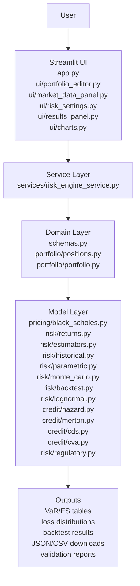
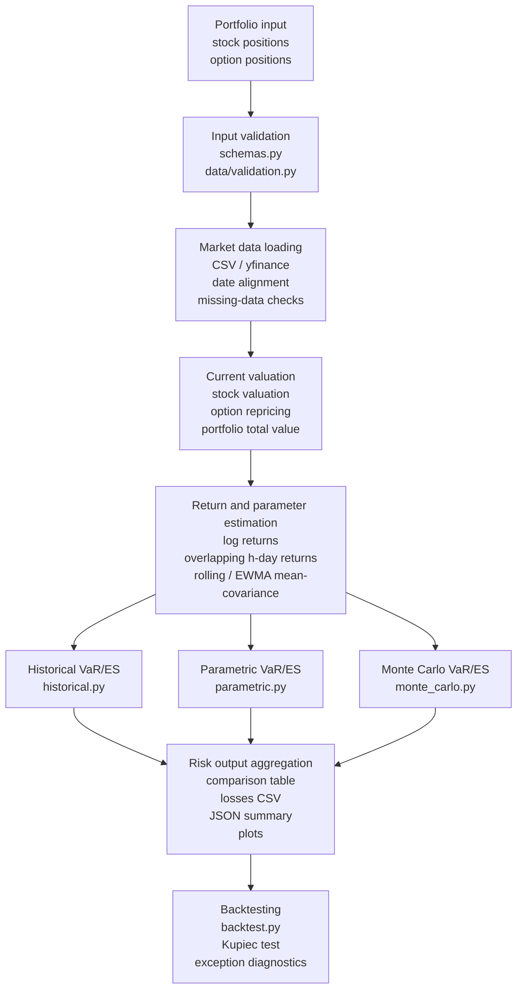
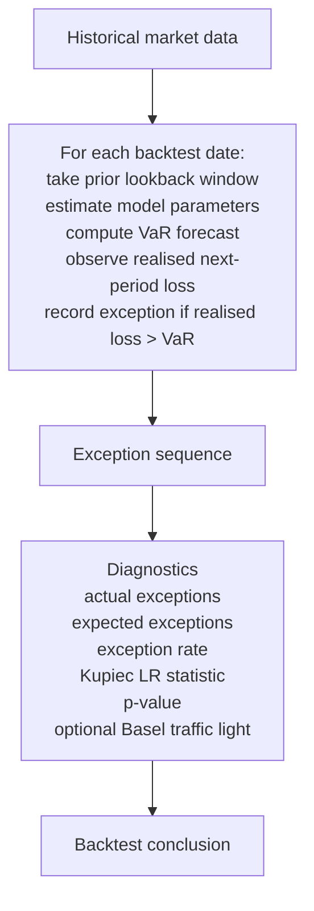
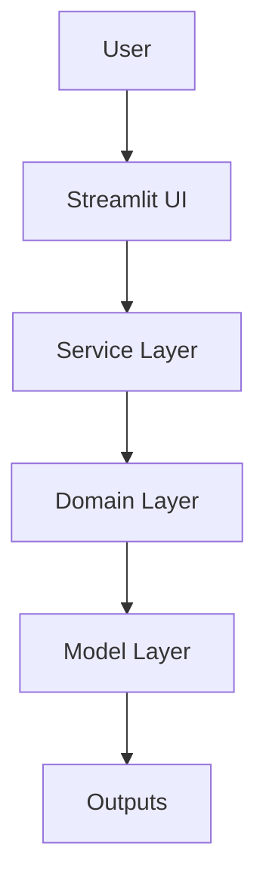
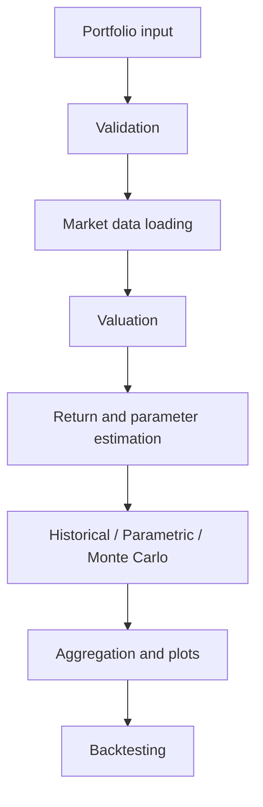
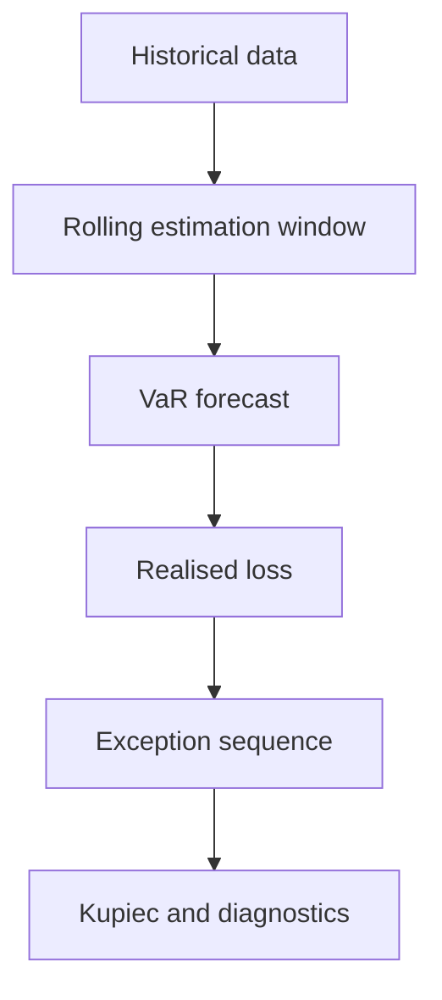

# Deliverable 2: Software Design Documentation Report

## 1. Executive Summary

The `MATH5320` repository implements a modular Python and Streamlit risk engine for portfolios of stocks and European options. The design separates user interface code, data loading, portfolio representation, pricing logic, risk models, orchestration, and validation tests. This separation is appropriate for a risk engine because the quantitative functions can be tested independently of the Streamlit interface, and the UI can be treated as a thin presentation layer over a reusable analytical core.

The README describes the core application workflow clearly: portfolio input, market data loading, risk settings, risk analysis, and VaR backtesting. That workflow is reflected directly in the codebase structure. `app.py` controls the top-level Streamlit flow, `src/ui/` contains panel-level UI logic, `src/services/` orchestrates end-to-end computations, `src/portfolio/` and `src/schemas.py` define the portfolio domain model, `src/pricing/` and `src/risk/` hold the analytical logic, and `tests/` validates the implementation.

The software architecture is appropriate for an academic risk engine because it:

- separates data gathering from calibration and computation,
- isolates pricing and risk formulas into mostly pure functions,
- enables unit and integration testing against known numerical fixtures,
- supports extension into course-formula modules without destabilizing the core stock/option risk application.

---

## 2. System Purpose and Scope

### 2.1 Purpose

The system is an educational portfolio risk application for MATH GR 5320. Its core purpose is to let a user:

- define a portfolio of stocks and European options,
- load historical market data,
- compute VaR and ES under multiple methodologies,
- compare methods under common data and parameter choices,
- run walk-forward VaR backtests,
- inspect supporting diagnostics and downloadable outputs.

The core required system is the stock-and-European-option risk engine. The repository also contains extension modules for exact GBM/lognormal risk, hazard-rate credit, Merton structural default, CDS, CVA, counterparty mitigation, and illustrative regulatory capital/DFAST-style calculations.

### 2.2 Scope

In scope:

- Stocks
- European calls and puts
- Historical, parametric, and Monte Carlo VaR
- Historical, parametric, and Monte Carlo ES
- Walk-forward VaR backtesting
- CSV and Yahoo Finance data loading
- Downloadable risk outputs
- Course-formula validation modules

Out of scope:

- Production trading or production risk management
- Enterprise authorization, audit, and access control
- American or path-dependent option pricing
- Full volatility-surface or stochastic-volatility repricing
- Official supervisory DFAST/CCAR modeling
- Production XVA or issuer-level enterprise credit systems

### 2.3 Software-Design Compliance Matrix

| Lecture 5 / model-risk design requirement | What this report includes |
|---|---|
| Clear statement of purpose | Section 2, System Purpose and Scope |
| Design documentation | Sections 3, 4, 5, and 14 with diagrams and module inventories |
| Data analysis | Sections 4, 6, and 8 covering loading, alignment, cleaning, and validation |
| Testing | Section 10 and cross-references to `tests/` and captured artifacts |
| System analysis and testing | Sections 4, 7, and 10 covering end-to-end VaR/ES workflow and backtesting |
| Module documentation | Section 5 with purpose, inputs, outputs, and test evidence |
| Data-flow documentation | Section 4 with portfolio-to-output diagrams |
| Code review concerns | Sections 8, 9, and 12 covering assumptions, numerical risks, validation, and weaknesses |
| Separation of concerns | Sections 3 and 7 describing UI, service, domain, and model separation |

Lecture 5 frames pre-deployment model risk management in terms of requirements, design documentation, data analysis, testing, and system analysis/testing. This document is structured to map directly to those expectations.

---

## 3. Software Architecture Overview

### 3.1 Layered Architecture Diagram



### 3.2 Architecture Explanation

The system uses a layered architecture.

- The UI layer collects inputs and displays results.
- The service layer orchestrates calculations.
- The domain layer defines portfolios and positions.
- The model layer contains pure pricing, risk, credit, and regulatory functions.
- The output layer renders tables, charts, downloads, and validation artifacts.

This design is appropriate because pure model functions can be tested independently from the Streamlit interface. The repository README already signals this architecture: `app.py` is the UI entry point, `schemas.py` defines positions and portfolios, `data/` handles market data and validation, `pricing/` contains Black-Scholes, `portfolio/` handles valuation and exposure, `risk/` contains returns, estimation, VaR/ES, and backtesting, `services/` handles orchestration, and `ui/` implements Streamlit panels.

### 3.3 Why This Design Fits a Risk Engine

This design is well suited to model-risk-sensitive code because:

- analytical logic is not embedded in UI callbacks,
- module responsibilities are narrow and readable,
- unit tests can target pricing, returns, estimators, and risk engines directly,
- orchestration can be validated separately from raw formula correctness,
- extension modules can be added without rewriting the application shell.

---

## 4. Data Flow and Control Flow

### 4.1 End-to-End Data-Flow Diagram



### 4.2 Core Modeling Conventions Used in the Flow

The software design follows the conventions documented in the README and implemented in `src/risk/`:

- Daily log returns: `r_t = log(S_t / S_t-1)`
- Overlapping horizon returns: `R_t^(h) = sum_{k=0}^{h-1} r_t-k`
- Price shock: `S_shocked = S_0 * exp(R)`
- PnL: `V_T - V_0`
- Loss: `V_0 - V_T`
- Horizon scaling: `mu_h = mu * h`, `Sigma_h = Sigma * h`
- Option pricing: Black-Scholes with continuous dividends
- Kupiec backtest statistic: `LR_uc ~ chi^2(1)`

These conventions matter to software design because they define the data structures that flow between modules. For example, historical and Monte Carlo engines both consume shocked spot vectors and full portfolio repricing, while the parametric engine consumes exposure vectors and estimated covariance matrices instead.

### 4.3 Backtesting Control-Flow Diagram



Backtesting is implemented as an out-of-sample walk-forward process in `src/risk/backtest.py`. The software should never use future data to estimate the VaR forecast at the current date. The implementation does this correctly by slicing prices up to the backtest date, fitting on that historical subset, then comparing forecast VaR with realized future loss over the chosen horizon.

### 4.4 Control-Flow Observations

The control flow is deliberately centralized:

- `app.py` controls navigation and tab-level sequencing.
- `RiskEngineService` provides a single orchestration entry point for core market risk.
- Each risk engine is invoked by service methods rather than by direct UI calls to formula modules.

This reduces duplicated logic and makes the path from user interaction to model output easier to reason about.

---

## 5. Module-by-Module Design

### 5.1 Module Inventory Table

| Module | File | Purpose | Inputs | Outputs | Test evidence |
|---|---|---|---|---|---|
| Schemas | `src/schemas.py` | Define stock, option, and portfolio objects | User inputs | Structured portfolio objects | `tests/test_config_and_validation.py` |
| Market data | `src/data/market_data.py` | CSV and market-data loading | Tickers, dates, CSVs | Aligned price data | `tests/test_market_data.py` |
| Data validation | `src/data/validation.py` | Validate price and input data | Prices, settings | Errors or clean acceptance | `tests/test_config_and_validation.py` |
| Black-Scholes | `src/pricing/black_scholes.py` | European option pricing and delta | `S, K, T, r, q, vol, type` | Price, delta | `tests/test_backend.py`, `tests/test_homework_cases.py` |
| Position valuation | `src/portfolio/positions.py` | Per-position value and sensitivity | Position plus market inputs | Value, delta exposure | `tests/test_backend.py` |
| Portfolio valuation | `src/portfolio/portfolio.py` | Aggregate positions and exposures | Portfolio and spot vector | Total value, exposure vector | `tests/test_backend.py` |
| Returns | `src/risk/returns.py` | Log and horizon return construction | Price matrix | Return matrix | `tests/test_backend.py`, `tests/test_coverage_gaps.py` |
| Estimators | `src/risk/estimators.py` | Rolling and EWMA mean/covariance | Return matrix | Mean vector, covariance matrix | `tests/test_backend.py`, `tests/test_homework_cases.py` |
| Historical risk | `src/risk/historical.py` | Historical VaR/ES | Portfolio, history, settings | VaR, ES, losses | `tests/test_backend.py`, `tests/test_course_validation.py` |
| Parametric risk | `src/risk/parametric.py` | Delta-normal VaR/ES | Exposure vector, covariance | VaR, ES | `tests/test_backend.py`, `tests/test_es_confidence_split.py` |
| Monte Carlo risk | `src/risk/monte_carlo.py` | Simulated VaR/ES | Mean, covariance, portfolio | VaR, ES, losses | `tests/test_backend.py`, `tests/test_coverage_gaps.py` |
| Backtesting | `src/risk/backtest.py` | Walk-forward VaR validation | History, model settings | Exceptions, Kupiec, diagnostics | `tests/test_backend.py`, `tests/test_backtest_extensions.py` |
| Exact GBM | `src/risk/lognormal.py` | Formula-sheet GBM VaR/ES | GBM parameters | Exact VaR/ES | `tests/test_lognormal.py`, `tests/test_course_validation.py` |
| Hazard | `src/credit/hazard.py` | Reduced-form default | Hazard, recovery, maturity | Survival, density, spread | `tests/test_credit.py`, `tests/test_course_validation.py` |
| Merton | `src/credit/merton.py` | Structural default | `V, B, T, r, mu, sigma` | PD, equity, debt | `tests/test_credit.py`, `tests/test_course_validation.py` |
| CDS | `src/credit/cds.py` | Par spread calculation | Hazard, recovery, discounting | Spread, protection/premium values | `tests/test_credit.py`, `tests/test_course_validation.py` |
| CVA | `src/credit/cva.py` | Counterparty valuation adjustment | Exposure, PD, recovery | CVA | `tests/test_credit.py`, `tests/test_cva_mitigants.py` |
| Regulatory | `src/risk/regulatory.py` | RWA, capital ratio, DFAST-style calculations | Assets, losses, RWA | Ratios, paths, stress metrics | `tests/test_regulatory.py`, `tests/test_dfast_pathing.py` |
| Service | `src/services/risk_engine_service.py` | Orchestrate end-to-end core risk run | Portfolio, data, settings | Unified result object | `tests/test_backend.py` |
| UI | `src/ui/*.py` | Streamlit display and input logic | User interaction | Rendered panels | `tests/test_ui_panels.py`, `tests/test_charts.py` |

### 5.2 Layer Responsibilities

#### UI Layer

Files in `src/ui/` implement focused Streamlit panels:

- portfolio entry,
- market data loading,
- risk parameter controls,
- result rendering,
- chart rendering,
- credit/CVA/regulatory extensions.

The UI layer does not contain the main pricing or risk formulas. That is a strong design choice because it keeps model logic inspectable and testable.

#### Service Layer

`src/services/risk_engine_service.py` is the main orchestration wrapper for the core market-risk engine. It standardizes a common interface:

- calculate current portfolio value,
- run all VaR/ES models,
- run backtesting,
- return a unified result dictionary for the UI.

#### Domain Layer

`src/schemas.py`, `src/portfolio/positions.py`, and `src/portfolio/portfolio.py` represent the financial objects and their current valuation/sensitivity state. This is where the code translates user-entered positions into risk-model-ready objects.

#### Model Layer

`src/pricing/`, `src/risk/`, `src/credit/`, and `src/risk/regulatory.py` hold the actual numerical models. These functions are close to pure mathematical transformations and are therefore the easiest parts of the system to validate against analytical fixtures.

### 5.3 Design Appropriateness

The module boundaries are sensible for a risk engine:

- pricing is separate from valuation aggregation,
- return construction is separate from estimation,
- estimation is separate from scenario generation,
- scenario generation is separate from reporting,
- backtesting is separate from current risk calculation,
- extensions are separate from the required stock/option engine.

This is exactly the kind of separation of concerns that software-design documentation for model risk should highlight.

---

## 6. Input and Output Schemas

### 6.1 Input Schema

#### Stock Input

| Field | Type | Rule | Validation behaviour |
|---|---|---|---|
| `ticker` | string | Non-empty symbol | Reject empty/missing ticker |
| `quantity` | numeric | Can be positive or negative | Reject non-numeric values |

#### Option Input

| Field | Type | Rule | Validation behaviour |
|---|---|---|---|
| `label` / `ticker` | string | Non-empty | Reject blank row if partially filled |
| `underlying` / `underlying_ticker` | string | Must exist in market data | Reject if missing from prices |
| `option_type` | string | `call` or `put` | Reject invalid type |
| `quantity` | numeric | Signed numeric | Reject non-numeric value |
| `strike` | numeric | Positive | Reject non-positive strike |
| `maturity` | date / positive time to maturity | Must be future-dated for live option pricing | Reject invalid maturity in UI/pricing |
| `volatility` | numeric | Positive decimal | Reject zero or negative volatility |
| `risk_free_rate` | numeric | Numeric decimal | Reject malformed value |
| `dividend_yield` | numeric | Numeric decimal | Reject malformed value |
| `multiplier` | numeric | Positive | Reject non-positive multiplier |

#### Market Data Input

| Field | Type | Rule | Validation behaviour |
|---|---|---|---|
| Date column / index | date | Must parse to `DatetimeIndex` | Reject malformed or missing dates |
| Price columns | numeric | One price series per ticker | Reject missing ticker series |
| Prices | numeric | Positive | Reject non-positive prices |
| Lookback support | integer availability | Must support requested history | Raise insufficient-history error |
| Alignment | shared date index | Aligned across underlyings after cleaning | Drop or reject inconsistent rows explicitly |
| Missing data | NaN-aware | No unhandled NaN paths | Reject or drop with visible handling |

#### Risk Settings

| Field | Type | Rule | Validation behaviour |
|---|---|---|---|
| Lookback window | integer | Positive and sufficiently large | Reject if too short |
| Horizon | integer | Positive | Reject if non-positive |
| VaR confidence | float | In `(0,1)` | Reject invalid confidence |
| ES confidence | float | In `(0,1)` | Reject invalid confidence |
| Estimator type | enum | `window` or `ewma` | Reject invalid setting |
| EWMA control | numeric | Positive if used | Reject invalid value |
| Monte Carlo simulations | integer | Positive | Reject zero or negative count |
| Random seed | integer or `None` | Fixed when reproducibility required | Document whether fixed or random |
| Backtest dates | implied by history | Must be feasible given lookback and horizon | Return empty result with reason or reject |

### 6.2 Output Schema

#### Risk Summary

| Field | Meaning |
|---|---|
| `method` | Historical, parametric, Monte Carlo |
| `VaR` | Value at Risk |
| `ES` | Expected Shortfall |
| `confidence levels` | VaR and ES confidence settings |
| `horizon` | Risk horizon |
| `portfolio value` | Current MTM |
| `assumptions` | Method-specific modeling assumptions |

#### Losses

| Field | Meaning |
|---|---|
| `scenario id/date` | Historical scenario date or simulated index |
| `method` | Historical or Monte Carlo |
| `loss` | Scenario loss under the sign convention `V_0 - V_T` |

#### Backtest Result

| Field | Meaning |
|---|---|
| `model` | Selected VaR model |
| `observations` | Number of forecasts |
| `exceptions` | Count of breaches |
| `expected exceptions` | `N * (1 - confidence)` |
| `exception rate` | `exceptions / observations` |
| `Kupiec statistic` | `LR_uc` |
| `p-value` | Coverage test result |

#### Download Outputs

| Output | Source |
|---|---|
| JSON summary | Results panel |
| Losses CSV | Results panel |
| Backtest CSV | Backtesting panel |

The README explicitly documents JSON risk summary, losses CSV, and backtest CSV outputs.

---

## 7. Risk Engine Orchestration

The core orchestration path is implemented in `src/services/risk_engine_service.py`.

### 7.1 Core Steps

1. Accept a validated `Portfolio`, aligned `prices`, a `pricing_date`, and a risk-settings bundle.
2. Compute current portfolio value from the latest spot vector.
3. Dispatch to:
   - `historical_var_es`
   - `parametric_var_es`
   - `monte_carlo_var_es`
4. Aggregate results into a single dictionary keyed by method.
5. On backtest requests, call `run_backtest` and then `kupiec_test`.
6. Return service-level objects to the UI for display and download.

### 7.2 Why the Service Layer Matters

Without a service layer, each Streamlit panel would need to know about:

- portfolio repricing,
- return estimation,
- scenario generation,
- output aggregation,
- error conditions.

That would increase duplication and coupling. The service layer instead acts as a single orchestration boundary, which is a strong design choice for maintainability and model governance.

### 7.3 Extension Orchestration

Credit and regulatory logic use separate service modules:

- `src/services/credit_service.py`
- `src/services/regulatory_service.py`

That keeps the required stock/option risk workflow independent from the course-formula extensions.

---

## 8. Data Validation and Error Handling

The codebase uses both front-end and back-end validation. UI-level controls reduce obvious user errors, while data- and model-layer checks protect against invalid numerical states.

### 8.1 Error-Handling Table

| Error case | Detection layer | Required behaviour |
|---|---|---|
| Missing ticker in price history | Data validation | Raise or display error |
| Too few observations | Risk module | Raise insufficient-history error or return explicit empty reason |
| Negative or zero prices | Data validation | Reject explicitly |
| Duplicate dates | Data loader | Should be aggregated or rejected explicitly |
| NaN prices | Data loader / validation | Drop with traceable handling or reject |
| Invalid option maturity | Schema / pricing | Reject |
| Negative volatility | Schema / pricing | Reject |
| Invalid confidence | Risk settings | Reject |
| Non-PSD covariance | Estimator / Monte Carlo | Raise or repair with documented method |
| Empty portfolio | Schema / service | Reject |
| Download failure | Data layer / UI | Clear user-facing error message |
| Monte Carlo seed missing | MC layer | Either randomize and record or require seed for regression |

### 8.2 Data Validation Design

Lecture 5 emphasizes documenting the data used, assessing data quality, demonstrating suitability, identifying proxies, and documenting assumptions from cleaning or smoothing. In this repository, the relevant software-design responses are:

- `src/data/validation.py` checks shape, index type, NaNs, and positivity.
- `src/data/market_data.py` handles CSV parsing, sorting, numeric coercion, Yahoo Finance retrieval, retry logic, and cache logic.
- `src/ui/market_data_panel.py` surfaces errors immediately to the user rather than silently proceeding.

### 8.3 Error-Handling Observations

The repository is reasonably defensive:

- pricing functions validate domain constraints,
- hazard and Merton functions validate impossible parameter combinations,
- backtesting returns a documented empty result when insufficient history exists,
- UI panels display exceptions rather than swallowing them.

This is exactly the kind of visible failure behavior a model-risk-sensitive application should prefer.

---

## 9. Numerical Implementation Controls

The numerical implementation uses explicit validation and tolerance-based testing to reduce numerical model risk. Floating point outputs are compared with tolerances rather than exact equality. Domains are checked before formulas are evaluated. Monte Carlo tests use fixed seeds where deterministic regression is required. Covariance matrices are checked for shape and symmetry via estimator tests, and edge cases are exercised to confirm finite outputs or controlled failures.

### 9.1 Numerical Control Table

| Risk | Control |
|---|---|
| Floating-point equality | Use `pytest.approx` / `np.isclose` in tests |
| Overflow in exponential or lognormal shocks | Validate inputs and use direct analytical formulas where available |
| Underflow in deep OTM option prices | Permit small finite values, avoid negative option prices |
| Catastrophic cancellation | Prefer analytical Greeks over unstable finite differences |
| Non-PSD covariance | Test covariance structure and document error/repair expectations |
| Monte Carlo randomness | Use fixed seed for regression-style tests |
| Stale or missing data | Validate before calculation |
| Wrong loss sign | Use explicit PnL and loss conventions plus sign-aware tests |
| VaR / ES confidence confusion | Separate-confidence tests exist in `tests/test_es_confidence_split.py` |
| Historical reconstruction error | Compare log-return and absolute-change paths where implemented |

### 9.2 Lecture 5 Alignment

Lecture 5 explicitly calls out:

- bugs,
- design weaknesses,
- hidden assumptions,
- floating-point comparison errors,
- unit tests,
- single-purpose routines,
- separation of data gathering from calibration from computation.

This repository aligns well with those expectations in structure, though not perfectly in complete coverage.

---

## 10. Testing and Coverage Integration

Testing is not a sidecar to the application; it is built into the design of the repository.

### 10.1 Test Integration by Layer

- Formula modules are validated by analytical and course-derived tests.
- Service orchestration is validated by backend tests.
- UI panels are validated with Streamlit panel tests.
- Market-data wrappers are validated independently from the risk engine.
- Integration scripts exercise end-to-end behavior with live data.

### 10.2 Observed Current Status

Observed local no-network run:

```bash
python -m pytest tests/ --ignore=tests/integration_test.py --ignore=tests/integration_test_formula_sheet.py -v
```

Observed result on `2026-05-10 04:54:54 EDT`:

- `569 passed`
- `242 warnings`

Observed strict coverage-gate run:

```bash
python -m pytest tests/ --cov=src --cov-report=term-missing --cov-report=html --cov-report=xml --cov-fail-under=100 --ignore=tests/integration_test.py --ignore=tests/integration_test_formula_sheet.py
```

Observed result:

- Unit tests still passed
- Coverage gate failed
- Total statement coverage was `92.49%`

This matters for software design because the repository’s README states a 100% statement coverage target, but the current implementation has not yet reached that target.

### 10.3 Captured Artifacts

The following artifact files were created in `test_artifacts/` during this documentation pass:

- `pytest_output.txt`
- `coverage_output.txt`
- `requirements_freeze.txt`
- `git_commit.txt`
- `python_version.txt`
- `per_file_test_counts.json`
- `homework_fixture_results.csv`
- `official_benchmark_results.csv`
- `backtest_results.csv`

---

## 11. Deployment and Reproducibility

### 11.1 Core Commands

Install dependencies:

```bash
pip install -r requirements.txt
```

Run the app:

```bash
streamlit run app.py
```

Run the no-network test suite:

```bash
python -m pytest tests/ --ignore=tests/integration_test.py --ignore=tests/integration_test_formula_sheet.py
```

Run coverage:

```bash
python -m pytest tests/ --cov=src --cov-report=term-missing --ignore=tests/integration_test.py --ignore=tests/integration_test_formula_sheet.py
```

Capture environment details:

```bash
python --version
pip freeze > test_artifacts/requirements_freeze.txt
git rev-parse HEAD
```

### 11.2 Observed Environment for This Documentation Pass

- Date/time: `2026-05-10 04:54:54 EDT`
- Git commit: `50143fde53c1d6b4d9bee277b96d97c2ef870dca`
- Python: `3.12.2`
- OS: `Darwin 24.5.0 arm64`
- Key packages observed:
  - `streamlit 1.37.1`
  - `numpy 1.26.4`
  - `pandas 3.0.2`
  - `scipy 1.17.1`
  - `plotly 5.24.1`
  - `yfinance 1.2.0`
  - `pytest 7.4.4`
  - `pytest-cov 7.1.0`

### 11.3 Reproducibility Assessment

Reproducibility is good for deterministic and no-network paths because:

- analytical modules are deterministic,
- Monte Carlo defaults to a fixed seed where regression stability is needed,
- the application depends on explicit settings objects,
- raw test outputs and environment snapshots can be stored.

Reproducibility is weaker for live-data integration because:

- Yahoo Finance data may update,
- market data availability can change,
- external dependencies can vary.

---

## 12. Known Software Limitations

| Limitation | Consequence | Mitigation |
|---|---|---|
| Streamlit app is not production software | No enterprise auth, audit, or access controls | Academic use only |
| Yahoo / yfinance data can be imperfect | Corporate actions, stale prices, or data discrepancies | Allow CSV input and validation checks |
| Black-Scholes handles only European options | No early exercise or path dependence | State scope clearly |
| Constant volatility input | Misses smile and skew dynamics | Document limitation and test sensitivity |
| Parametric VaR uses normal approximation | Weak tail modelling | Compare with historical and Monte Carlo |
| Monte Carlo uses multivariate normal returns | Tail/model risk remains | Compare with empirical methods |
| Historical VaR depends on lookback window | Instability if history is too short or unrepresentative | Allow window sensitivity analysis |
| Credit and regulatory modules are simplified | Not suitable for production XVA or CCAR | Label as course-formula extensions |
| DFAST helper is illustrative | Not an official Fed model | State non-intended use explicitly |
| Current coverage target not met | Documentation/testing target mismatch | Extend tests before final submission |

An additional software-specific limitation emerged during this documentation pass: both integration scripts currently fail because they assert `ES >= VaR` while the repository allows separate VaR and ES confidence levels. That is not simply a random bug; it is a mismatch between an older integration assumption and the current design.

---

## 13. Future Software Extensions

The most useful software extensions would be:

1. Align all integration scripts and docs with the current separate-confidence VaR/ES design.
2. Increase statement coverage to the 100% target advertised in the README.
3. Add explicit covariance PSD handling or repair for Monte Carlo edge cases.
4. Add audit-style logging for data cleaning and dropped rows.
5. Add explicit serialization of run settings and random seeds into downloadable artifacts.
6. Add volatility-shock support for option stress testing.
7. Add richer UI export support for report-ready tables and figures.
8. Add packaging automation for the final submission bundle.

---

## 14. Appendix: Architecture Diagrams and Module Tables

### 14.1 Architecture Diagram (Submission Copy)



### 14.2 Data-Flow Diagram (Submission Copy)



### 14.3 Backtesting Control-Flow Diagram (Submission Copy)



### 14.4 Expanded Module Table

| Layer | Files | Role |
|---|---|---|
| UI | `app.py`, `src/ui/*` | User input, rendering, downloads |
| Service | `src/services/*` | End-to-end orchestration |
| Domain | `src/schemas.py`, `src/portfolio/*` | Portfolio representation and valuation |
| Pricing | `src/pricing/*` | Option pricing |
| Risk | `src/risk/*` | Returns, estimators, VaR/ES, backtesting |
| Extensions | `src/credit/*`, `src/risk/regulatory.py` | Course-formula modules |
| Validation | `tests/*`, `notebooks/*` | Testing and analytical evidence |
