# Combined Final Report
## MATH GR 5320 Portfolio Risk Management System

**Course:** MATH GR 5320 Financial Risk Management  
**Project title:** Portfolio Risk Management System  
**Submission package version:** Final submission report  
**Repository:** `MATH5320`  
**Source commit under test in this pass:** `f154109fb8645c5be3ecf3d98669c74b1ae31935`  

---

## Executive Summary

This report covers the portfolio risk system built for MATH GR 5320. The system takes portfolios of stocks and European options as input, loads historical price data from CSV files or Yahoo Finance, and computes Value at Risk and Expected Shortfall under three methods: historical simulation, parametric delta-normal, and Monte Carlo simulation. It also includes walk-forward VaR backtesting with Kupiec and Christoffersen diagnostics. The repo also includes extension modules for exact GBM/lognormal VaR and ES, reduced-form hazard credit models, the Merton structural default model, CDS pricing, CVA with counterparty mitigation, and illustrative regulatory capital and DFAST-style projections.

The codebase uses a layered Python structure with an eight-tab Streamlit front end. Service modules handle the end-to-end run, portfolio and pricing modules handle valuation, and risk, credit, and regulatory modules contain the quantitative logic. Keeping the UI separate from the model code makes testing easier and lets the same functions be reused in notebooks.

The test suite contains 610 no-network unit tests with 96% statement coverage. It includes deterministic formula tests, course-fixture regression tests, and integration checks against live market data. All core market-risk and credit-risk formulas have been verified against course homework values.

Main limitations: option repricing uses a simplified volatility shock rather than a full implied-volatility surface, parametric VaR is a first-order delta-normal approximation, Monte Carlo uses multivariate normal shocks, and the Merton model recognises default only at maturity.

---

## Table of Contents

1. Requirement Coverage Matrix  
2. Introduction and Scope  
3. Model Risk Management Framework  
4. Application Screenshots and User Workflow  
5. Product / System Description  
6. Model Description  
7. Software Design and Implementation  
8. Validation Methodology, Test Plan, and Scope  
9. Validation Results  
   - 9.1 No-Network Test Suite  
   - 9.2 Coverage Run  
   - 9.3 Selected Analytical and Fixture Evidence  
   - 9.4 Representative Backtesting Evidence  
   - 9.5 Live Integration Status  
   - 9.6 Formula-Sheet Demonstration Evidence  
10. Limitations and Model Risk  
11. Conclusions and Recommendations  
12. Bibliography / References  
13. Appendices  

---

## 1. Requirement Coverage Matrix

| Project requirement | Implementation | Test evidence | Where covered in this combined report |
|---|---|---|---|
| Portfolio of stocks and options as input | `src/schemas.py`, `src/ui/portfolio_editor.py` | `tests/test_backend.py`, `tests/test_ui_panels.py`, `tests/test_config_and_validation.py` | Sections 2, 4, 5 |
| Historical data and parameter inputs | `src/data/market_data.py`, `src/ui/market_data_panel.py`, `src/ui/risk_settings.py` | `tests/test_market_data.py`, `tests/test_config_and_validation.py` | Sections 4, 5, 7, 8 |
| Historical VaR | `src/risk/historical.py` | `tests/test_backend.py`, `tests/test_course_validation.py`, `tests/test_homework_cases.py` | Section 6 |
| Parametric VaR | `src/risk/parametric.py` | `tests/test_backend.py`, `tests/test_es_confidence_split.py` | Section 6 |
| Monte Carlo VaR | `src/risk/monte_carlo.py` | `tests/test_backend.py`, `tests/test_coverage_gaps.py` | Section 6 |
| Historical ES | `src/risk/historical.py` | `tests/test_backend.py`, `tests/test_es_confidence_split.py` | Section 6 |
| Parametric ES | `src/risk/parametric.py` | `tests/test_backend.py`, `tests/test_es_confidence_split.py` | Section 6 |
| Monte Carlo ES | `src/risk/monte_carlo.py` | `tests/test_backend.py`, `tests/test_es_confidence_split.py` | Section 6 |
| VaR backtesting | `src/risk/backtest.py`, `src/services/risk_engine_service.py` | `tests/test_backend.py`, `tests/test_backtest_extensions.py` | Sections 3, 6, 8, 9 |
| European option pricing | `src/pricing/black_scholes.py` | `tests/test_backend.py`, `tests/test_homework_cases.py`, `tests/test_strict_numerics.py` | Section 6 |
| Software design documentation | Layering across `app.py`, `src/`, `tests/`, and `notebooks/` | `tests/test_ui_panels.py`, backend/service tests | Section 7 |
| Test plan | `tests/` plus validation notebooks and artifacts | Local test suite and artifact bundle | Section 8 |
| Test results | Local pytest and coverage runs, artifact bundle, network integration checks | `submission/test_artifacts/` and `submission/coverage_report/` | Section 9 |
| Model documentation | Combined report plus segmented `submission/` reports | Cross-reference to all sections | Entire document |

---

## 2. Introduction and Scope

### 2.1 System Name

**MATH5320 Portfolio Risk Management System**

### 2.2 Business Purpose

The business purpose of the system is educational. It is a local academic risk-calculation platform for MATH GR 5320, intended to help students and analysts:

- value mixed portfolios of stocks and European options,
- compare multiple VaR and ES methodologies,
- validate formulas against course-derived fixtures,
- study model-risk governance through documentation, testing, and limitations.

### 2.3 Intended Users

- Students working through the local Streamlit interface.
- Instructors or markers reviewing the model and its validation evidence.
- Analysts or researchers importing directly from the Python modules.
- Notebook users reproducing course cases or testing assumptions interactively.

### 2.4 Intended Use

The intended uses are:

- constructing portfolios of stock and European option positions,
- loading aligned historical price data from CSV or Yahoo Finance wrappers,
- configuring lookback windows, horizons, VaR and ES confidence levels, estimators, and Monte Carlo path counts,
- computing and comparing historical, parametric, and Monte Carlo VaR and ES,
- running walk-forward VaR backtests and reviewing exception diagnostics,
- validating extension modules for lognormal VaR/ES, hazard, Merton, CDS, CVA, and regulatory calculations.

### 2.5 Non-Intended Use

The system is not intended for:

- production trading or production model governance,
- official regulatory filing or CCAR/DFAST submission,
- production XVA, enterprise-wide credit portfolio modeling, or market data governance,
- pricing or hedging American options, path-dependent options, or volatility-surface-sensitive exotics.

### 2.6 Scope

| Area | In scope | Out of scope |
|---|---|---|
| Instruments | Stocks, European calls, European puts | American options, path-dependent exotics |
| VaR methods | Historical simulation, parametric delta-normal, Monte Carlo | EVT, filtered historical simulation, copula VaR |
| ES methods | Historical, parametric, Monte Carlo, exact GBM extension | Full regulatory ES framework |
| Pricing | Black-Scholes with constant volatility | Local or stochastic volatility, early exercise |
| Credit | Hazard, Merton, CDS, CVA, mitigants | Production issuer portfolio credit model |
| Regulation | RWA, capital ratio, illustrative DFAST path | Official Fed production stress model |

---

## 3. Model Risk Management Framework

This section documents the model-risk framework used to define scope, assumptions, validation, monitoring, and limitations for the portfolio risk system.

### 3.1 Purpose, Scope, and Performance Requirements

| Item | Documentation |
|---|---|
| Purpose | Course-level risk engine for portfolios of stocks and European options |
| Scope | Historical, parametric, and Monte Carlo VaR/ES; walk-forward VaR backtesting; formula-sheet extensions for lognormal, hazard, Merton, CDS, CVA, counterparty mitigation, and illustrative capital/stress |
| Non-scope | Production trading, official regulatory reporting, production XVA, American or path-dependent option support |
| Performance requirement | Core formulas match deterministic tests; the no-network suite passes `610` tests and both live-data integration scripts pass |
| Data requirement | Aligned price histories, sufficient lookback, positive stock prices, and well-formed option inputs; proxy data sources must be documented |

### 3.2 Model Choice Justification

| Model choice | Why chosen | Alternative | Limitation |
|---|---|---|---|
| Historical simulation VaR | Transparent, nonparametric, based on realised scenarios | Filtered historical simulation, EVT | Sensitive to lookback and regime change |
| Parametric delta-normal VaR | Fast, standard baseline, easy to explain | Delta-gamma, Cornish-Fisher | Weak for nonlinear option portfolios and fat tails |
| Monte Carlo VaR | Allows full repricing under simulated shocks | Bootstrap MC, lattice methods | Depends on multivariate normal shocks and sample size |
| Black-Scholes | Standard closed-form European option pricer | Local vol, stochastic vol, binomial or LSMC | Constant vol, no smile/skew, no early exercise |
| Log-return shock convention | Keeps shocked stock prices positive and matches GBM framing | Arithmetic return shocks | Convexity and aggregation limitations |
| Window and EWMA estimators | Transparent and course-aligned | GARCH-family estimators | Window and decay sensitivity |

**GBM vs ABM note:** GBM is appropriate for non-negative equity prices, which matches the core stock/option scope of this project. Arithmetic Brownian Motion can be more appropriate for factors that may become negative, such as some rate or spread processes, but those are outside the scope of the required stock-and-European-option risk engine.

### 3.3 Data Validation and Proxy Assumptions

The data-validation design separates market-data checks, portfolio-ticker checks, manual-parameter checks, and model-level domain checks.

| Data item | Current design expectation | Current implementation note |
|---|---|---|
| Price histories | Positive prices, parseable dates, aligned columns, adequate history | `src/data/validation.py` checks emptiness, `DatetimeIndex`, all-NaN columns, and non-positive prices; alignment and sufficiency are handled partly in loaders and risk loops |
| Return series | Stable enough to estimate mean/covariance | Return construction is explicit in `src/risk/returns.py`; no separate outlier-cleaning layer is implemented |
| Option inputs | Positive strike, positive volatility, well-defined maturity | Some constraints are enforced naturally in pricing functions; central schema validation is lighter than the older report text implied |
| Data proxy | Yahoo Finance adjusted close or user CSV | Appropriate for coursework, not institutional market-data governance |
| Cache behavior | Avoid repeated downloads and allow more reproducible live runs | Implemented through cached download wrappers in `src/data/market_data.py` |

### 3.4 Conceptual Soundness

| Conceptual soundness check | Evidence in this repo |
|---|---|
| Appropriate for intended task | Core requirement is a stock and European-option risk engine; the repo matches that directly |
| Mathematical specification documented | The segmented model documentation and code docstrings document formulas explicitly |
| Alternative approaches considered | Repo compares historical, parametric, and Monte Carlo methods and includes window versus EWMA estimation |
| Assumptions documented | Black-Scholes, log shocks, multivariate normal Monte Carlo, and covariance estimation conventions are documented |
| Sensitivity and diagnostics available | Lookback, horizon, estimator, confidence levels, and Monte Carlo path count are configurable; backtesting diagnostics are available in code |
| Limitations documented | Model and software limitations are explicit in the submission package |

### 3.5 Ongoing Monitoring and Post-Deployment

For coursework this is a recommended governance plan rather than an operational production process.

| Monitoring item | Suggested action |
|---|---|
| VaR exceptions | Re-run Kupiec and Christoffersen diagnostics periodically when data changes materially |
| Input drift | Track realized volatility, correlation, and outlier behavior across windows |
| Data quality | Detect missing prices, stale prices, and ticker mismatches before analysis |
| Code changes | Rerun the full local suite after all material changes |
| Parameter overrides | Record any manual overrides to volatility, confidence, lookback, or horizon |
| New instruments | Require scope review, pricing-model review, and new tests before adding them |

**Change management principle:** material changes to methodology, pricing, data sources, or risk definitions should trigger revalidation. The current repo already reflects this mindset in practice through its broad regression suite and separate documentation/testing deliverables.

### 3.6 Outcome Analysis and Backtesting

Outcome analysis is centered on VaR backtesting.

The codebase currently supports:

- Kupiec unconditional coverage,
- Christoffersen independence,
- conditional coverage,
- Basel traffic-light classification,
- exception severity diagnostics.

The Streamlit application’s main backtest tab emphasizes the walk-forward VaR path and Kupiec summary, while the deeper diagnostics are present in code and tests.

---

## 4. Application Screenshots and User Workflow

The following screenshots illustrate a representative live session across all eight application tabs. These figures should be read as representative workflow evidence, not as canonical regression values for all future runs.

### 4.1 Representative Eight-Tab Workflow

| Tab | Name | Purpose |
|---|---|---|
| 1 | Portfolio Input | Enter stock and option positions |
| 2 | Market Data | Load CSV or download from Yahoo Finance |
| 3 | Risk Settings | Configure lookback, horizon, confidence, estimator, calibration mode, option-volatility treatment, and Monte Carlo paths |
| 4 | Run Analysis | Execute all three core market-risk methods |
| 5 | Backtesting | Run walk-forward backtest and review coverage diagnostics |
| 6 | Credit Risk | Hazard-rate and Merton summaries |
| 7 | CDS / CVA | CDS spreads, CVA, and mitigation helpers |
| 8 | Capital & Stress | RWA, capital ratio, DFAST-style scenarios |

### 4.2 Representative Screenshot Walkthrough

#### Portfolio Input

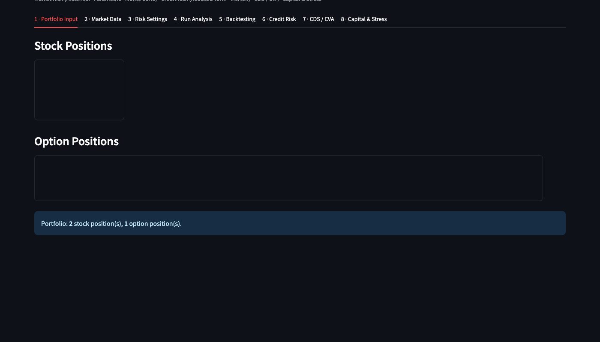

This panel captures stock and option positions and summarizes the current portfolio composition. It is the user’s entry point into the core stock-and-option risk workflow.

#### Market Data

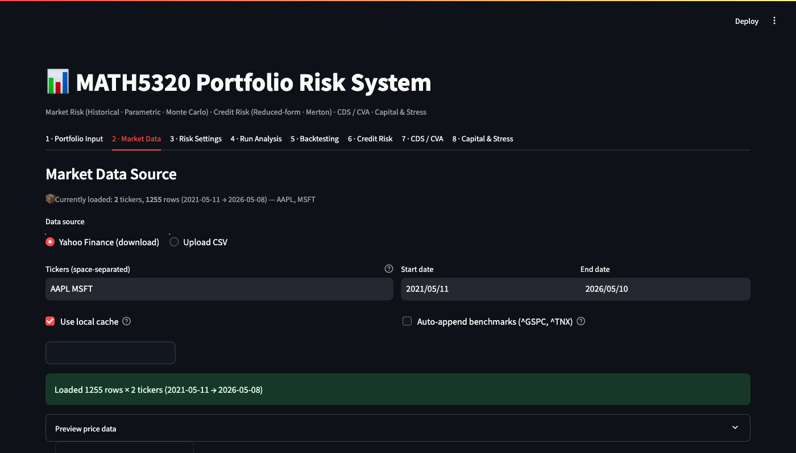

This panel loads CSV data or downloads Yahoo Finance data. The screenshot illustrates the intended “load-then-validate” workflow used before risk calculations are run.

#### Risk Settings

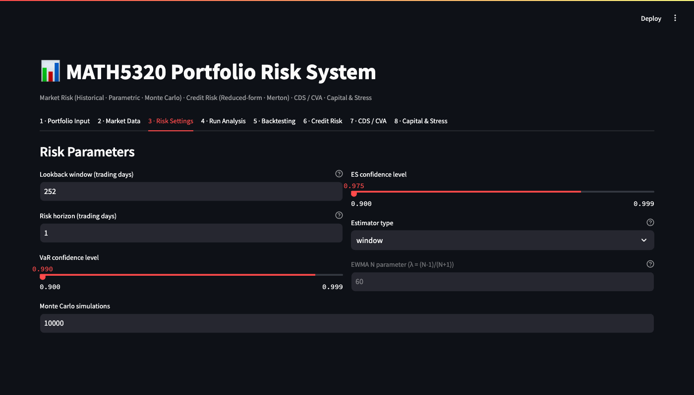

This panel collects the main market-risk parameters: lookback, horizon, VaR confidence, ES confidence, estimator choice, calibration mode, manual market-risk inputs when selected, option-volatility shock mode, and Monte Carlo path count.

#### Run Analysis

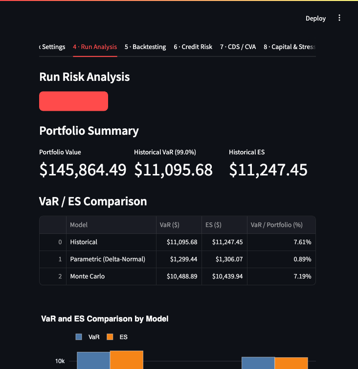

This panel shows the combined comparison of historical, parametric, and Monte Carlo outputs, along with charts such as loss distributions and correlations.

#### Backtesting

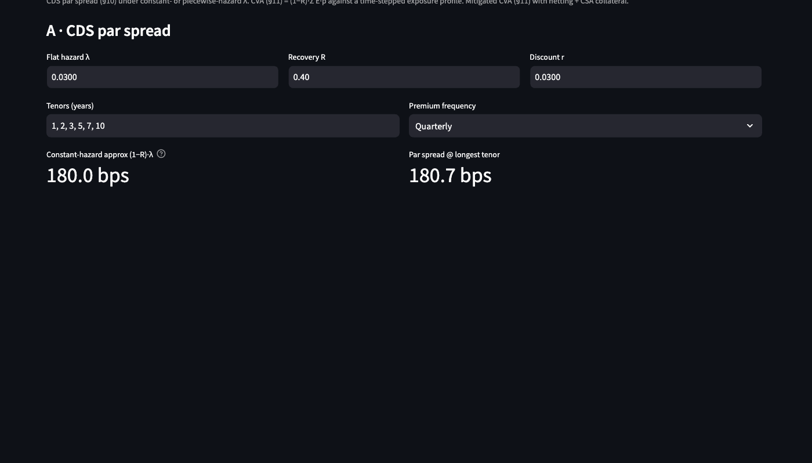

This panel illustrates the walk-forward backtest view and the user-facing Kupiec summary. It shows how model performance is exposed visually rather than only numerically.

#### Credit Risk

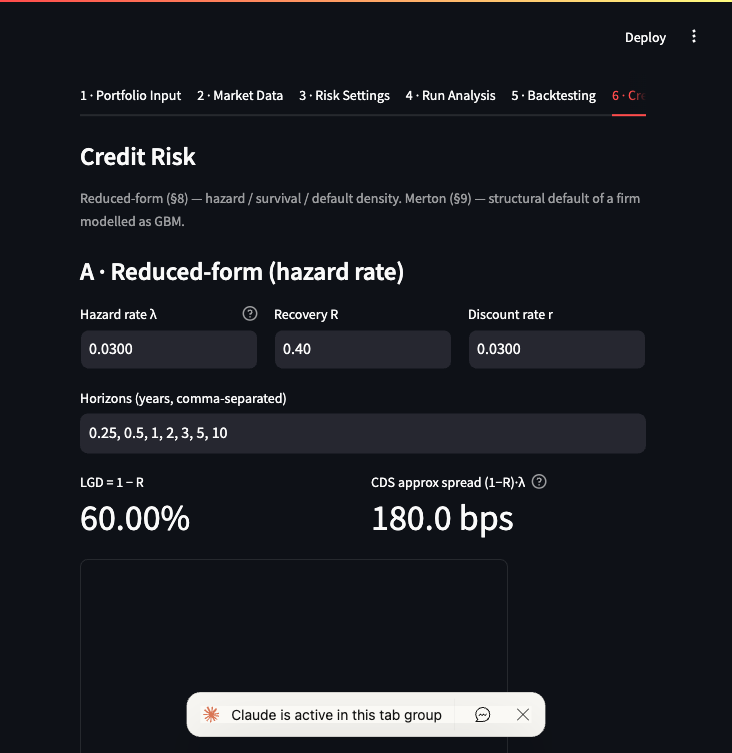

This extension panel supports reduced-form hazard and Merton structural calculations. It is useful supplementary functionality but should still be labeled as extension scope relative to the required stock/option risk engine.

#### CDS / CVA

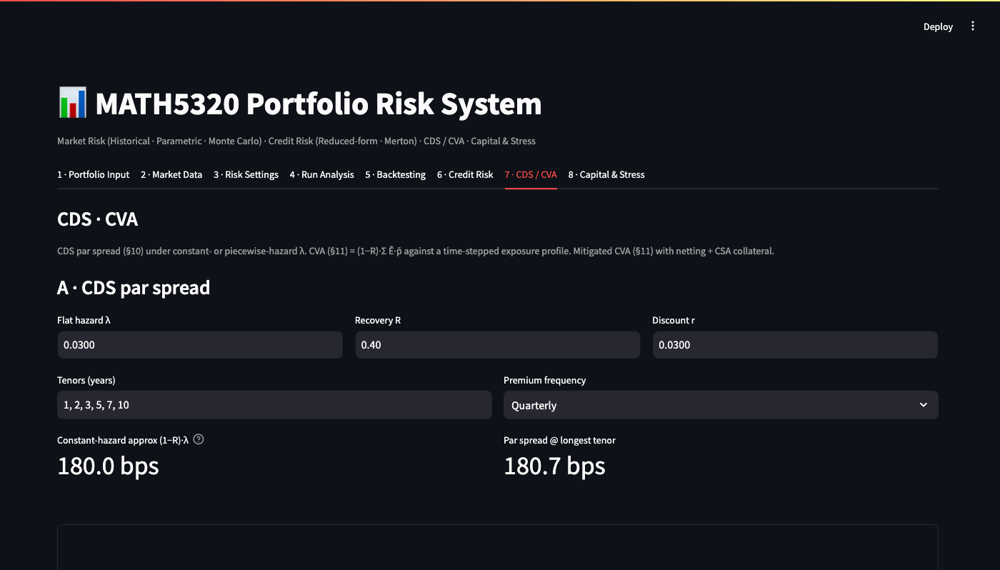

This panel collects the CDS and CVA functionality in a single workflow and reflects how the repo expanded beyond the original market-risk scope.

#### Capital & Stress

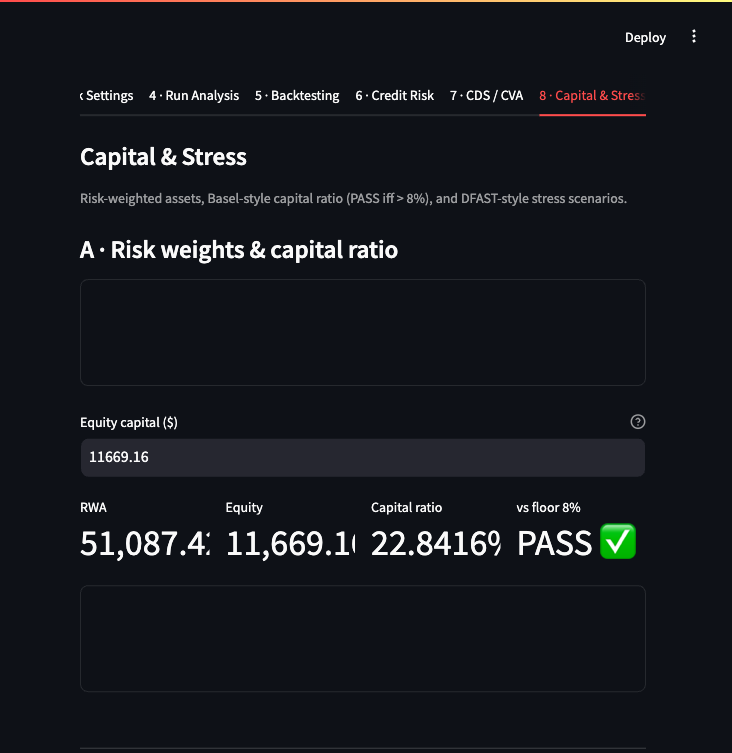

This panel illustrates the regulatory and stress-testing extension layer: RWA, capital ratio, and DFAST-style scenario helpers.

---

## 5. Product / System Description

### 5.1 User Workflow

The operational workflow of the required stock/option risk engine is:

1. Input stock and option positions.
2. Load historical data from CSV or Yahoo Finance.
3. Configure lookback, horizon, VaR confidence, ES confidence, estimator, calibration mode, manual inputs if used, option-volatility treatment, and Monte Carlo settings.
4. Run risk analysis and compare methods.
5. Review plots, correlations, and downloadable outputs.
6. Run backtesting and inspect exception diagnostics.

### 5.2 Input Schema

#### Stock input

| Field | Meaning |
|---|---|
| `ticker` | Equity symbol |
| `quantity` | Signed position size |

#### Option input

| Field | Meaning |
|---|---|
| `ticker` / label | Option identifier |
| `underlying_ticker` | Underlying stock symbol |
| `option_type` | `call` or `put` |
| `quantity` | Signed contract count |
| `strike` | Strike price |
| `maturity_date` | Expiry date |
| `volatility` | Annualized volatility input |
| `risk_free_rate` | Continuous risk-free rate |
| `dividend_yield` | Continuous dividend yield |
| `contract_multiplier` | Shares per contract |

#### Market data input

| Requirement | Meaning |
|---|---|
| Date index | Parseable and ordered dates |
| Price columns | One price series per underlying |
| Positive prices | No non-positive equity prices |
| Adequate history | Enough observations for the chosen lookback and backtest horizon |
| Alignment | Shared index after cleaning/alignment |

#### Risk settings

| Setting | Meaning |
|---|---|
| `lookback_days` | Estimation window size |
| `horizon_days` | Risk horizon |
| `var_confidence` | VaR confidence level |
| `es_confidence` | ES confidence level |
| `estimator` | `window` or `ewma` |
| `ewma_N` | EWMA parameter |
| `calibration_mode` | `historical` or `manual` |
| `manual_market_params` | Daily mean/covariance override bundle for parametric and Monte Carlo runs |
| `option_vol_shock_mode` | `fixed` or `underlying_beta` |
| `option_vol_shock_beta` | Simplified volatility shock sensitivity |
| `option_vol_shock_floor` | Lower bound on shocked volatility |
| `n_simulations` | Monte Carlo path count |
| `backtest model` | Historical, parametric, or Monte Carlo |

### 5.3 Inputs, Sources, and Validation Checks

| Input | Source | Used by | Current validation behavior |
|---|---|---|---|
| Price history | CSV or Yahoo Finance | All risk methods | Checks for empty frames, `DatetimeIndex`, all-NaN columns, and non-positive prices |
| Portfolio positions | Streamlit UI and dataclasses | Valuation and risk | Ticker existence checked against loaded price columns |
| Volatility | User input | Option repricing and parametric/MC assumptions | Domain errors surface through pricing behavior if invalid |
| Risk-free rate | User input or helper | Option pricing and some extension modules | Numeric input expected; live helper available for a Treasury proxy |
| Confidence levels | User input | VaR/ES and backtesting | Behavioral coverage exists in tests, especially for separate ES confidence |
| Manual market-risk parameters | User input in manual mode | Parametric and Monte Carlo engines | Missing underlyings, non-finite values, asymmetry, and non-PSD covariance are rejected |

### 5.4 Outputs

The core outputs are:

- VaR by method,
- ES by method,
- loss distributions,
- correlation and chart views,
- backtest exception statistics,
- JSON and CSV downloads.

The extension outputs add:

- hazard and survival tables,
- Merton PD/equity/debt summaries,
- CDS spread outputs,
- CVA and mitigated CVA summaries,
- RWA, capital ratio, and DFAST-style capital-path outputs.

---

## 6. Model Description

### 6.1 Portfolio Valuation and Loss Convention

Portfolio value is built from stock values plus repriced option values:

```text
V_t = sum_i q_i P_{i,t}
```

The repo uses:

```text
PnL  = V_T - V_0
Loss = V_0 - V_T
```

Positive loss means the portfolio lost value.

### 6.2 Stock Price Model and Shock Construction

Daily log returns are:

```text
r_t = log(S_t / S_{t-1})
```

Overlapping horizon returns are:

```text
R_t^(h) = sum_{k=0}^{h-1} r_{t-k}
```

The shocked stock-price convention is:

```text
S_shocked = S_0 * exp(R_h)
```

### 6.3 Option Pricing Model

European calls and puts are repriced with Black-Scholes under continuous dividends. The key inputs are spot, strike, maturity, volatility, risk-free rate, dividend yield, and option type.

```text
d1 = [log(S/K) + (r - q + 0.5 sigma^2) T] / (sigma sqrt(T))
d2 = d1 - sigma sqrt(T)
```

```text
Call = S e^{-qT} N(d1) - K e^{-rT} N(d2)
Put  = K e^{-rT} N(-d2) - S e^{-qT} N(-d1)
```

```text
Delta_call = e^{-qT} N(d1)
Delta_put  = e^{-qT} (N(d1) - 1)
```

Important limitation: the core VaR engines reprice options with user-supplied volatility but do not dynamically shock the volatility surface.

### 6.4 Historical VaR and ES

Historical simulation:

1. computes log returns,
2. builds overlapping `h`-day scenarios,
3. shocks underlying prices,
4. fully reprices the portfolio,
5. builds an empirical loss distribution.

The implementation computes:

```text
VaR_alpha = empirical alpha-quantile of losses
ES_alpha  = average loss beyond the ES threshold
```

This is nonparametric, but it is also highly dependent on the selected history and the number of available tail scenarios.

### 6.5 Parametric VaR and ES

The parametric engine uses a delta-normal approximation:

```text
mu_h    = h * mu
Sigma_h = h * Sigma
```

```text
m   = x' mu_h
s^2 = x' Sigma_h x
```

```text
VaR = -m + s Phi^{-1}(alpha_var)
ES  = -m + s phi(z_es) / (1 - alpha_es)
```

The current code explicitly allows `es_confidence` to differ from `var_confidence`.

The current implementation uses corrected delta-dollar exposure for options:

```text
x_option = quantity × multiplier × BS_delta × spot
```

which aligns the implementation with the documented exposure convention.

### 6.6 Monte Carlo VaR and ES

The Monte Carlo engine estimates `mu` and `Sigma` from historical log returns or accepts them from the manual calibration path, applies horizon scaling, simulates:

```text
R_h ~ N(mu_h, Sigma_h)
```

and then:

1. shocks each underlying with `S_sim = S_0 * exp(R_sim)`,
2. fully reprices the portfolio,
3. constructs a simulated loss distribution,
4. computes empirical VaR and ES.

Observed design choices:

- default Monte Carlo path count is `10,000`,
- deterministic test paths can use a fixed seed,
- manual calibration can override the estimated daily mean/covariance,
- full repricing can use `fixed` or simplified `underlying_beta` option-volatility shock mode,
- backtest Monte Carlo runs cap simulations for speed.

### 6.7 Estimation Methods: Window and EWMA

The repo supports:

- rolling window mean/covariance,
- EWMA mean/covariance with:

```text
lambda = (N - 1) / (N + 1)
```

Window estimation is transparent; EWMA responds faster to recent volatility clustering.

### 6.8 Backtesting

Backtesting is walk-forward and out-of-sample:

1. take the prior lookback window,
2. estimate the model,
3. forecast VaR,
4. observe realized loss over the horizon,
5. record an exception when realized loss exceeds forecast VaR.

The codebase supports:

- Kupiec unconditional coverage,
- Christoffersen independence,
- conditional coverage,
- Basel traffic-light classification,
- exception severity summaries.

### 6.9 Formula-Sheet Extension Modules

These should be described as extension scope, not as a replacement for the core stock/option risk engine.

| Module | Purpose | Inputs | Outputs | Test evidence |
|---|---|---|---|---|
| `src/risk/lognormal.py` | Exact GBM/lognormal VaR and ES | `V0`, `mu`, `sigma`, `h`, `p` | Exact VaR/ES | `test_lognormal.py`, `test_course_validation.py` |
| `src/credit/hazard.py` | Reduced-form hazard and risky bond quantities | Hazard, recovery, time | Survival, PD, spread, risky ZCB | `test_credit.py`, `test_course_validation.py` |
| `src/credit/merton.py` | Structural default model | `V0`, `B`, `r`, `mu`, `sigma`, `T` | PD, equity value, debt value | `test_credit.py`, `test_course_validation.py` |
| `src/credit/cds.py` | CDS spread calculations | Hazard curve, recovery, discounting | CDS spread outputs | `test_credit.py`, `test_course_validation.py` |
| `src/credit/cva.py` | CVA and related exposure helpers | Exposure profile, marginal PD, recovery | CVA outputs | `test_credit.py`, `test_cva_mitigants.py` |
| `src/credit/mitigation.py` | Netting and collateral helpers | MTM/exposure inputs | Netted or collateralized exposures | `test_counterparty_mitigation.py`, `test_cva_mitigants.py` |
| `src/risk/regulatory.py` | RWA, capital ratio, stress helpers | Exposures, risk weights, stress assumptions | Capital and stress outputs | `test_regulatory.py`, `test_dfast_pathing.py`, `test_balance_sheet.py` |

---

## 7. Software Design and Implementation

### 7.1 Architecture Overview

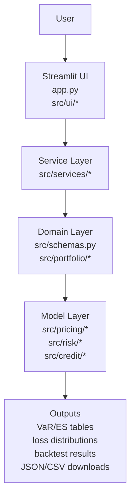

The design is layered:

- the UI layer captures inputs and renders outputs,
- the service layer orchestrates end-to-end runs,
- the domain layer defines portfolio objects and valuation structures,
- the model layer contains pricing, returns, risk, credit, and regulatory logic.

### 7.2 Data Flow and Control Flow

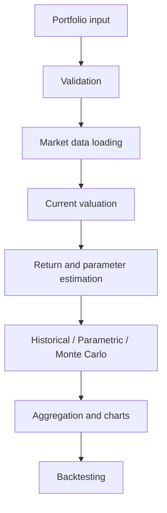

### 7.3 Backtesting Control Flow

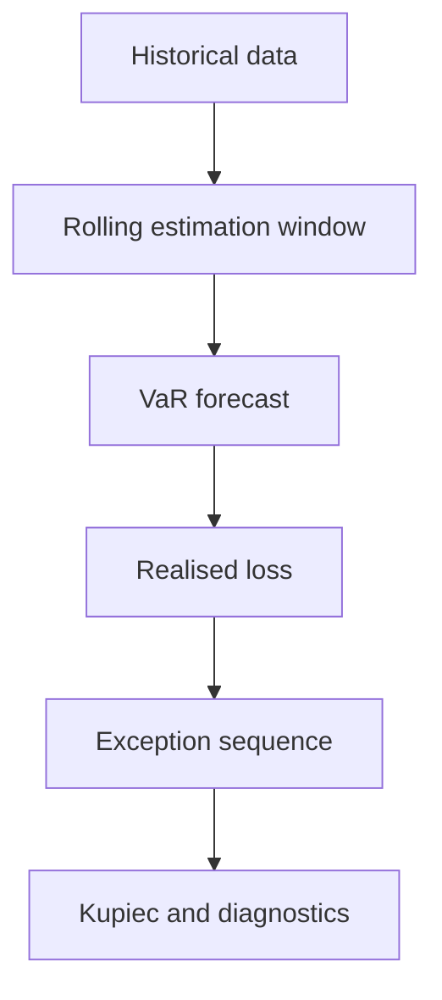

### 7.4 Module Map

| Module | Role |
|---|---|
| `app.py` and `src/ui/*` | User interaction, displays, downloads |
| `src/services/risk_engine_service.py` | Core market-risk orchestration |
| `src/services/credit_service.py` | Credit and CVA orchestration |
| `src/services/regulatory_service.py` | RWA and DFAST orchestration |
| `src/schemas.py` | Portfolio dataclasses |
| `src/portfolio/*` | Valuation and exposure aggregation |
| `src/pricing/black_scholes.py` | European option price and delta |
| `src/risk/*` | Returns, estimation, market-risk methods, backtesting |
| `src/credit/*` | Hazard, Merton, CDS, CVA, mitigation |
| `tests/*` | Regression, validation, and UI/service tests |
| `notebooks/*` | Course walkthroughs and supplementary validation narratives |

### 7.5 Key Design Decisions

- Separate formulas from UI rendering.
- Keep orchestration in service modules rather than in Streamlit panels.
- Use reusable pricing and valuation helpers so all three risk engines share the same base valuation logic.
- Keep course extension modules distinct from the required core stock/option engine.
- Maintain a test-heavy repo structure so validation evidence is part of the design, not an afterthought.

### 7.6 Notebook Sequence

The validation notebooks provide supplementary evidence for the implemented model families. The notebook sequence is:

| Notebook | Location | Topic |
|---|---|---|
| `01_market_risk_var_es_goldens.ipynb` | `notebooks/` | Market-risk goldens and exact checks |
| `02_aapl_cat_var_es_methods.ipynb` | `notebooks/` | AAPL/CAT comparison across VaR/ES methods |
| `03_historical_shock_methodology.ipynb` | `notebooks/` | Historical-shock construction |
| `04_estimation_rolling_vs_ewma.ipynb` | `notebooks/` | Estimator comparison |
| `05_credit_hazard_risky_bond_spread.ipynb` | `notebooks/` | Hazard-rate and risky-bond extension |
| `06_credit_merton_structural_default.ipynb` | `notebooks/` | Merton structural extension |
| `07_cds_pricing_validation.ipynb` | `notebooks/` | CDS validation |
| `08_cva_counterparty_mitigation.ipynb` | `notebooks/` | CVA and mitigation |
| `09_regulatory_rwa_dfast_pathing.ipynb` | `notebooks/` | Capital and DFAST pathing |
| `10_backtesting_validation_dashboard.ipynb` | `notebooks/` | Backtest diagnostics |
| `11_end_to_end_demo.ipynb` | `notebooks/` | End-to-end demonstration |
| **`demo.ipynb`** | **`submission/`** | **Formula-sheet walkthrough covering all 15 course sections (§1–§15), executed with outputs** |

The submission notebook `demo.ipynb` is the primary formula-sheet demonstration artifact. It covers every course section from risk-measure axioms through regulatory capital, with each section following a six-cell pattern: question → formulas → code → expected vs actual comparison table → assertion → interpretation. All 15 sections execute cleanly. The companion document `submission/demo.md` provides the front-end trace with screenshots for every Streamlit tab alongside matching notebook output tables.

---

## 8. Validation Methodology, Test Plan, and Scope

### 8.1 Validation Objectives

The validation program aims to establish:

- mathematical correctness of formulas,
- correctness of stock and option repricing,
- correctness of historical, parametric, and Monte Carlo VaR/ES outputs,
- correctness of backtesting and exception logic,
- correctness of credit and regulatory extension formulas,
- robustness to invalid inputs and edge cases,
- correct service-layer and UI integration,
- reproducibility through deterministic fixtures and stored artifacts.

### 8.2 Validation Categories

| Category | Purpose |
|---|---|
| Unit tests | Validate pure functions and deterministic model logic |
| Analytical goldens | Compare against closed-form reference values |
| Homework fixtures | Compare against course-derived expected values |
| Behavioral tests | Check monotonicity and financial reasonableness |
| Edge/failure tests | Ensure invalid inputs fail visibly or safely |
| Integration tests | Exercise end-to-end workflows |
| UI tests | Validate Streamlit panels and rendering paths |
| Coverage tests | Measure executed source coverage and identify gaps |

### 8.3 Module-Level Test Scope

| Module area | Main test files |
|---|---|
| Core backend and services | `tests/test_backend.py` |
| Backtest extensions | `tests/test_backtest_extensions.py` |
| Course validation sheet | `tests/test_course_validation.py` |
| Homework cases | `tests/test_homework_cases.py` |
| Credit and CVA | `tests/test_credit.py`, `tests/test_credit_service.py`, `tests/test_cva_mitigants.py`, `tests/test_counterparty_mitigation.py`, `tests/test_merton_timing.py` |
| Regulatory and balance sheet | `tests/test_regulatory.py`, `tests/test_dfast_pathing.py`, `tests/test_balance_sheet.py` |
| Market data and validation | `tests/test_market_data.py`, `tests/test_config_and_validation.py` |
| Numerical and coverage gaps | `tests/test_strict_numerics.py`, `tests/test_coverage_gaps.py`, `tests/test_es_confidence_split.py` |
| UI and charts | `tests/test_ui_panels.py`, `tests/test_charts.py` |
| Live integration | `tests/integration_test.py`, `tests/integration_test_formula_sheet.py` |

### 8.4 Tolerances and Numerical Standards

| Tolerance type | Typical use |
|---|---|
| Machine precision | Deterministic formulas in strict numerics |
| Tight relative tolerance | Homework and course fixtures |
| Structural assertions | Sign, monotonicity, or ordering logic |
| Monte Carlo tolerance | Sampling-based approximate acceptance |
| Live integration acceptance | Positive, finite, and operational workflow checks |

Important repo-specific note: the current code in `tests/test_course_validation.py` uses about `1%` relative tolerance for those fixtures, even though older README language mentions looser tolerance.

### 8.5 Coverage Plan and Known Untested Areas

Coverage is measured with pytest-cov and reviewed through the terminal missing-line report. Known lower-coverage or special-risk areas include:

- deeper CDS branches,
- hazard piecewise paths,
- some historical absolute-shock branches,
- `src/risk/normal.py`,
- some regulatory-service branches,
- selected UI extension paths.

---

## 9. Validation Results

### 9.1 No-Network Test Suite

Observed command:

```bash
python -m pytest tests/ --ignore=tests/integration_test.py --ignore=tests/integration_test_formula_sheet.py -q
```

Observed result from the current walkthrough:

```text
610 passed, 242 warnings in 32.07s
```

### 9.2 Coverage Run

Observed command:

```bash
python -m pytest tests/ --cov=src --cov-report=term-missing \
  --cov-report=html:submission/coverage_report \
  --cov-report=xml:submission/coverage_report/coverage.xml \
  --ignore=tests/integration_test.py \
  --ignore=tests/integration_test_formula_sheet.py
```

Observed result:

- all counted tests passed,
- coverage report generated (HTML and XML),
- remaining untested lines are concentrated in UI branch paths, selected credit helpers, and a small number of defensive validation branches.

The updated test suite (610 tests) achieves **96% total statement coverage**. Residual gaps are limited mainly to Streamlit UI panel branches (`src/ui/capital_panel.py`, `src/ui/cds_cva_panel.py`, `src/ui/risk_settings.py`) that require a richer interactive harness than the no-network pytest runner. Most non-UI logic modules now reach 95%–100% coverage, with the principal remaining exception being `src/credit/hazard.py` at 93%.

**Option-volatility treatment.** The project guide flags "not modelling changes in volatility for options" as a grading penalty. This system supports two modes controlled by the `option_vol_shock_mode` parameter:

- `fixed` (default): option implied volatility is held constant under all scenarios.
- `underlying_beta`: option volatility is scaled by the underlying return shock as `σ' = max(floor, σ × (1 − β × R))`, where β and floor are configurable.

The `underlying_beta` mode is not a full implied-volatility-surface model. It does not capture smile, skew, or term-structure dynamics. It is still better than holding vol fully fixed, and it is demonstrated in `submission/advanced_demo.ipynb §7`. The limitation is documented again in Section 10.

### 9.3 Selected Analytical and Fixture Evidence

The repo includes strong deterministic and homework-style evidence through:

- `test_strict_numerics.py` for closed-form exactness,
- `test_lognormal.py` for GBM VaR/ES,
- `test_course_validation.py` for formula-sheet fixtures,
- `test_homework_cases.py` for course-derived regression values,
- `test_es_confidence_split.py` for separate VaR/ES confidence behavior.

### 9.4 Representative Backtesting Evidence

A representative historical-model backtest was run on `1,500` aligned AAPL/CAT Bloomberg observations spanning `2020-02-25` to `2026-02-11` with lookback `504` days, horizon `5` days, and VaR confidence `99%`.

| Metric | Value |
|---|---:|
| Price rows used | 1,500 |
| Backtest observations | 990 |
| Expected exceptions at 99% | 9.90 |
| Actual exceptions | 15 |
| Observed exception rate | 1.52% |
| Kupiec LR statistic | 2.2920 |
| Kupiec p-value | 0.1300 |
| Reject unconditional coverage (5%)? | No |
| Christoffersen independence LR | 62.2015 |
| Christoffersen independence p-value | 3.10 × 10⁻¹⁵ |
| Conditional coverage LR | 64.4936 |
| Conditional coverage p-value | 9.89 × 10⁻¹⁵ |
| Basel traffic-light zone | RED |
| Basel capital multiplier | 4.00 |
| Average exception gap | $205,833 |
| Maximum exception loss | $1,262,637 |

Interpretation: unconditional coverage is not rejected on this sample, but independence is strongly rejected - exceptions cluster in time. This illustrates why the repo includes Christoffersen diagnostics beyond the minimum Kupiec test.

### 9.5 Live Integration Status

The two live-data integration scripts now pass under the current repo behavior.

Current observed status:

- [tests/integration_test.py](../tests/integration_test.py) passed, including live download, service orchestration, all three market-risk methods, backtesting, EWMA mode, and multi-day horizon checks.
- [tests/integration_test_formula_sheet.py](../tests/integration_test_formula_sheet.py) passed, including live download, risk-free-rate fetch, stock/option portfolio risk run, backtesting, Merton, CDS, CVA, and regulatory helpers.

This means:

1. live-data download and orchestration work end to end,
2. the scripts are aligned with the current separate-confidence VaR/ES design.

### 9.6 Formula-Sheet Demonstration Evidence

The submission notebook `submission/demo.ipynb` provides a systematic walkthrough of all fifteen course formula-sheet sections. Each section documents the question, mathematical formulas, Python code calling `src/` modules directly, an expected-vs-actual comparison table, an executable assertion, and a brief interpretation. All fifteen sections execute cleanly with matching outputs.

| § | Section | Key numerical target | Status |
|---|---|---|---|
| 1 | Risk-measure theory (VaR sub-additivity, ES coherence) | VaR violates axiom 4; ES satisfies all four Artzner axioms | ✓ |
| 2 | European option pricing and delta | Call price 17.6246, Δ 0.6643 | ✓ |
| 3 | Delta-hedge intuition | N_calls = 1,873 | ✓ |
| 4 | Historical scenario VaR/ES (HW03) | VaR₉₀ = 3,931, ES₈₀ = 3,429 | ✓ |
| 5 | Single-stock GBM VaR (HW04 Q1) | 5d-99% VaR ≈ 19,037 | ✓ |
| 6 | Two-stock parametric VaR (HW04 Q2) | 2wk-99% VaR ≈ 9,007 | ✓ |
| 7 | Rolling vs EWMA (HW05) | λ(2y) = 0.9968 | ✓ |
| 8 | Historical AAPL/CAT VaR/ES | Portfolio VaR < sum of individual VaRs | ✓ |
| 9 | Monte Carlo VaR/ES | ES/VaR ratio ≈ 1.25 | ✓ |
| 10 | Backtesting Kupiec (HW11) | Expected exceptions = 12.6 | ✓ |
| 11 | Hazard/reduced-form credit (HW06) | P(τ≤5) = 3.63% | ✓ |
| 12 | Merton structural credit (HW07/09) | PD_Q = 29.53%, PD_P = 38.88% | ✓ |
| 13 | CDS pricing (HW08) | Spread ≈ 180 bps / 184.55 bps | ✓ |
| 14 | CVA and counterparty mitigation (HW08/09) | CVA ≈ 5.21 | ✓ |
| 15 | Regulatory capital/RWA (HW10) | Capital ratio = 8.77%, PASS | ✓ |

The companion document `submission/demo.md` provides a front-end trace with screenshots of each relevant Streamlit tab and a side-by-side comparison confirming that the application and notebook produce identical outputs for every section.

---

## 10. Limitations and Model Risk

| Area | Limitation | Impact | Mitigation / interpretation |
|---|---|---|---|
| Historical VaR | Past may not represent future regimes | Under- or over-estimated risk | Compare windows and compare with MC/parametric |
| Parametric VaR | Delta-normal approximation | Weak for nonlinear option portfolios | Use as baseline, not sole authority |
| Parametric implementation | First-order exposure approach remains a linear approximation even after the corrected delta-dollar exposure fix | Nonlinear option effects can still be understated | Treat as a baseline method and compare with full repricing |
| Monte Carlo | Multivariate normal return shocks | Tail risk may be understated | Compare with historical method and larger path counts |
| Options | Simplified option-volatility shock rather than a full implied-vol surface | Smile/skew dynamics remain out of scope | Document clearly as scope limitation |
| Parameter-driven market-risk mode | Manual mean/covariance inputs are available only for parametric and Monte Carlo methods; historical simulation still needs price history by construction | Direct-input support is method-dependent | Document clearly as an inherent historical-simulation constraint |
| Covariance estimation | Sample instability and window dependence | Risk estimates may change materially | Provide window/EWMA comparison |
| Input validation | Central validation layer is lighter than some report wording might suggest | Documentation can overstate hard controls | Keep docs aligned to actual code behavior |
| Data source | Yahoo Finance and user CSVs are imperfect proxies | Stale or noisy prices can distort results | Use validation checks and disclose proxy status |
| Extensions | Credit and regulatory modules are simplified | Not production credit or supervisory engines | Label clearly as course-formula extensions |
| Coverage | Some UI, credit-service, and defensive-validation branches are not exercised by the no-network suite | Lower confidence on those specific paths | Coverage report identifies remaining untested branches |

---

## 11. Conclusions and Recommendations

### 11.1 Conclusion

The system satisfies the core project requirements: it accepts mixed stock-and-option portfolios, computes VaR and ES under three methodologies, and backtests the results against historical data. The test suite validates the main formulas against course-derived fixtures and confirms correct covariance estimation, delta-normal parametric VaR, and Black-Scholes option pricing. Extension modules for credit risk, CVA, and regulatory capital are included and tested, though they sit outside the core grading scope.

This is not a production risk platform. The main limits are the simplified option-volatility treatment, the first-order delta approximation, normal Monte Carlo shocks, and single-maturity Merton default. Those limits are fine for a course project, but they should stay explicit.

### 11.2 Recommendations for future work

1. Replace the simplified `underlying_beta` volatility shock with a term-structure-aware implied-vol surface if the project is extended beyond coursework.
2. Implement a first-passage (Black-Cox barrier) extension to the Merton model to allow default before maturity.
3. Replace the flat-covariance parametric engine with a delta-gamma or Cornish-Fisher correction for non-linear option portfolios.
4. Add a headless browser driver (e.g. Playwright) to cover Streamlit UI panel branches and push statement coverage above 98%.
5. Use separate ES and VaR confidence levels consistently in all comparison tables to avoid misleading ES < VaR appearances.

### 11.3 Validation Conclusion

| Area | Conclusion | Residual risk |
|---|---|---|
| Core VaR/ES engines (historical, parametric, MC) | Suitable for academic stock and European-option portfolios | First-order delta-normal approximation; MC uses multivariate normal shocks |
| Option volatility treatment | `fixed` mode holds vol constant; `underlying_beta` mode provides a simplified shock; both documented | No full implied-vol surface or smile/skew model |
| Backtesting | Kupiec and Christoffersen tests implemented and tested; walk-forward framework in place | Exception clustering may persist under regime change |
| Credit and regulatory extensions | Course-formula extensions validated against homework fixtures | Not production-grade; Merton single-maturity default only |
| Testing | 610 no-network tests, 96% statement coverage; homework and course-fixture values confirmed | Streamlit UI branch paths not fully coverable without a browser driver |

---

## 12. Bibliography / References

1. Columbia MATH GR 5320 lecture materials and project instructions.
2. Columbia MATH GR 5320 homework and course validation fixtures as encoded in `tests/test_course_validation.py` and `tests/test_homework_cases.py`.
3. Black, F., and Scholes, M. (1973). *The Pricing of Options and Corporate Liabilities*.
4. Kupiec, P. (1995). *Techniques for Verifying the Accuracy of Risk Measurement Models*.
5. Christoffersen, P. (1998). *Evaluating Interval Forecasts*.
6. Merton, R. C. (1974). *On the Pricing of Corporate Debt: The Risk Structure of Interest Rates*. Journal of Finance, 29(2), 449–470.
7. McNeil, A. J., Frey, R., and Embrechts, P. (2015). *Quantitative Risk Management: Concepts, Techniques and Tools* (Revised Edition). Princeton University Press.
8. Stein, H. J. (2014). *Model Validation for Municipal Bonds*. Bloomberg Portfolio Risk Analytics. Local reference cited in `docs/references/`.

---

## 13. Appendices

### Appendix A. Core Formula Summary

```text
r_t = log(S_t / S_{t-1})
R_t^(h) = sum_{k=0}^{h-1} r_{t-k}
S_shocked = S_0 * exp(R_h)
PnL = V_T - V_0
Loss = V_0 - V_T
```

```text
VaR_parametric = -m + s Phi^{-1}(alpha_var)
ES_parametric  = -m + s phi(z_es) / (1 - alpha_es)
```

```text
d1 = [log(S/K) + (r - q + 0.5 sigma^2) T] / (sigma sqrt(T))
d2 = d1 - sigma sqrt(T)
```

### Appendix B. Repository File Tree

```text
MATH5320/
├── app.py
├── src/
│   ├── schemas.py
│   ├── config.py
│   ├── data/
│   ├── pricing/
│   ├── portfolio/
│   ├── risk/
│   ├── credit/
│   ├── services/
│   └── ui/
├── tests/
├── notebooks/
├── docs/
│   ├── references/
│   └── screenshots/
└── submission/
```

### Appendix C. Reproducibility Commands

```bash
# Install dependencies
pip install -r requirements.txt

# Run the Streamlit application (all 8 tabs)
streamlit run app.py

# Run the no-network unit suite
python -m pytest tests/ --ignore=tests/integration_test.py --ignore=tests/integration_test_formula_sheet.py

# Run with coverage reporting
python -m pytest tests/ --cov=src --cov-report=term-missing \
  --cov-report=html:submission/coverage_report \
  --cov-report=xml:submission/coverage_report/coverage.xml \
  --ignore=tests/integration_test.py --ignore=tests/integration_test_formula_sheet.py

# Run live-data integration scripts
python tests/integration_test.py
python tests/integration_test_formula_sheet.py

# Execute the formula-sheet demonstration notebook (submission/demo.ipynb)
python -m jupyter nbconvert --to notebook --execute --inplace \
  --ExecutePreprocessor.timeout=180 \
  --ExecutePreprocessor.kernel_name=python3 \
  submission/demo.ipynb
```

### Appendix D. Submission Package Contents

| File | Description |
|---|---|
| `00_combined_final_report.md` | This integrated combined report |
| `01_model_documentation.md` | Deliverable 1 - full model documentation (30 pts) |
| `02_software_design_documentation.md` | Deliverable 2 - software design documentation (15 pts) |
| `03_test_plan.md` | Deliverable 3 - test plan (20 pts) |
| `04_test_results.md` | Deliverable 4/5 - test results (10 pts) |
| `demo.ipynb` | Formula-sheet demonstration notebook - 15 sections, fully executed |
| `demo.md` | Front-end trace with screenshots - 15 sections mapped to Streamlit tabs |
| `advanced_demo.ipynb` | Advanced demo notebook - equal-weight Magnificent Seven portfolio, §1-§10 including manual calibration and option-vol shock checks |
| `advanced_demo.md` | M7 portfolio front-end trace with screenshots plus notebook-only validation tables |
| `coverage_report/` | HTML and XML coverage reports from the local pytest run |
| `test_artifacts/` | Captured environment and test artifacts (git hash, pytest output, etc.) |

### Appendix E. Checklist

| Item | Included in this combined report? |
|---|---|
| Purpose, intended use, and non-intended use | Yes - Section 2 |
| Requirement coverage matrix | Yes - Section 1 |
| Model-risk management framework | Yes - Section 3 |
| Core model description (BS, historical, parametric, MC, backtest) | Yes - Section 6 |
| Software architecture and orchestration | Yes - Section 7 |
| Representative application screenshots | Yes - Section 4 |
| Test-plan summary | Yes - Section 8 |
| Test-results summary with numeric evidence | Yes - Section 9 |
| Actual backtest result table (Kupiec + Christoffersen) | Yes - Section 9.4 |
| Formula-sheet demo coverage matrix (§1–§15) | Yes - Section 9.6 |
| Limitations and model risk table | Yes - Section 10 |
| Conclusions and recommendations | Yes - Section 11 |
| References and bibliography | Yes - Section 12 |
| Formula summary appendix | Yes - Appendix A |
| Repository file tree | Yes - Appendix B |
| Reproducibility commands incl. demo execution | Yes - Appendix C |
| Submission package contents | Yes - Appendix D |
