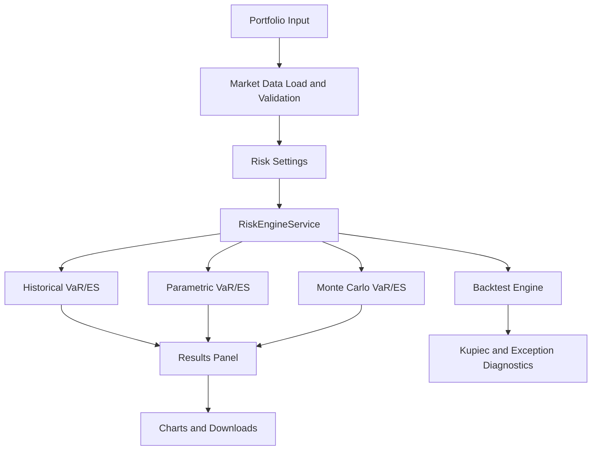
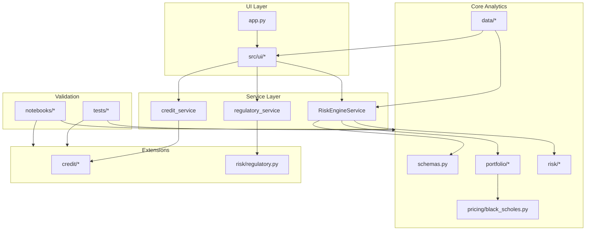

# Final Project Report
## MATH5320 Portfolio Risk Management System

Course: MATH5320  
Project: Financial Risk Management System  
Repository: `MATH5320`  
Observed workspace date: May 11, 2026

Team members named in the existing report notebook: Nigel Li, Michael Adegbite, Stella

---

## Executive Summary

This project implements a Python and Streamlit portfolio risk engine for the academic setting of Columbia MATH GR 5320. The core system supports portfolios of stocks and European options, values options with the Black-Scholes model, and computes Value at Risk (VaR) and Expected Shortfall (ES) under multiple methodologies. The required market-risk engine is clearly present in the repository and is exposed both through a Streamlit application and through reusable Python modules.

From the code and README, the intended core workflow is: define a portfolio of stock and option positions, load historical market data from CSV or Yahoo Finance wrappers, choose historical or manual calibration for the parametric and Monte Carlo engines, set risk parameters such as lookback window, horizon, confidence levels, estimator choice, Monte Carlo simulation count, and option-volatility shock mode, and then run comparative risk analysis and VaR backtesting. The main user-facing outputs are method-by-method VaR and ES estimates, loss distributions, correlation visualizations, backtest exception summaries, and downloadable JSON and CSV files.

The core market-risk methodologies implemented are historical simulation, parametric delta-normal VaR/ES, and Monte Carlo VaR/ES. Historical and Monte Carlo methods use full portfolio repricing under shocked market states and now support a simplified option-volatility scenario mode in addition to fixed implied vol. The parametric method uses a delta-normal approximation based on estimated or manually supplied mean and covariance of log returns together with an exposure vector built from equity holdings and corrected option delta-dollar exposures. VaR backtesting is implemented through walk-forward forecasting and Kupiec unconditional coverage testing, with additional Christoffersen independence and conditional-coverage diagnostics available in the codebase.

Beyond the required stock-and-option risk engine, the repository also contains a second layer of course-formula validation modules. These extensions cover exact GBM/lognormal VaR and ES, reduced-form hazard models, the Merton structural default model, CDS pricing, CVA, counterparty mitigation mechanics, and illustrative regulatory capital and DFAST-style calculations. The notebook structure and module layout strongly suggest that the project evolved in two phases: first, a required market-risk application; second, a broader formula-sheet and validation toolkit for the course.

Validation is a major strength of the repository. On May 11, 2026, the local no-network test suite was run from this workspace with:

```bash
python -m pytest tests/ --ignore=tests/integration_test.py --ignore=tests/integration_test_formula_sheet.py -q
```

The observed result was:

```text
576 passed, 242 warnings in 14.95s
```

An additional coverage run used:

```bash
python -m pytest tests/ --cov=src --cov-report=term-missing \
  --cov-report=html:submission/coverage_report \
  --cov-report=xml:submission/coverage_report/coverage.xml \
  --ignore=tests/integration_test.py --ignore=tests/integration_test_formula_sheet.py
```

The coverage run reported `576 passed` with coverage output recorded in `submission/test_artifacts/coverage_output.txt`. The two live-data integration scripts were run separately and both passed.

The main conclusion is that the system is suitable for the intended academic use: computing and comparing VaR and ES for portfolios of stocks and European options, validating formula modules against course-derived fixtures, and demonstrating model-risk governance through documentation, test evidence, and explicit discussion of limitations. The principal limitations are the use of historical log-return shocks, delta-normal approximation for the parametric engine, simplified rather than full-surface option-volatility shocks, multivariate normal return simulation for Monte Carlo, and the illustrative rather than production nature of the credit and regulatory extensions.

---

## Requirement Coverage Matrix

| Project requirement | Implementation evidence | Test evidence | Documentation section |
|---|---|---|---|
| Portfolio of stocks and options as input | `src/schemas.py`, `src/ui/portfolio_editor.py` | `tests/test_backend.py`, `tests/test_ui_panels.py`, `tests/test_config_and_validation.py` | Product/System Description |
| Historical data and parameter inputs | `src/data/market_data.py`, `src/ui/market_data_panel.py`, `src/ui/risk_settings.py` | `tests/test_market_data.py`, `tests/test_config_and_validation.py` | Product/System Description |
| Historical VaR | `src/risk/historical.py` | `tests/test_backend.py`, `tests/test_course_validation.py`, `tests/test_homework_cases.py` | Model Description |
| Parametric VaR | `src/risk/parametric.py` | `tests/test_backend.py`, `tests/test_es_confidence_split.py`, `tests/test_homework_cases.py` | Model Description |
| Monte Carlo VaR | `src/risk/monte_carlo.py` | `tests/test_backend.py`, `tests/test_coverage_gaps.py`, `tests/integration_test.py` | Model Description |
| Historical ES | `src/risk/historical.py` | `tests/test_backend.py`, `tests/test_es_confidence_split.py` | Model Description |
| Monte Carlo ES | `src/risk/monte_carlo.py` | `tests/test_backend.py`, `tests/test_es_confidence_split.py` | Model Description |
| VaR backtesting | `src/risk/backtest.py`, `src/services/risk_engine_service.py` | `tests/test_backend.py`, `tests/test_backtest_extensions.py`, `notebooks/10_backtesting_validation_dashboard.ipynb` | Model Description and Validation Results |
| Option pricing for European options | `src/pricing/black_scholes.py`, `src/portfolio/positions.py` | `tests/test_backend.py`, `tests/test_homework_cases.py` | Model Description |
| Model documentation | This report draft plus the existing `FINAL_REPORT.ipynb` | Local repository evidence | Entire document |
| Software design documentation | `README.md`, module layering in `src/`, Streamlit app structure | `tests/test_ui_panels.py`, integration tests | Software Design and Implementation |
| Test plan | `tests/` and notebook validation workflow | Local test suite | Validation Methodology and Scope |
| Software | `app.py`, `src/`, `notebooks/` | Local test suite and integration scripts | Product/System Description and Software Design |
| Test results | Observed pytest and coverage runs in this workspace | Commands and outputs reproduced below | Validation Results |

---

## Introduction and Scope

### System Name

The system will be referred to in this report as the `MATH5320 Portfolio Risk Management System`.

### Business Purpose

The business purpose of the system is educational. It is a local academic risk-calculation platform for MATH GR 5320, intended to help students and analysts value portfolios, compare multiple risk methodologies, test risk model behavior against course fixtures, and document model assumptions and limitations in a validation-oriented format.

### Intended Users

Intended users are students, instructors, and technically capable analysts working locally through either:

- The Streamlit application in `app.py`
- Direct Python imports from the `src/` package
- Supporting Jupyter notebooks under `notebooks/`

### Intended Use

The intended uses are:

- Define portfolios of stocks and European options
- Load historical market data from CSV files or Yahoo Finance wrappers
- Compute VaR and ES under historical, parametric, and Monte Carlo methods
- Compare methodologies under a common portfolio and common market data
- Run walk-forward VaR backtesting and exception diagnostics
- Validate course-formula modules such as lognormal VaR/ES, hazard, Merton, CDS, CVA, and regulatory calculations
- Produce documentation and test evidence for a course project

### Non-Intended Use

The system is not intended for:

- Production trading or risk management
- Regulatory filing or supervisory capital submission
- Official CCAR or DFAST modeling
- Production XVA, issuer-level credit portfolio modeling, or enterprise-wide risk aggregation
- Pricing or hedging complex exotics, American options, or full volatility-surface products

### Portfolio and Data Scope

The system accepts a portfolio of stock and option positions. It supports both history-driven estimation and direct parameter input, depending on the module. The core Streamlit workflow documented in the README is:

1. Add stock and option positions.
2. Load historical price data from Yahoo Finance or CSV.
3. Configure lookback, horizon, confidence levels, estimator type, and Monte Carlo simulation count.
4. Run comparative risk analysis.
5. Run backtesting.

The exact model families covered in the repository are:

- Equity and stock risk
- European option pricing
- Portfolio VaR and ES
- VaR backtesting
- Formula-sheet extensions: exact GBM/lognormal, hazard, Merton, CDS, CVA, counterparty mitigants, and regulatory capital/stress

### Scope Table

| Area | In scope | Out of scope |
|---|---|---|
| Instruments | Stocks, European calls, European puts | American options, path-dependent options, exotics |
| VaR methods | Historical, parametric delta-normal, Monte Carlo | EVT, filtered historical simulation, copula VaR |
| ES methods | Historical, parametric, Monte Carlo, exact GBM extension | Full regulatory ES framework |
| Pricing | Black-Scholes European option pricing | Local volatility, stochastic volatility, early exercise |
| Credit | Hazard, Merton, CDS, CVA course modules | Full issuer portfolio credit model |
| Regulation | RWA, capital ratio, illustrative DFAST pathing | Official Fed CCAR/DFAST production model |

---

## Product/System Description

### User Workflow

From the application structure in `app.py`, the product is organized as an eight-tab Streamlit application:

1. Portfolio Input
2. Market Data
3. Risk Settings
4. Run Analysis
5. Backtesting
6. Credit Risk
7. CDS / CVA
8. Capital & Stress

The user workflow for the required market-risk engine is:

1. Enter stock and option positions.
2. Load aligned historical prices by CSV upload or Yahoo Finance download.
3. Configure risk settings such as lookback window, horizon, VaR confidence, ES confidence, estimator type, calibration mode, optional manual mean/vol/correlation inputs, Monte Carlo path count, and option-volatility shock mode.
4. Run risk analysis to obtain historical, parametric, and Monte Carlo results.
5. Review summary tables, charts, and downloadable output.
6. Run backtesting and review coverage diagnostics.

The last three tabs extend the product into course-specific modules for credit, CVA/CDS, and regulatory capital.

### Intended User Experience

The system is designed to be interactive but still modular. Streamlit is used only as the front end. Core logic is delegated to pricing, portfolio, risk, credit, and service modules. This separation reduces the amount of business logic inside the UI and makes the quantitative code reusable in tests and notebooks.

### Input Schema

The repository defines three core dataclasses in `src/schemas.py`:

- `StockPosition`
  - `ticker`
  - `quantity`
- `OptionPosition`
  - `ticker`
  - `underlying_ticker`
  - `option_type`
  - `quantity`
  - `strike`
  - `maturity_date`
  - `volatility`
  - `risk_free_rate`
  - `dividend_yield`
  - `contract_multiplier`
- `Portfolio`
  - `stocks`
  - `options`

### Market Data Requirements

For the core market-risk engine, the required market data is an aligned wide price table indexed by date, with one price series per underlying ticker. The CSV loader expects a first date column and one numeric price column per ticker. The Yahoo Finance loader returns adjusted close values and then aligns them in a similar wide format.

### Inputs, Sources, and Validation Checks

| Input | Source | Used by | Validation check |
|---|---|---|---|
| Price history | CSV upload or Yahoo Finance wrapper | All risk methods | Datetime index, non-empty, no all-NaN columns, positive prices |
| Portfolio positions | Streamlit UI and dataclasses | Valuation and risk modules | Ticker existence is checked explicitly; many other field rules are enforced through UI expectations and pricing-domain checks rather than one central schema validator |
| Volatility | User input for options; estimated returns for VaR engines | Option pricing, parametric VaR, Monte Carlo VaR | Expected positive numeric; non-positive values surface through pricing-domain checks |
| Risk-free rate | User input for options; helper lookup in selected panels | Black-Scholes and selected extension modules | Numeric input expected; helper fetches are sanity-checked by range and fallback behavior |
| Horizon | User input | Historical, parametric, Monte Carlo, backtesting | Positive integer expected; backtests return an explicit empty reason when history is too short |
| Confidence levels | User input | VaR and ES | Values in `(0,1)` are expected; separate VaR and ES confidence behavior is covered in tests |
| Calibration mode | User input | Parametric and Monte Carlo engines | UI constrains to `historical` or `manual`; manual mode is covered in backend and UI tests |
| Manual daily mean / covariance | User input in manual mode | Parametric and Monte Carlo engines | Manual builder rejects missing underlyings, non-finite values, asymmetry, and non-PSD covariance |
| Option-volatility shock mode | User input | Historical, Monte Carlo, and backtesting repricing | UI constrains to `fixed` or `underlying_beta`; unknown modes raise explicitly |

### Outputs

The main outputs are:

- Historical VaR and ES
- Parametric VaR and ES
- Monte Carlo VaR and ES
- Loss distributions
- Correlation heatmap
- Portfolio value summary
- Backtest exception statistics
- JSON summary download
- Loss CSV download
- Backtest CSV download
- Kupiec-results JSON download

### Representative Application Figures

The packaged submission now includes representative screenshots from the live Streamlit application. These figures illustrate the user workflow and UI surface of the core risk engine and extension panels.

#### Figure 1. Portfolio Input


#### Figure 2. Market Data


#### Figure 3. Risk Settings


#### Figure 4. Run Analysis


#### Figure 5. Backtesting


#### Figure 6. Credit Risk Extension


#### Figure 7. CDS / CVA Extension


#### Figure 8. Capital & Stress Extension


### Risk Engine Workflow



---

## Model Description

### 5.1 Portfolio Valuation and Loss Convention

For stock positions, portfolio value is the sum of quantity times current spot:

```text
V_t(stock) = sum_i q_i * S_i,t
```

For option positions, each option is repriced using Black-Scholes with current spot, strike, maturity, volatility, risk-free rate, dividend yield, and contract multiplier. Expired options are valued at intrinsic value.

The repository uses the following sign conventions, explicitly documented in the README and implemented in the risk modules:

```text
PnL = V_T - V_0
Loss = V_0 - V_T
```

Positive loss therefore means the portfolio lost value.

The core distinction among methods is:

- Historical VaR/ES: full repricing under shocked scenarios
- Monte Carlo VaR/ES: full repricing under simulated scenarios
- Parametric VaR/ES: delta-normal approximation rather than full nonlinear repricing

### 5.2 Stock Price Model and Shock Construction

The equity-shock framework is based on log returns:

```text
r_t = log(S_t / S_t-1)
```

Overlapping horizon returns are built by rolling summation:

```text
R_t^(h) = r_t + r_t-1 + ... + r_t-h+1
```

The shocked price convention used in historical and Monte Carlo scenario generation is:

```text
S_T = S_0 * exp(R_h)
```

The main assumptions implied by the code are:

- Log returns are the working shock variable for equity underlyings
- Historical estimation uses a finite lookback window
- Stationarity is assumed within the chosen estimation window
- Covariance is estimated from historical log returns
- Parametric and Monte Carlo models use horizon scaling with `mu_h = h * mu` and `Sigma_h = h * Sigma`

An alternate historical absolute-shock branch exists in `src/risk/historical.py`, but the default and primary implementation uses log shocks.

### 5.3 Option Pricing Model

European calls and puts are priced using Black-Scholes with continuous dividends. The code in `src/pricing/black_scholes.py` implements:

```text
d1 = [log(S/K) + (r - q + 0.5 * sigma^2)T] / (sigma * sqrt(T))
d2 = d1 - sigma * sqrt(T)

Call = S * exp(-qT) * N(d1) - K * exp(-rT) * N(d2)
Put  = K * exp(-rT) * N(-d2) - S * exp(-qT) * N(-d1)
```

The corresponding deltas are:

```text
Delta_call = exp(-qT) * N(d1)
Delta_put  = exp(-qT) * (N(d1) - 1)
```

Required inputs are:

- Spot `S`
- Strike `K`
- Time to maturity `T`
- Volatility `sigma`
- Risk-free rate `r`
- Dividend yield `q`
- Option type

Observed design choice: the core full-repricing engines now support two volatility modes. `fixed` keeps the option's input implied volatility unchanged, while `underlying_beta` applies a simple leverage-style scenario shock `sigma' = max(floor, sigma * (1 - beta * R))`. This is better than a spot-only repricing approach, but it is still a simplified course-level approximation rather than a full implied-volatility surface model.

### 5.4 Historical VaR and ES

Historical simulation is implemented in `src/risk/historical.py`. The algorithm is:

1. Compute daily log returns.
2. Build overlapping `h`-day log-return scenarios.
3. Restrict to the lookback window.
4. Compute current portfolio value `V_0`.
5. Shock underlyings with `S_shocked = S_0 * exp(R)`.
6. Reprice the full portfolio under each scenario.
7. Form the empirical loss distribution.
8. Compute VaR and ES from the loss distribution.

Definitions:

```text
VaR_alpha = empirical alpha-quantile of loss
ES_alpha  = average loss in the tail beyond the ES threshold
```

This is a nonparametric method in the sense that it does not assume a normal return distribution. Its limitations are:

- It reacts only as fast as the selected history allows
- It is sensitive to the lookback window
- Extreme quantiles can be unstable when the scenario count is limited
- It assumes past scenarios remain relevant for future risk

### 5.5 Parametric VaR and ES

The parametric engine in `src/risk/parametric.py` uses a delta-normal approximation. It first builds an exposure vector from current holdings and option deltas, then estimates the mean vector and covariance matrix of daily log returns, then applies horizon scaling:

```text
mu_h    = h * mu
Sigma_h = h * Sigma
```

Portfolio mean and variance are then computed in exposure form:

```text
m   = x' * mu_h
s^2 = x' * Sigma_h * x
```

The implemented formulas are:

```text
VaR_alpha = -m + s * Phi^-1(alpha)
ES_alpha  = -m + s * phi(z_alpha) / (1 - alpha_es)
```

where `alpha_es` is the ES confidence level and `z_alpha` is the normal quantile.

Important implementation note: the code allows ES confidence to differ from VaR confidence. This should be documented because some simplified treatments silently assume a single common confidence level.

The current implementation uses corrected delta-dollar option exposure:

```text
x_option = quantity × multiplier × BS_delta × spot
```

so the parametric engine now matches its own stated exposure convention.

Key limitations are:

- Approximately normal PnL assumption
- Sensitivity to covariance estimation
- First-order approximation for option risk
- Potential loss of accuracy for strongly nonlinear option portfolios
- Remaining dependence on covariance quality and linearization assumptions

### 5.6 Monte Carlo VaR and ES

The Monte Carlo engine in `src/risk/monte_carlo.py` either estimates `mu` and `Sigma` from log returns or accepts them from the manual calibration path, scales them to horizon, and simulates:

```text
R_h ~ N(mu_h, Sigma_h)
```

For each simulation:

1. Draw a multivariate normal horizon return vector.
2. Shock each underlying with `S_sim = S_0 * exp(R_sim)`.
3. Reprice the portfolio.
4. Record loss `V_0 - V_sim`.

VaR and ES are then computed empirically from the simulated loss distribution.

Observed design choices from the code:

- Default Monte Carlo path count is `10,000`
- The default random seed is `42`, which helps reproducibility in tests and notebooks
- Manual calibration mode can override the estimated daily mean/covariance
- Full repricing can use `fixed` or simplified `underlying_beta` option-volatility shock mode
- In backtesting, Monte Carlo paths are capped at `2,000` for speed and the seed is not fixed

Limitations:

- Simulated returns are multivariate normal
- Monte Carlo error remains unless path count is large
- Tails may be underrepresented with too few paths
- Covariance quality directly affects scenario quality

### 5.7 Estimation Methods: Window and EWMA

The repository supports two estimators in `src/risk/estimators.py`.

The rolling-window estimator uses:

```text
mu_hat    = sample mean over the lookback window
Sigma_hat = sample covariance over the lookback window
```

The EWMA estimator uses exponentially decaying weights with:

```text
lambda = (N - 1) / (N + 1)
```

This is the exact convention documented in the README and the code.

Observed design rationale:

- Window estimation is transparent and easy to explain
- EWMA allows recent observations to receive more weight
- The presence of notebook `04_estimation_rolling_vs_ewma.ipynb` suggests estimator comparison is a deliberate course objective, not an incidental implementation detail

Alignment and missing-data handling are conservative:

- Price frames are expected to be aligned by date
- Validation checks reject malformed data
- Notebook examples often use `dropna()` after alignment

### 5.8 Backtesting

Backtesting is implemented in `src/risk/backtest.py` as walk-forward VaR forecasting. For each evaluation date `t`:

1. Fit the selected risk model using data up to `t`
2. Forecast horizon VaR
3. Compute realized loss from `t` to `t+h`
4. Flag an exception if realized loss exceeds forecast VaR

The exception indicator is:

```text
I_t = 1{Loss_t > VaR_t}
```

The expected exception rate at VaR confidence `alpha` is:

```text
1 - alpha
```

Kupiec unconditional coverage is implemented as:

```text
LR_uc = -2 * [log L0 - log L1]
```

with the test interpreted against a chi-square distribution with 1 degree of freedom.

The repository goes beyond the README and also implements:

- Christoffersen independence test
- Conditional coverage test
- Basel traffic-light classification
- Exception severity diagnostics

What backtesting validates:

- Frequency of VaR breaches
- Whether unconditional coverage roughly matches target
- Whether exceptions are clustered

What it does not fully validate:

- ES calibration
- Exact tail severity modeling
- Structural stability across all regimes

### 5.9 Formula-Sheet Extension Modules

The repository includes several course-formula modules that extend beyond the core stock/option risk engine. These should be presented as extensions, not confused with the baseline project requirement.

| Module | Purpose | Main formula family | Inputs | Outputs | Validation fixture |
|---|---|---|---|---|---|
| `src/risk/lognormal.py` | Exact GBM/lognormal VaR and ES | Closed-form long/short GBM loss formulas | `V0`, `mu`, `sigma`, `h`, `p` | Exact VaR and ES | `test_lognormal.py`, `test_course_validation.py` |
| `src/credit/hazard.py` | Reduced-form credit | Survival, default density, risky ZCB, credit spread | Hazard, recovery, time | Survival, PD, spread, risky bond price | `test_credit.py`, `test_course_validation.py` |
| `src/credit/merton.py` | Structural default | Asset-value option framework | `V0`, `B`, `r`, `mu`, `sigma`, `T` | PD, equity value, debt value, spread | `test_credit.py`, `test_course_validation.py` |
| `src/credit/cds.py` | CDS pricing | Par spread under flat or piecewise hazard | Hazard curve, recovery, discount rate | CDS spread | `test_credit.py`, `test_course_validation.py` |
| `src/credit/cva.py` | Counterparty valuation adjustment | Discrete and discounted CVA | Exposure profile, marginal PD, recovery | CVA | `test_credit.py`, `test_course_validation.py`, `test_cva_mitigants.py` |
| `src/risk/regulatory.py` | Regulatory capital and stress | RWA, capital ratio, DFAST-style stress | Exposures, weights, capital, scenario inputs | RWA, ratios, stress path | `test_regulatory.py`, `test_dfast_pathing.py`, `test_balance_sheet.py` |

These modules strengthen the educational value of the repo by tying implementation to course formulas, but they remain simplified models rather than production systems.

---

## Software Design and Implementation

### Architecture Overview

The project follows a layered design:

- UI layer
- Service/orchestration layer
- Schema and portfolio layer
- Pricing layer
- Risk-model layer
- Credit and regulatory extension layer
- Test layer

This structure is visible both in the README and in the `src/` directory layout.



### Module Map

| Module | Role | Report section |
|---|---|---|
| `src/pricing/black_scholes.py` | European option pricing and delta | Option pricing model |
| `src/portfolio/positions.py` | Position-level valuation and sensitivity helpers | Portfolio valuation |
| `src/portfolio/portfolio.py` | Portfolio valuation and exposure aggregation | Portfolio valuation and parametric engine |
| `src/risk/historical.py` | Historical VaR/ES | Historical simulation |
| `src/risk/parametric.py` | Delta-normal VaR/ES | Parametric VaR |
| `src/risk/monte_carlo.py` | Monte Carlo VaR/ES | Monte Carlo VaR |
| `src/risk/backtest.py` | Walk-forward backtesting and diagnostics | Backtesting |
| `src/risk/estimators.py` | Window and EWMA estimators | Estimation methods |
| `src/data/market_data.py` | CSV and Yahoo Finance data loading | Product/System Description |
| `src/credit/hazard.py` | Hazard-rate extension | Formula-sheet extensions |
| `src/credit/merton.py` | Structural default extension | Formula-sheet extensions |
| `src/credit/cds.py` | CDS pricing extension | Formula-sheet extensions |
| `src/credit/cva.py` | CVA extension | Formula-sheet extensions |
| `src/risk/regulatory.py` | RWA and DFAST-style calculations | Formula-sheet extensions |

### Implementation Choices Inferred From the Repo

The code suggests several design decisions even where no explicit design memo is present:

1. The application was intentionally split into a thin UI and a reusable analytics core. This reduces model risk by keeping business logic out of the Streamlit layer.
2. Pricing, return construction, estimation, risk measurement, and validation were written as mostly pure functions. This makes them easy to test and to reuse in notebooks.
3. The presence of service classes suggests the authors wanted a single orchestration entry point for the UI rather than direct UI-to-formula coupling.
4. The notebook sequence strongly suggests phased development: required market-risk engine first, formula-sheet coverage second.
5. The extensive test suite shows that validation was treated as a first-class deliverable rather than an afterthought.

### Why the Design Reduces Model Risk

The modular design reduces model risk in several ways:

- Formula logic is separated from UI rendering
- Pure functions can be unit tested against analytical fixtures
- Service objects centralize orchestration and reduce duplication
- Test notebooks and pytest fixtures can target individual layers independently
- Validation can distinguish pricing errors, estimation errors, scenario-generation errors, and UI faults

---

## Validation Methodology and Scope

### Validation Objectives

The validation program implied by the repository aims to establish:

- Mathematical correctness of implemented formulas
- Correct portfolio repricing for stocks and options
- Correct return and covariance estimation
- Correct VaR and ES calculations under each methodology
- Correct backtesting logic and exception diagnostics
- Correct data loading and input validation behavior
- Correct UI-service integration for the Streamlit application

### Validation Types

The repository uses multiple validation styles:

- Analytical goldens
- Homework-derived fixtures
- Course validation-sheet fixtures
- Synthetic edge cases
- Integration tests
- UI smoke tests
- Coverage-gap regression tests
- Backtesting diagnostics

Each serves a distinct purpose:

- Analytical goldens check formula correctness against known values
- Homework fixtures align implementation with course expectations
- Edge-case tests probe validation logic and numerical boundaries
- Integration tests exercise end-to-end workflows
- UI tests confirm the app renders and reacts correctly
- Coverage-gap tests protect against untested branches and regressions

### Test Inventory

| Test group | File(s) | Purpose | Evidence type |
|---|---|---|---|
| Core backend | `tests/test_backend.py` | Pricing, portfolio value, returns, estimators, VaR/ES, service flow | Pytest output |
| Backtest extensions | `tests/test_backtest_extensions.py` | Christoffersen, conditional coverage, Basel traffic-light, exception severity | Pytest output |
| Course validation | `tests/test_course_validation.py` | Formula-sheet fixtures and acceptance targets | Pytest output and fixture tables |
| Homework cases | `tests/test_homework_cases.py` | Additional course homework scenarios | Pytest output |
| Lognormal | `tests/test_lognormal.py` | Exact GBM VaR/ES | Pytest output |
| Credit | `tests/test_credit.py`, `tests/test_credit_service.py`, `tests/test_cva_mitigants.py`, `tests/test_counterparty_mitigation.py`, `tests/test_merton_timing.py` | Hazard, Merton, CDS, CVA, mitigants | Pytest output |
| Regulatory | `tests/test_regulatory.py`, `tests/test_dfast_pathing.py`, `tests/test_balance_sheet.py` | RWA, capital ratio, stress pathing | Pytest output |
| Market data | `tests/test_market_data.py` | CSV loader, Yahoo Finance wrappers, caching, risk-free-rate helper | Pytest output |
| Validation and config | `tests/test_config_and_validation.py` | Data and portfolio validation | Pytest output |
| UI panels and charts | `tests/test_ui_panels.py`, `tests/test_charts.py` | Streamlit panel behavior and chart helpers | Pytest output |
| Coverage-gap regression | `tests/test_coverage_gaps.py`, `tests/test_strict_numerics.py`, `tests/test_es_confidence_split.py` | Branch coverage and numerical discipline | Pytest output |
| Network integration | `tests/integration_test.py`, `tests/integration_test_formula_sheet.py` | End-to-end runs with live market data | Script output when executed |

### Tolerances and Numerical Standards

The validation suite mixes several tolerance styles depending on the problem:

- Exact or near-exact tolerances for deterministic formulas
- Relative tolerances for course fixtures
- Structural assertions for monotonicity and sign behavior
- Monte Carlo tolerances that accept sampling noise

Important documentation note: the current code in `tests/test_course_validation.py` sets `REL = 0.01`, meaning approximately 1% relative tolerance for those fixtures. The README still mentions about 10% relative tolerance. The documentation should therefore follow the code, not the outdated README text.

---

## Validation Results

### 8.1 Local Test Execution Summary

Observed local no-network unit run:

```bash
python -m pytest tests/ --ignore=tests/integration_test.py --ignore=tests/integration_test_formula_sheet.py -q
```

Observed result:

```text
576 passed, 242 warnings in 14.95s
```

Observed coverage run:

```bash
python -m pytest tests/ --cov=src --cov-report=term-missing \
  --cov-report=html:submission/coverage_report \
  --cov-report=xml:submission/coverage_report/coverage.xml \
  --ignore=tests/integration_test.py --ignore=tests/integration_test_formula_sheet.py
```

Observed result summary:

```text
576 passed, 242 warnings in 30.53s
TOTAL 2073 statements, 182 missed, 91% coverage
```

Interpretation:

- The observed local suite passed completely.
- No skips were reported in this no-network run.
- The two network integration scripts were deliberately excluded from the counted result.
- When run separately, those network integration scripts now pass under the current separate-confidence VaR and ES design.
- Environment warnings were present, but they were dependency warnings rather than test failures.

### 8.2 Selected Analytical Validation Cases

The following representative cases were recomputed directly from this workspace and match the repository's fixture values.

| Case ID | Module | Input summary | Expected | Actual | Tolerance | Pass |
|---|---|---|---:|---:|---|---|
| BS01 | Black-Scholes | `S=100, K=100, T=1, r=5%, q=0, sigma=20%` call price | 10.4506 | 10.4506 | textbook closed form | Yes |
| BS02 | Black-Scholes | same inputs, put price | 5.5735 | 5.5735 | textbook closed form | Yes |
| LN01 | Exact GBM long VaR | `V0=10000, mu=0.02, sigma=0.2, h=1, p=0.99` | 3720.3420 | 3720.3420 | course fixture | Yes |
| LN02 | Exact GBM short ES | same base scale | 5999.5959 | 5999.5959 | course fixture | Yes |
| HZ01 | Hazard survival | `s(5)` with `lambda=0.0074` | 0.9636761 | 0.9636761 | course fixture | Yes |
| HZ02 | Risky ZCB | `r=0.05, T=5, LGD=0.6, s(T)=exp(-0.03*5)` | 0.7137123 | 0.7137123 | course fixture | Yes |
| MR01 | Merton Q-PD | `V0=1.1mm, B=850k, sigma=0.28, T=5, r=0.055` | 0.2952952 | 0.2952952 | course fixture | Yes |
| CDS01 | CDS approx spread | `lambda=3%, R=40%` | 0.0180 | 0.0180 | formula-sheet landmark | Yes |
| CVA01 | Discrete CVA | exposures `[100,80,50]`, PD `[0.01,0.015,0.02]`, `R=40%` | 1.9200 | 1.9200 | deterministic arithmetic | Yes |
| REG01 | Capital ratio | `equity=12, rwa=100` | 0.1200 | 0.1200 | deterministic arithmetic | Yes |

### 8.3 AAPL/CAT Course Portfolio Example

The repository includes Bloomberg CSV files for AAPL and CAT and notebooks dedicated to that portfolio. Using the course portfolio construction in `notebooks/02_aapl_cat_var_es_methods.ipynb`:

- Purchase date: `1997-10-13`
- Shares of AAPL: `24,679`
- Shares of CAT: `171`
- Latest observed portfolio value from the notebook-style run in this workspace: `$6,931,589.50`
- Two-year lookback window: `504` trading observations
- Horizon: `5` trading days
- VaR confidence: `99%`
- ES confidence: `97.5%`
- Observed AAPL/CAT return correlation over the final lookback window: `0.3507`

#### Method Comparison

| Method | VaR 99% | ES 97.5% | Interpretation |
|---|---:|---:|---|
| Exact GBM/lognormal extension | $574,654.55 | $576,926.26 | Closed-form benchmark on portfolio log-return series |
| Parametric delta-normal | $597,001.22 | $600,070.94 | Smooth covariance-based estimate |
| Historical simulation | $728,791.66 | $742,986.34 | Largest tail estimate on this window |
| Monte Carlo (`N=5000`) | $582,657.67 | $583,971.11 | Full repricing under MVN log-return shocks |

Observed behavior is economically plausible:

- Historical risk is the largest because recent extreme scenarios dominate the empirical tail.
- Parametric and Monte Carlo are closer to one another because both rely on the same normal-return family.
- The exact GBM benchmark is slightly below the parametric and Monte Carlo values in this particular calibration.

### 8.4 Representative Backtesting Result

To include an actual backtest table in this report, a representative historical-model backtest was run on the most recent `1,500` aligned AAPL/CAT Bloomberg observations, spanning `2020-02-25` to `2026-02-11`, with:

- Lookback window: `504` days
- Horizon: `5` days
- VaR confidence: `99%`
- Model: historical simulation

Observed result summary:

| Metric | Value |
|---|---:|
| Price rows used | 1500 |
| Backtest observations | 990 |
| Expected exceptions at 99% | 9.90 |
| Actual exceptions | 15 |
| Observed exception rate | 1.52% |
| Kupiec LR statistic | 2.2920 |
| Kupiec p-value | 0.1300 |
| Reject unconditional coverage at 5%? | No |
| Christoffersen independence LR | 62.2015 |
| Christoffersen independence p-value | 3.10e-15 |
| Conditional coverage LR | 64.4936 |
| Conditional coverage p-value | 9.89e-15 |
| Basel traffic-light zone | RED |
| Basel capital multiplier | 4.00 |
| Average exception gap | $205,833.28 |
| Maximum exception loss | $1,262,636.56 |

Interpretation:

- Unconditional coverage is not rejected on this sample, so the raw exception count is not statistically inconsistent with a 99% VaR target.
- Independence is strongly rejected, meaning exceptions cluster in time.
- The conditional-coverage result is therefore poor even though Kupiec alone looks acceptable.
- This is exactly why the extra Christoffersen diagnostics in the repo are valuable; Kupiec by itself would understate this model risk.

### 8.5 Coverage Discussion

Coverage reporting identifies tested and untested source paths. Lower-coverage modules in the observed report include:

| Module | Coverage |
|---|---:|
| `src/risk/normal.py` | 56% |
| `src/credit/cds.py` | 62% |
| `src/credit/hazard.py` | 71% |
| `src/services/regulatory_service.py` | 73% |
| `src/risk/historical.py` | 74% |
| `src/ui/risk_settings.py` | 75% |
| `src/risk/returns.py` | 77% |
| `src/ui/capital_panel.py` | 82% |

This does not invalidate the project, but it means the documentation should not claim full validation or full branch coverage of every extension path.

---

## Limitations and Model Risk

### Limitation Table

| Model area | Limitation | Impact | Mitigation / control |
|---|---|---|---|
| Historical VaR | Past may not represent future | Under- or over-estimation in regime shifts | Allow window selection; compare with parametric and Monte Carlo |
| Parametric VaR | Delta-normal approximation | Can understate nonlinear option tail risk | Use historical and Monte Carlo as comparison points |
| Monte Carlo VaR | Multivariate normal simulated shocks | Weak tail behavior under non-normal markets | Increase paths; compare against historical tails |
| Covariance estimation | Estimation error in `Sigma` | Misstates diversification and risk concentration | Compare rolling-window and EWMA estimators |
| Options | Black-Scholes assumes European exercise and a simplified volatility treatment | Misses smile, skew, stochastic vol, and early exercise | Document as limitation; keep intended use academic |
| Option shock model | `underlying_beta` is only a simplified volatility-shock approximation | Can understate or mis-shape option risk under richer vol moves | Treat as course-level approximation and extend only if needed |
| Parameter-driven market-risk mode | Manual daily mean/covariance entry is available only for parametric and Monte Carlo methods; historical simulation still requires price history by construction | Direct-input support is method-dependent | Document clearly as an inherent historical-simulation constraint |
| Backtesting | Kupiec alone is incomplete | May miss exception clustering | Christoffersen diagnostics already added in code |
| Data | CSV and Yahoo Finance inputs can be stale, missing, or inconsistent | Distorted returns and estimates | Validation checks and user review |
| Credit modules | Simplified course models | Not suitable for production credit risk management | Label clearly as extensions |
| Regulatory modules | Illustrative DFAST and RWA logic | Not an official supervisory model | Explicit non-intended use statement |
| Validation coverage | Some UI and extension branches are not exercised by the no-network suite | Lower confidence on specific untested paths | Coverage report identifies remaining untested branches |

### Known Weaknesses and Implementation Caveats

The main model risk is that the required equity/option risk engine combines full repricing with simplified distributional assumptions. Historical VaR avoids an explicit parametric distribution but depends on sample history and scenario availability. Parametric VaR is transparent and fast but relies on normal approximation and first-order sensitivity treatment. Monte Carlo allows full repricing, but it still inherits the multivariate normal return assumption unless extended.

Two additional repo-specific caveats should be documented honestly:

1. The README still mentions roughly 10% relative tolerance for course validation goldens, while the current code uses 1% relative tolerance in `tests/test_course_validation.py`. Documentation should be aligned to the code.
2. The current option-volatility shock logic is deliberately simplified and should not be described as a full implied-volatility surface model.
3. The live integration scripts now pass, but the README’s `100%` coverage target still overstates the achieved test coverage.

---

## Conclusions and Recommendations

### Conclusion

The `MATH5320 Portfolio Risk Management System` is acceptable for its intended course-project use. It successfully implements the required stock-and-European-option risk engine, provides multiple VaR and ES methodologies, supports VaR backtesting, and includes a large amount of validation evidence. The codebase is organized in a clear modular structure, and the test suite is unusually strong for an academic repository.

The system should not be presented as a production platform, a regulatory-capital engine, or a full derivatives-risk system. It is best described as a teaching-quality risk and validation framework that goes beyond the baseline project requirements by adding extensive formula-sheet modules and diagnostics.

### Recommendations

The most valuable next steps would be:

1. Align documentation with implementation, especially around validation tolerances and the broader backtesting toolkit already present in code.
2. Preserve the corrected delta-dollar exposure convention in the parametric layer and document it explicitly in any final Word/PDF version.
3. Extend the simplified option-volatility shock logic only if the project is pushed beyond current coursework scope.
4. Increase coverage in lower-tested extension modules such as CDS, hazard, selected historical-risk branches, and selected regulatory/UI paths.
5. Preserve the current layered design, because it materially supports testing and lowers model-integration risk.

---

## Bibliography / References

1. Columbia MATH GR 5320, `project_requirements.pdf`, local course project specification in `docs/references/`.
2. Columbia MATH GR 5320, course homeworks and formula-sheet validation fixtures as referenced in `tests/test_course_validation.py` and `tests/test_homework_cases.py`.
3. Stein, H. J., `model_validation_report_example.pdf`, local reference document in `docs/references/`.
4. Black, F., and Scholes, M. (1973). "The Pricing of Options and Corporate Liabilities." Journal of Political Economy.
5. Kupiec, P. H. (1995). "Techniques for Verifying the Accuracy of Risk Measurement Models." Journal of Derivatives.
6. Christoffersen, P. (1998). "Evaluating Interval Forecasts." International Economic Review.
7. Merton, R. C. (1974). "On the Pricing of Corporate Debt: The Risk Structure of Interest Rates." Journal of Finance, 29(2), 449–470.
8. McNeil, A. J., Frey, R., and Embrechts, P. (2015). *Quantitative Risk Management: Concepts, Techniques and Tools* (Revised Edition). Princeton University Press.
9. Basel Committee on Banking Supervision. Basel traffic-light and capital multiplier framework, cited here only as context for the illustrative backtesting diagnostics.

---

## Appendices

### Appendix A. Formula Summary

#### A.1 Core Market-Risk Formulas

```text
r_t = log(S_t / S_t-1)
R_t^(h) = sum_{k=0}^{h-1} r_t-k
S_T = S_0 * exp(R_h)
Loss = V_0 - V_T
PnL  = V_T - V_0
```

#### A.2 Parametric VaR/ES

```text
mu_h    = h * mu
Sigma_h = h * Sigma
m       = x' * mu_h
s^2     = x' * Sigma_h * x
VaR     = -m + s * Phi^-1(alpha)
ES      = -m + s * phi(z) / (1 - alpha_es)
```

#### A.3 Black-Scholes

```text
d1 = [log(S/K) + (r - q + 0.5 * sigma^2)T] / (sigma * sqrt(T))
d2 = d1 - sigma * sqrt(T)
Call = S * exp(-qT) * N(d1) - K * exp(-rT) * N(d2)
Put  = K * exp(-rT) * N(-d2) - S * exp(-qT) * N(-d1)
```

#### A.4 Hazard / Credit

```text
s(t)     = exp(-lambda * t)         for constant hazard
PD(t)    = 1 - s(t)
p(t)     = lambda * s(t)
RiskyZCB = exp(-rT) * [1 - LGD * (1 - s(T))]
Spread   = -(1/T) * log(1 - LGD * (1 - s(T)))
```

#### A.5 Merton

```text
d2 = [log(V0/B) + (nu - 0.5 * sigma^2)T] / (sigma * sqrt(T))
d1 = d2 + sigma * sqrt(T)
PD = N(-d2)
E0 = V0 * N(d1) - B * exp(-rT) * N(d2)
D0 = V0 - E0
```

#### A.6 CVA and Regulatory

```text
CVA = (1 - R) * sum_i Exposure_i * MarginalPD_i
RWA = sum_i Weight_i * Exposure_i
CapitalRatio = Equity / RWA
```

### Appendix B. Test Plan

| Validation objective | Primary files | Method |
|---|---|---|
| Formula correctness | `test_lognormal.py`, `test_credit.py`, `test_course_validation.py` | Golden-value comparison |
| Portfolio repricing correctness | `test_backend.py`, `test_coverage_gaps.py` | Deterministic valuation tests |
| Estimator correctness | `test_backend.py`, `test_homework_cases.py` | Shape checks and expected values |
| Method-comparison correctness | `notebooks/02_*`, `test_es_confidence_split.py` | Cross-method consistency |
| Backtesting correctness | `test_backend.py`, `test_backtest_extensions.py`, `notebooks/10_*` | Exception diagnostics |
| Data-loader correctness | `test_market_data.py`, `test_config_and_validation.py` | Input-path regression |
| UI correctness | `test_ui_panels.py`, `test_charts.py` | Streamlit smoke and behavior tests |
| Integration correctness | `integration_test.py`, `integration_test_formula_sheet.py` | End-to-end workflow tests |

### Appendix C. Observed Local Test Output

Observed no-network command:

```bash
python -m pytest tests/ --ignore=tests/integration_test.py --ignore=tests/integration_test_formula_sheet.py -q
```

Observed tail of output:

```text
........................................................................ [100%]
576 passed, 242 warnings in 14.95s
```

Observed coverage command:

```bash
python -m pytest tests/ --cov=src --cov-report=term-missing \
  --cov-report=html:submission/coverage_report \
  --cov-report=xml:submission/coverage_report/coverage.xml \
  --ignore=tests/integration_test.py --ignore=tests/integration_test_formula_sheet.py
```

Observed tail of output:

```text
================================ tests coverage ================================
TOTAL                                  2073    182    91%
====================== 576 passed, 242 warnings in 30.53s ======================
```

### Appendix D. Notebooks and Supporting Evidence

The notebook sequence provides a strong supplementary narrative:

- `notebooks/01_market_risk_var_es_goldens.ipynb`
- `notebooks/02_aapl_cat_var_es_methods.ipynb`
- `notebooks/03_historical_shock_methodology.ipynb`
- `notebooks/04_estimation_rolling_vs_ewma.ipynb`
- `notebooks/05_credit_hazard_risky_bond_spread.ipynb`
- `notebooks/06_credit_merton_structural_default.ipynb`
- `notebooks/07_cds_pricing_validation.ipynb`
- `notebooks/08_cva_counterparty_mitigation.ipynb`
- `notebooks/09_regulatory_rwa_dfast_pathing.ipynb`
- `notebooks/10_backtesting_validation_dashboard.ipynb`
- `notebooks/11_end_to_end_demo.ipynb`

The primary formula-sheet demonstration artifact is the submission notebook:

- **`submission/demo.ipynb`** — covers all fifteen course sections (§1 risk-measure theory through §15 regulatory capital), fully executed with outputs. Each section uses a six-cell structure: question, formulas, code, expected-vs-actual table, assertion, interpretation. All assertions pass.
- **`submission/demo.md`** — front-end trace companion: screenshots of each relevant Streamlit tab with side-by-side comparison confirming the application matches the notebook for every section.

These submission artifacts can be cited directly as evidence in the final submission package.

### Appendix E. User Guide and Reproducibility

Install dependencies:

```bash
pip install -r requirements.txt
```

Run the app:

```bash
streamlit run app.py
```

Run the local no-network tests:

```bash
python -m pytest tests/ --ignore=tests/integration_test.py --ignore=tests/integration_test_formula_sheet.py
```

Run coverage:

```bash
python -m pytest tests/ --cov=src --cov-report=term-missing \
  --cov-report=html:submission/coverage_report \
  --cov-report=xml:submission/coverage_report/coverage.xml \
  --ignore=tests/integration_test.py --ignore=tests/integration_test_formula_sheet.py
```

Run the live-data integration scripts:

```bash
python tests/integration_test.py
python tests/integration_test_formula_sheet.py
```

### Appendix F. Final Submission Checklist

| Item | Status in this draft |
|---|---|
| Executive summary states purpose and conclusion | Yes |
| Intended use and non-intended use documented | Yes |
| Stock/option portfolio scope documented | Yes |
| Historical VaR/ES documented | Yes |
| Parametric VaR/ES documented | Yes |
| Monte Carlo VaR/ES documented | Yes |
| Black-Scholes documented | Yes |
| Backtesting and Kupiec documented | Yes |
| Estimation/window/EWMA documented | Yes |
| Input/output schema documented | Yes |
| Architecture diagram included | Yes |
| Requirement coverage matrix included | Yes |
| Test plan included | Yes |
| Test results included | Yes |
| Backtesting result table included | Yes |
| Limitations table included | Yes |
| Recommendations included | Yes |
| Bibliography included | Yes |
| Appendix contains formula and test details | Yes |
| Screenshots inserted | Yes |
| Local test pass evidence included | Yes |
| Formula-sheet demo notebook (submission/demo.ipynb) referenced | Yes |
| Front-end trace document (submission/demo.md) referenced | Yes |
