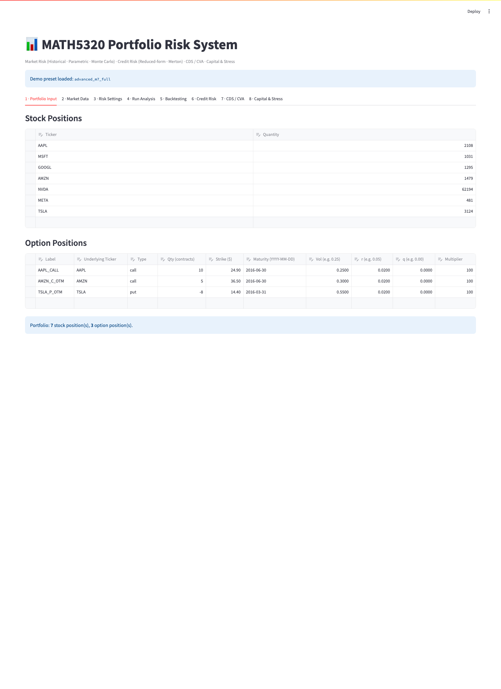
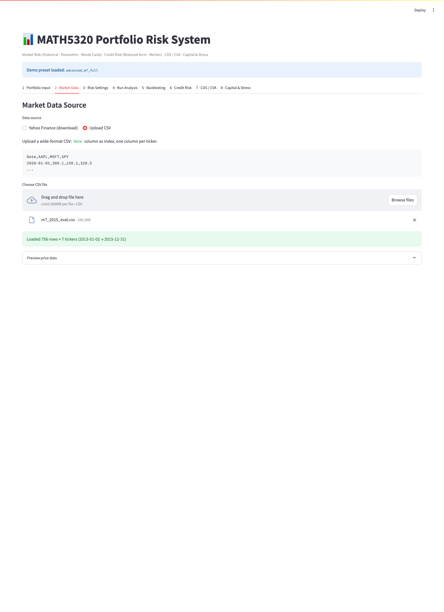
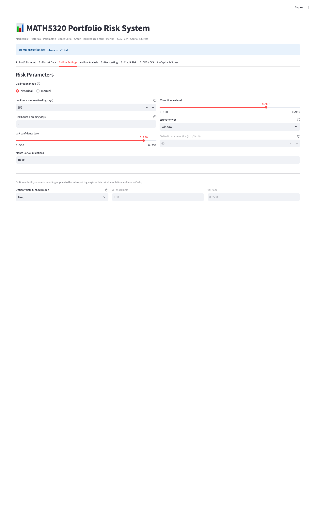
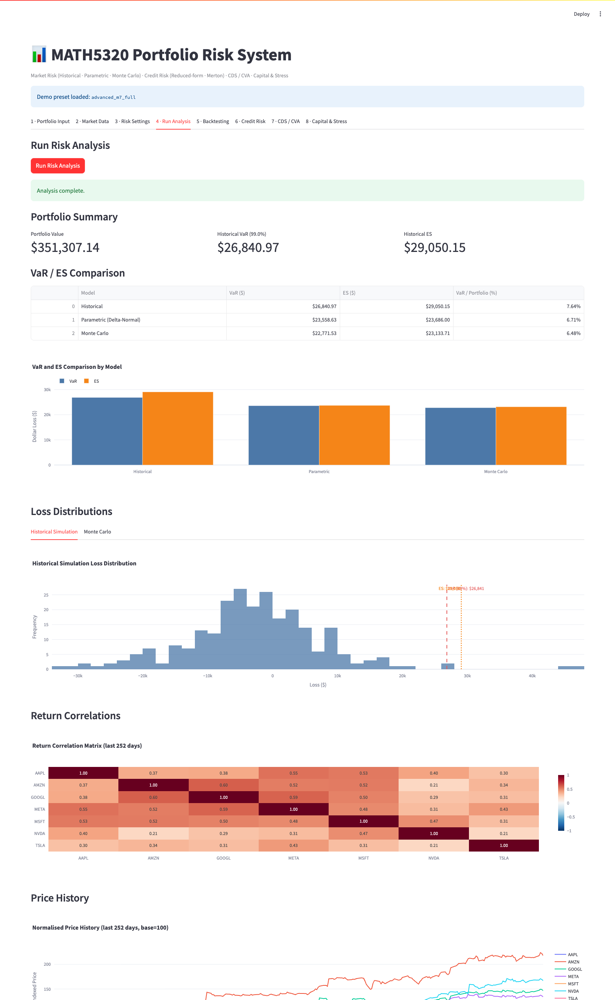
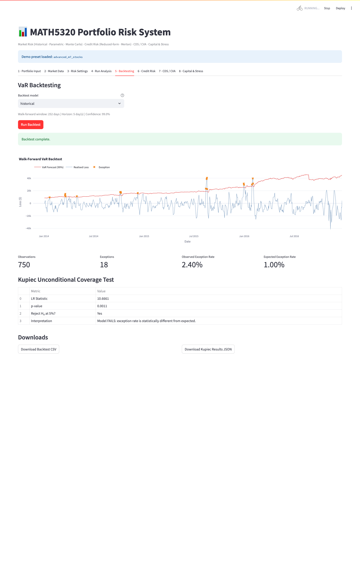
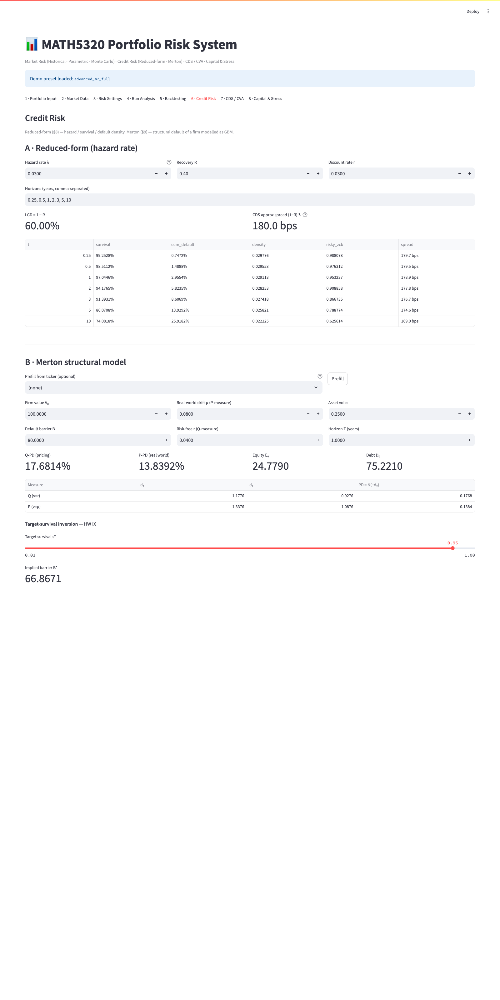

# MATH GR 5320 - Advanced Demo: Live Front-End Trace

**Columbia University · Spring 2026**

This is the live Streamlit front-end trace for the equal-weight Magnificent Seven portfolio used in [advanced_demo.ipynb](./advanced_demo.ipynb). The point of this note is simple: show that the app can load the same portfolio and data, run the same market-risk workflow, and reproduce the key notebook numbers on screen.

The app was run locally at `http://localhost:8502`.

## Demo Setup

| Item | Value |
|------|-------|
| Notebook reference | `submission/advanced_demo.ipynb` |
| Reference numbers | `submission/test_artifacts/advanced_demo_reference.json` |
| Source market-data export | `data/m7_2015.csv` |
| Analysis preset | `advanced_m7_full` |
| Analysis data file | `data/m7_2015_eval.csv` |
| Backtest preset | `advanced_m7_stocks` |
| Backtest data file | `data/m7_2015.csv` |
| Analysis date | 2015-12-31 |
| Backtest sample | 2013-01-02 to 2016-12-30 |

Two presets were used on purpose:

1. `advanced_m7_full` for the point-in-time portfolio analysis with the stock book plus the three-option overlay.
2. `advanced_m7_stocks` for the historical backtest, which keeps the same M7 stock book but avoids mixing option expiries into the walk-forward VaR test.

The two CSV inputs used by the app are derived from the notebook export `data/m7_2015.csv`:

1. `data/m7_2015_eval.csv` ends at 2015-12-31 so the live valuation date matches the notebook.
2. `data/m7_2015.csv` keeps the extra 2016 rows needed for the walk-forward backtest.

## Coverage Matrix

| Step | Notebook topic | App tab | Evidence |
|------|----------------|---------|----------|
| 1 | M7 portfolio construction | Tab 1 | Portfolio preset screenshot |
| 2 | Market-data load | Tab 2 | CSV load screenshot |
| 3 | Risk settings | Tab 3 | Parameter screenshot |
| 4 | Full-portfolio VaR / ES | Tab 4 | Live result screenshot + reference match table |
| 5 | Stock-only backtest | Tab 5 | Live backtest screenshot + reference match table |
| 6 | Credit tab smoke check | Tab 6 | Reduced-form screenshot |

## Tab 1 - Portfolio Input

The preset loads seven long equity positions and three option positions.

### Stock positions

| Ticker | Quantity |
|--------|----------|
| AAPL | 2108 |
| MSFT | 1031 |
| GOOGL | 1295 |
| AMZN | 1479 |
| NVDA | 62194 |
| META | 481 |
| TSLA | 3124 |

### Option overlay

| Label | Underlying | Type | Qty | Strike ($) | Maturity | Vol | r |
|-------|------------|------|-----|------------|----------|-----|---|
| AAPL_CALL | AAPL | call | 10 | 24.90 | 2016-06-30 | 0.25 | 0.02 |
| AMZN_C_OTM | AMZN | call | 5 | 36.50 | 2016-06-30 | 0.30 | 0.02 |
| TSLA_P_OTM | TSLA | put | -8 | 14.40 | 2016-03-31 | 0.55 | 0.02 |

The app status line confirms the expected book:

`Portfolio: 7 stock position(s), 3 option position(s).`

Reference book values from `advanced_demo_reference.json`:

| Measure | Value |
|---------|-------|
| Stock book value | $349,833.69 |
| Net option value | $1,473.45 |
| Full portfolio value | $351,307.14 |

## Tab 2 - Market Data

For the point-in-time analysis run, the app loads [data/m7_2015_eval.csv](/Users/nigelli/Desktop/Columbia%20MAFN/26Spring/MATH5320/Project/MATH5320/data/m7_2015_eval.csv), which stops at the notebook valuation date.

| Field | Value |
|------|-------|
| File | `data/m7_2015_eval.csv` |
| Tickers | AAPL, MSFT, GOOGL, AMZN, NVDA, META, TSLA |
| Rows loaded | 756 |
| Date range | 2013-01-02 to 2015-12-31 |

That matters because the notebook prices the portfolio at 2015-12-31, so the front-end run has to stop at the same date if we want a clean one-to-one comparison.

## Tab 3 - Risk Settings

The preset drives the app with the same market-risk setup used for the reference run.

| Parameter | Value |
|-----------|-------|
| Calibration mode | historical |
| Lookback window | 252 trading days |
| Horizon | 5 trading days |
| VaR confidence | 99.0% |
| ES confidence | 97.5% |
| Estimator | window |
| Monte Carlo simulations | 10000 |
| Option-volatility shock mode | fixed |
| Vol shock beta | 1.00 |
| Vol floor | 0.0500 |

## Tab 4 - Run Analysis

This is the key screen. The live app output matches the reference JSON built from the same engine modules.

### Full-portfolio result match

| Quantity | App | Reference | Match |
|----------|-----|-----------|-------|
| Portfolio value | $351,307.14 | $351,307.14 | Yes |
| Historical VaR | $26,840.97 | $26,840.97 | Yes |
| Historical ES | $29,050.15 | $29,050.15 | Yes |
| Parametric VaR | $23,558.63 | $23,558.63 | Yes |
| Parametric ES | $23,686.00 | $23,686.00 | Yes |
| Monte Carlo VaR | $22,771.53 | $22,771.53 | Yes |
| Monte Carlo ES | $23,133.71 | $23,133.71 | Yes |

### Structural checks visible in the live run

| Check | Result |
|-------|--------|
| Historical VaR > Parametric VaR > Monte Carlo VaR | Yes |
| Historical ES > Historical VaR | Yes |
| Parametric ES > Parametric VaR | Yes |
| Monte Carlo ES > Monte Carlo VaR | Yes |
| All risk numbers positive | Yes |

### Stock-only versus full-portfolio effect

The notebook also studies what happens when the three options are added on top of the stock book. Those comparison values come from the same reference run used to build the demo.

| Model | Stock-only VaR ($) | Full VaR ($) | Increase ($) |
|-------|--------------------|--------------|--------------|
| Historical | 25,470.57 | 26,840.97 | 1,370.40 |
| Parametric | 22,161.69 | 23,558.63 | 1,396.95 |
| Monte Carlo | 21,683.52 | 22,771.53 | 1,088.01 |

| Model | Stock-only ES ($) | Full ES ($) | Increase ($) |
|-------|-------------------|-------------|--------------|
| Historical | 27,483.83 | 29,050.15 | 1,566.33 |
| Parametric | 22,281.64 | 23,686.00 | 1,404.36 |
| Monte Carlo | 21,886.13 | 23,133.71 | 1,247.58 |

The option overlay increases risk across all three methods, which is what we expect here because the short TSLA put adds downside exposure.

### Diversification check from the same run

| Measure | Value |
|---------|-------|
| Sum of individual stock historical VaRs | $32,153.25 |
| Stock-only portfolio historical VaR | $25,470.57 |
| Diversification benefit | 20.78% |

So the app-backed reference run preserves the same diversification story as the notebook: the portfolio VaR is below the sum of the standalone stock VaRs.

## Tab 5 - Backtesting

For the live backtest proof, the app is reopened with the `advanced_m7_stocks` preset and [data/m7_2015.csv](/Users/nigelli/Desktop/Columbia%20MAFN/26Spring/MATH5320/Project/MATH5320/data/m7_2015.csv), which provides the extra 2016 realised returns needed for the walk-forward test.

### Backtest result match

| Quantity | App | Reference | Match |
|----------|-----|-----------|-------|
| Observations | 750 | 750 | Yes |
| Exceptions | 18 | 18 | Yes |
| Observed exception rate | 2.40% | 2.40% | Yes |
| Expected exception rate | 1.00% | 1.00% | Yes |
| Kupiec LR statistic | 10.6661 | 10.6661 | Yes |
| p-value | 0.0011 | 0.0011 | Yes |
| Reject H0 at 5% | Yes | Yes | Yes |

This is a strong front-end check because the backtest is not a static table. The app has to estimate rolling VaR forecasts, compare them with realised losses, count exceptions, and then compute the Kupiec test on top.

## Tab 6 - Credit Risk Smoke Check

The M7 advanced demo is mainly about the market-risk workflow, but the credit tab was also opened to confirm that the live front-end credit panel renders and computes outputs.

The reduced-form section shows:

| Quantity | Value |
|----------|-------|
| Hazard rate λ | 0.0300 |
| Recovery R | 0.40 |
| Discount rate r | 0.0300 |
| LGD | 60.00% |
| CDS approximation | 180.0 bps |
| 5-year cumulative default | 13.9292% |

The Merton subsection is not used as formal evidence in this note because this front-end pass was built to mirror the M7 market-risk notebook. The structural-credit modules remain covered elsewhere in the main submission package and test suite.

## Conclusion

This front-end trace does what it needs to do:

1. It loads the same balanced M7 portfolio as the advanced notebook.
2. It uses date-aligned CSV inputs so the live app and notebook share the same valuation date.
3. It reproduces the headline portfolio VaR and ES numbers exactly to the displayed cents.
4. It reproduces the stock-only backtest result exactly, including the exception count, LR statistic, and p-value.

So for the main market-risk story, the Streamlit front-end is now properly evidenced rather than just described.
