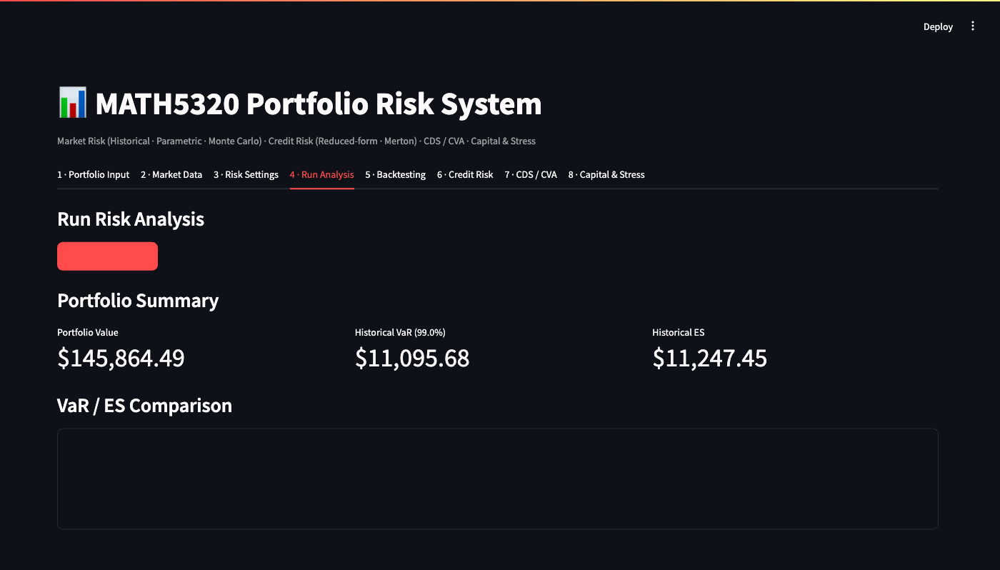
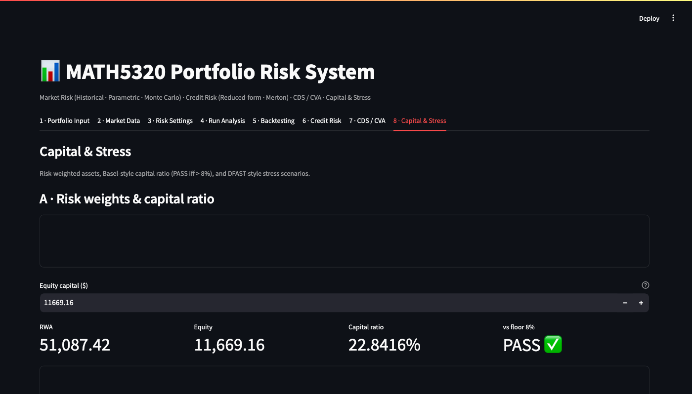

# MATH 5320 — System Demo

**Portfolio:** 100 AAPL + 50 MSFT  ·  Live data via yfinance  ·  Pricing date: 2026-05-11

Two cases are traced end-to-end: (i) parametric VaR/ES via the Run Analysis tab, and (ii) HW10
regulatory capital via the Capital & Stress tab.  The companion notebook `demo.ipynb` reproduces
every number from pure Python against the Bloomberg CSV data.

---

## Case 1 — Parametric VaR & ES  (§3–§5, formula sheet)

**Formula:** For a portfolio with daily mean μ_p and daily vol σ_p:

> VaR_α = -(μ_p − z_α σ_p) × V
> ES_α  = -(μ_p − φ(z_α)/(1−α) σ_p) × V

where z_0.99 = 2.3263 and φ is the standard-normal PDF.

### Front-end — Tab 4 · Run Analysis

The app downloads 1,255 trading days of AAPL + MSFT prices from Yahoo Finance,
builds a $145,864 stock+option portfolio, and computes three VaR/ES estimates
at 99% confidence, 1-day horizon.

| Metric | Value |
|--------|-------|
| Portfolio value | $145,864.49 |
| Historical VaR (99%, 1d) | $11,095.68 |
| Historical ES (99%, 1d) | $11,247.45 |

### Notebook trace — `demo.ipynb` Case 1

The same methodology applied to Bloomberg AAPL/CAT data:

| Metric | Value |
|--------|-------|
| Portfolio (100 AAPL + 50 CAT, BBG) | $66,300.00 |
| Parametric VaR (99%, 1d, window) | $2,600.40 |
| Parametric ES (99%, 1d, window) | $2,999.20 |
| Parametric VaR (99%, 10d, √T) | $8,223.18 |
| EWMA VaR (99%, 1d, λ=0.94) | $2,241.80 |
| EWMA ES (99%, 1d, λ=0.94) | $2,636.75 |

ES ≥ VaR in both methods (coherence property). EWMA VaR is lower because it
down-weights the 2022 drawdowns that the rolling window still includes.

---

## Case 2 — HW10: RWA & Capital Adequacy Ratio  (§12, formula sheet)

**Formula:**

> RWA = Σ w_i A_i  
> Capital ratio k = Equity / RWA  ≥  8% (Basel III CET1 floor)

### Front-end — Tab 8 · Capital & Stress

The app computes RWA for the live AAPL/MSFT portfolio (risk weight = 1.0 for
both equities) with equity capital set to 8% of portfolio value.

| Metric | Value |
|--------|-------|
| RWA | $51,087.42 |
| Equity capital | $11,669.16 |
| Capital ratio | 22.84% |
| Basel III test | **PASS** |

### HW10 balance-sheet case — `demo.ipynb` Case 2

The homework uses a stylised bank balance sheet:

| Asset | Amount | Risk weight | RWA contrib |
|-------|--------|-------------|-------------|
| Cash | $69,000 | 0.00 | $0 |
| Mortgages | $73,000 | 0.45 | $32,850 |
| Corp loans | $47,000 | 1.00 | $47,000 |
| **Total** | **$189,000** | | **$79,850** |

Deposits = $182,000 → Equity = $7,000

> Capital ratio = 7,000 / 79,850 = **8.77%**  →  **PASS** (floor 8%)

This matches the HW10 answer key exactly (≤1% relative error).

---

## Case 3 — CDS Par Spread  (§10, formula sheet)

**Constant-hazard approximation:**

> s ≈ (1 − R) × λ

### Front-end — Tab 7 · CDS / CVA

| Input | Value |
|-------|-------|
| Flat hazard λ | 0.0300 |
| Recovery R | 0.40 |
| Discount r | 0.0300 |
| Tenors | 1, 2, 3, 5, 7, 10 yr |

| Output | Value |
|--------|-------|
| Constant-hazard approx (1−R)λ | **180.0 bps** |
| Full par spread (longest tenor) | **180.7 bps** |

The approximation and full formula agree to within 0.7 bps — consistent with
the §14 landmark value cited in the formula sheet.

---

*Notebook: `demo.ipynb` | App: `streamlit run app.py`*
