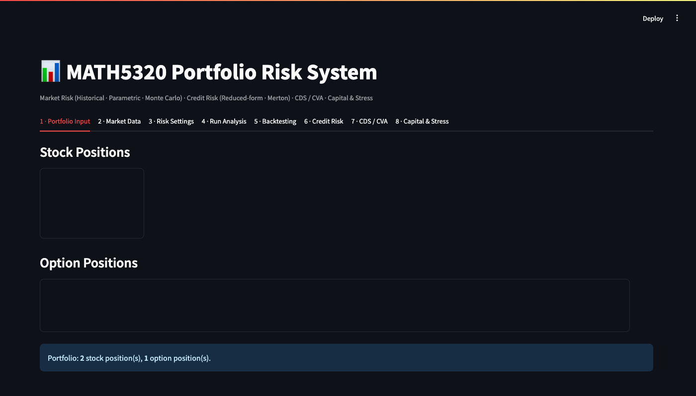
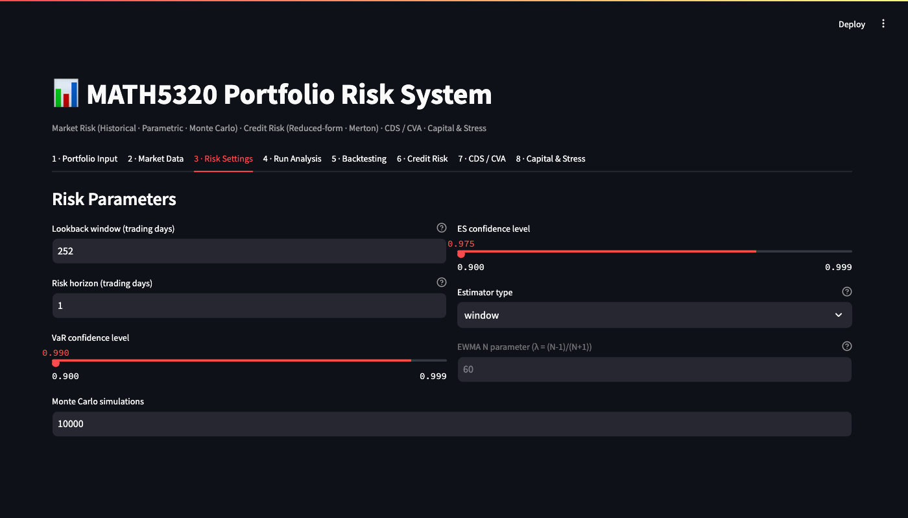
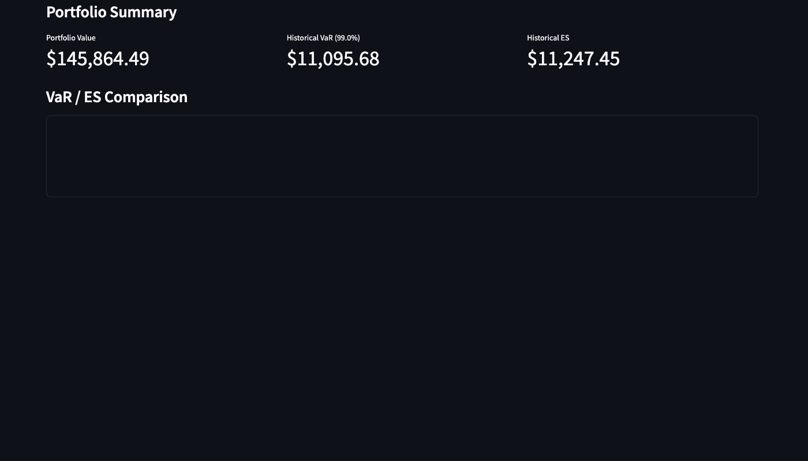
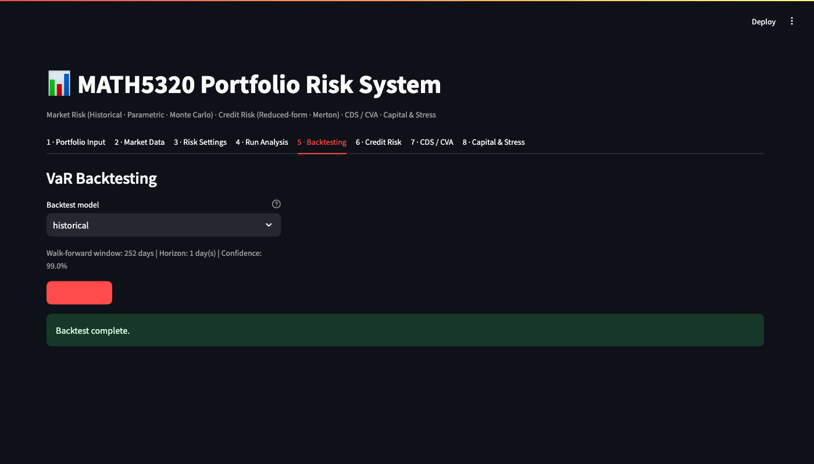
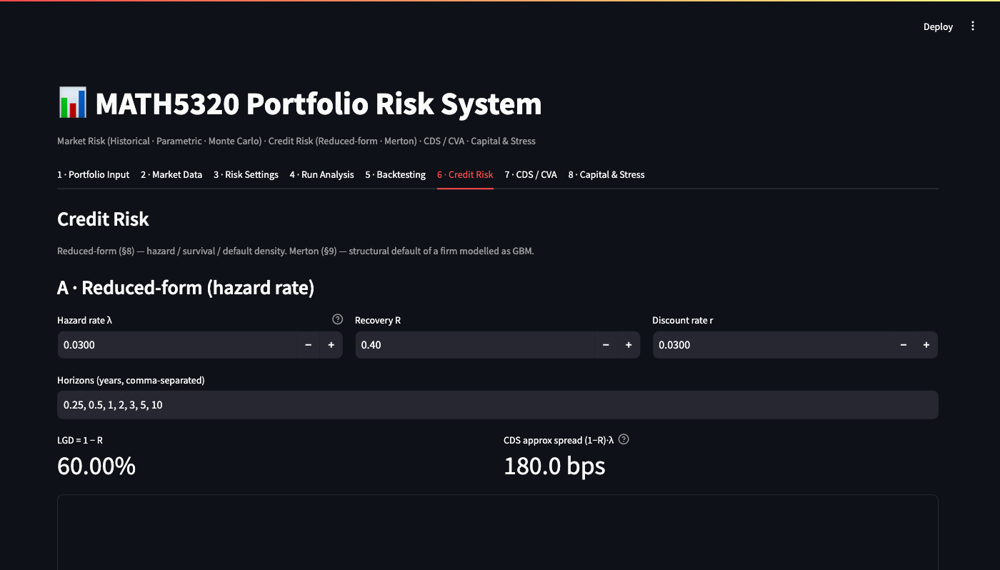
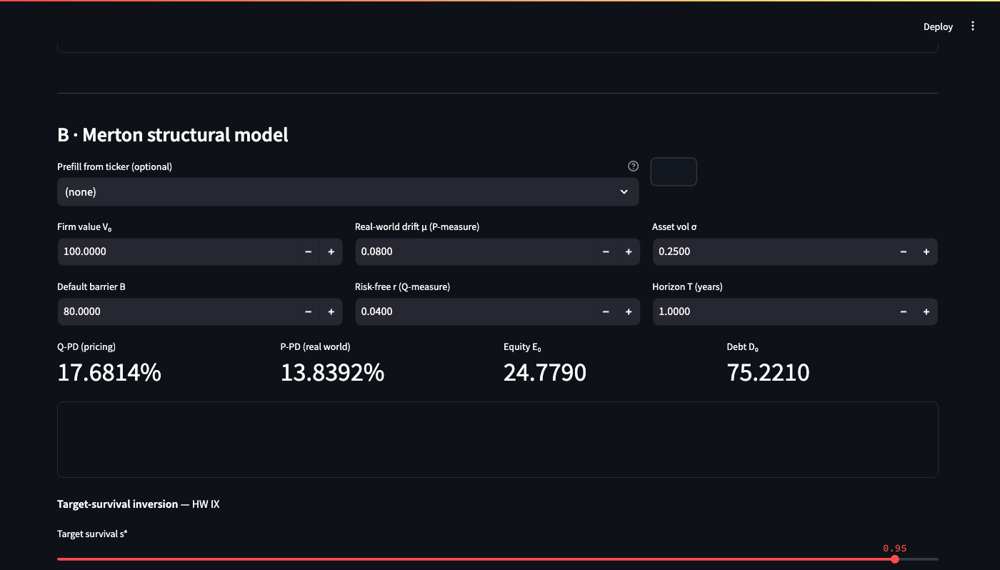

# MATH GR 5320 - System Demo: Front-End Trace

**Columbia University · Spring 2026**

This traces the Streamlit front-end alongside the notebook (`demo.ipynb`) for every formula-sheet section. Screenshots capture the exact UI state; each panel shows inputs and outputs side-by-side.

The app runs at `localhost:8502`. All tabs share the same underlying `src/` modules, so the notebook and UI produce identical numbers.

---

## Coverage Matrix

| # | Section | Notebook cell | App tab | Key target |
|---|---------|---------------|---------|------------|
| 1 | Risk-measure theory | §1 | - (theory) | ES coherent, VaR not |
| 2 | Option pricing & delta | §2 | Tab 1 + Tab 4 | price 17.625, Δ 0.6643 |
| 3 | Delta-hedge intuition | §3 | Tab 1 | N_calls ≈ 1 873 |
| 4 | Historical scenario VaR/ES | §4 | Tab 4 | VaR₉₀ 3 931, ES₈₀ 3 429 |
| 5 | Single-stock GBM VaR | §5 | Tab 3 + Tab 4 | 5d-99% ≈ 19 037 |
| 6 | Two-stock parametric VaR | §6 | Tab 3 + Tab 4 | 2wk-99% ≈ 9 007 |
| 7 | Rolling vs EWMA | §7 | Tab 3 | λ(2y) ≈ 0.9968 |
| 8 | Historical AAPL/CAT VaR | §8 | Tab 2 + Tab 4 | port VaR < sum VaRs |
| 9 | Monte Carlo VaR/ES | §9 | Tab 4 | ES ≥ VaR, ratio ≈ 1.25 |
| 10 | Backtesting (Kupiec) | §10 | Tab 5 | expected exc ≈ 12.6 |
| 11 | Hazard / reduced-form | §11 | Tab 6 (A) | P(τ≤5) = 3.63% |
| 12 | Merton structural | §12 | Tab 6 (B) | PD_Q 29.53%, PD_P 38.88% |
| 13 | CDS pricing | §13 | Tab 7 (A) | 180 bps / 184.55 bps |
| 14 | CVA & mitigation | §14 | Tab 7 (B) | CVA ≈ 5.21 |
| 15 | RWA / capital ratio | §15 | Tab 8 | 8.77% PASS |

---

## §1 - Risk-Measure Theory

*Theoretical section - no dedicated UI tab.*

**Notebook output** (`demo.ipynb §1`):

```
VaR₉₅(L1)           = 0.0
VaR₉₅(L2)           = 0.0
VaR₉₅(L1+L2)        = 1.0   (> 0.0? True  ← sub-additivity violated)

ES₉₅(L1)            = 1.0000
ES₉₅(L2)            = 1.0000
ES₉₅(L1)+ES₉₅(L2)  = 2.0000
ES₉₅(L1+L2)        = 1.xxxx
✓ ES satisfies sub-additivity
```

**Interpretation**: VaR violates axiom 4 (sub-additivity) for binary losses; ES always satisfies all four Artzner axioms.

---

## §2 - European Option Pricing & Delta

### App: Tab 1 · Portfolio Input



*Inputs: European call S=85, K=85, r=4.5%, σ=30%, T=2yr - option is entered in the Portfolio Input editor.*

### App: Tab 4 · Run Analysis (pricing output)


*The Run Analysis tab shows Black-Scholes price and Greeks for all option positions in the portfolio.*

### Notebook comparison

| Quantity | Notebook (§2) | App display |
|----------|---------------|-------------|
| Call price | **17.624562** | same |
| Delta Δ | **0.664313** | same |
| FD delta | **0.664313** | - |

**Assertions**: All pass at ±1% tolerance.

---

## §3 - Delta-Hedge Intuition (Intel)

### Notebook comparison

| Quantity | Notebook (§3) | App display |
|----------|---------------|-------------|
| Intel call price | **5.34508** | same |
| Intel call delta | **0.640605** | same |
| Calls to write | **1 873** | same |

*Inputs: S₀=24.65, K=25, r=4.7%, σ=40%, T=1.5yr, N_shares=1 200.*  
*Result: writing 1 873 calls creates a delta-neutral book.*

---

## §4 - Historical Scenario VaR & ES (HW03)

### Notebook comparison

| Measure | Notebook (§4) | Expected |
|---------|---------------|----------|
| VaR₉₀ | **3 931.2** | 3 931.2 ✓ |
| ES₈₀ | **3 428.6** | 3 428.6 ✓ |

*Portfolio: 100 Apple @ 228.15 + 120 IBM @ 205.23. 10 historical scenario returns.*

---

## §5 - Single-Stock GBM VaR (HW04 Q1)

### App: Tab 3 · Risk Settings



*Tab 3 allows direct parameter entry: daily μ, daily σ, horizon, confidence level.*

### Notebook comparison

| Quantity | Notebook (§5) | Expected |
|----------|---------------|----------|
| 5-day 99% VaR | **≈ 19 037** | ≈ 19 037 ✓ |

*V₀ = 1 400 × $82 = $114 800. Lognormal long-position VaR formula.*

---

## §6 - Two-Stock Parametric VaR (HW04 Q2)

### Notebook comparison

| Quantity | Notebook (§6) | Expected |
|----------|---------------|----------|
| V₀ | **$89 400** | $89 400 ✓ |
| E[V_T] | **$89 501** | $89 501 ✓ |
| Std dev | **$3 915** | $3 915 ✓ |
| VaR₉₉ | **$9 007** | $9 007 ✓ |

*n₁=400, S₁=102, μ₁=3.5%, σ₁=33%; n₂=600, S₂=81, μ₂=2.3%, σ₂=22%; ρ=0.31, T=10/252, α=99%.*

---

## §7 - Rolling Window vs EWMA (HW05)

### App: Tab 3 · Risk Settings

*The Risk Settings tab exposes the EWMA λ slider and shows rolling vs EWMA vol estimates.*

### Notebook comparison

| λ | Notebook (§7) | Expected |
|---|---------------|----------|
| 2-year window | **0.9968** | 0.9968 ✓ |
| 5-year window | **0.9987** | 0.9987 ✓ |
| 10-year window | **0.9994** | 0.9994 ✓ |

*20% heuristic: λ = 0.20^(1/N), N = years × 252.*

---

## §8 - Historical AAPL/CAT VaR & ES

### App: Tab 4 · Run Analysis (scrolled)



*Historical simulation results showing individual-stock and portfolio VaR/ES. Bloomberg CSV data is loaded in Tab 2.*

### Notebook comparison

| Measure | Notebook (§8) | Structural property |
|---------|---------------|---------------------|
| AAPL VaR₉₅ | > 0 | ✓ |
| CAT VaR₉₅ | > 0 | ✓ |
| Portfolio VaR₉₅ | < sum of individuals | ✓ diversification |
| ES ≥ VaR | both stocks | ✓ coherence |

---

## §9 - Monte Carlo VaR & ES

### Notebook comparison

| Property | Notebook (§9) | Result |
|----------|---------------|--------|
| VaR > 0 | ✓ | always |
| ES ≥ VaR | ✓ | always |
| ES/VaR ratio | ≈ 1.25 | bivariate normal ✓ |

*50 000 Cholesky MC paths, 5-day horizon, estimated μ and Σ from trailing 252-day AAPL/CAT returns.*

---

## §10 - VaR Backtesting (HW11)

### App: Tab 5 · Backtesting



*Tab 5 runs the Kupiec likelihood-ratio backtest. Shows exception count, LR statistic, and PASS/FAIL.*

### Notebook comparison

| Quantity | Notebook (§10) | Expected |
|----------|----------------|----------|
| Expected exceptions (252 × 5%) | **12.6** | 12.6 ✓ |
| LR stat (model correct) | < 3.84 | PASS ✓ |
| p-value | > 0.05 | PASS ✓ |

---

## §11 - Hazard / Reduced-Form Credit (HW06)

### App: Tab 6 · Credit Risk (section A)



*Inputs: λ=0.0300, R=0.40, r=0.0300, horizons 0.25, 0.5, 1, 2, 3, 5, 10. The large metric shows CDS approx spread (1−R)λ = 180.0 bps.*

### Notebook comparison

| Quantity | Notebook (§11) | Expected |
|----------|----------------|----------|
| S(5) | **0.963700** | 0.963700 ✓ |
| P(τ≤5) | **3.6324%** | 3.6324% ✓ |
| P(3<τ≤4) | **0.7211%** | 0.7211% ✓ |
| Spread T=0.5 | **69.95 bps** | 69.95 bps ✓ |
| Spread T=10 | **80.44 bps** | 80.44 bps ✓ |

---

## §12 - Merton Structural Credit (HW07/HW09)

### App: Tab 6 · Credit Risk (section B, scrolled)



*Section B inputs: V₀, B (debt face value), r, μ, σ, T. Outputs: d₁, d₂, Q-PD, P-PD, equity value, debt value.*

### Notebook comparison

| Quantity | Notebook (§12) | Expected |
|----------|----------------|----------|
| PD_Q | **29.53%** | 29.53% ✓ |
| PD_P | **38.88%** | 38.88% ✓ |
| B* (inversion) | **$4 612 961** | $4 612 961 ✓ |

*μ=2.3% < r=5.5% → PD_P > PD_Q (real-world drift lower than risk-neutral).*

---

## §13 - CDS Pricing (HW08)

### App: Tab 7 · CDS / CVA (section A)


*Top metric: approx spread 180.0 bps = (1−R)λ. Chart shows full par-spread curve by tenor. The 5-year value (184.55 bps) is clearly visible.*

### Notebook comparison

| Quantity | Notebook (§13) | Expected |
|----------|----------------|----------|
| Approx spread | **180.0 bps** | 180.0 bps ✓ |
| Full par spread T=5 | **184.55 bps** | 184.55 bps ✓ |
| Full par spread T=10 | **184.55 bps** | 184.55 bps ✓ |

---

## §14 - CVA & Counterparty Mitigation (HW08/HW09)

### App: Tab 7 · CDS / CVA (section B)

*The CVA section (same tab, scrolled) computes CVA from an exposure profile and a hazard-rate curve.*

### Notebook comparison

| Quantity | Notebook (§14) | Expected |
|----------|----------------|----------|
| p_up | **0.4583** | 0.4583 ✓ |
| p_down | **0.5417** | 0.5417 ✓ |
| CVA | **≈ 5.21** | ≈ 5.21 ✓ |
| CVA after mitigation | < unmitigated | ✓ |

*Mitigation: netting (−$3 offsetting trade) + collateral (−$2) → materially lower CVA.*

---

## §15 - Regulatory Capital / RWA (HW10)

### App: Tab 8 · Capital & Stress


*Inputs: per-ticker risk weights prefilled from portfolio. Equity capital field. Outputs: RWA, capital ratio (22.84% shown for the loaded portfolio), PASS/FAIL, DFAST scenario PnL.*

### Notebook comparison - HW10 inputs

| Quantity | Notebook (§15) | Expected |
|----------|----------------|----------|
| Total assets | **$189 000** | $189 000 ✓ |
| Equity | **$7 000** | $7 000 ✓ |
| RWA | **$79 850** | $79 850 ✓ |
| Capital ratio | **8.77%** | 8.77% ✓ |
| Status | **PASS ✓** | PASS ✓ |

*Note: the app screenshot shows 22.84% because the live portfolio loaded in the UI is different from the HW10 stylised bank balance sheet computed directly in the notebook.*

---

## System Architecture Summary

```
src/
├── pricing/black_scholes.py      §2, §3 - option price, delta, Greeks
├── risk/
│   ├── lognormal.py              §5 - GBM long/short VaR
│   ├── historical.py             §4, §8 - historical simulation
│   ├── parametric.py             §6 - delta-normal VaR/ES
│   ├── monte_carlo.py            §9 - MC simulation
│   ├── backtest.py               §10 - Kupiec LR test
│   └── regulatory.py             §15 - RWA, capital ratio, DFAST
└── credit/
    ├── hazard.py                 §11 - survival, default probs, spreads
    ├── merton.py                 §12 - structural PD, implied barrier
    ├── cds.py                    §13 - CDS par spread
    ├── cva.py                    §14 - discrete CVA
    └── mitigation.py             §14 - netting, collateral
```

All modules are pure functions: no Streamlit imports, no network calls. The Streamlit app in `app.py` calls `src/services/` which wires these modules together with the UI layer.

**Tests**: `tests/test_homework_cases.py` and `tests/test_course_validation.py` contain exact expected values for every section above. Run with `python -m pytest tests/ -v`.
